

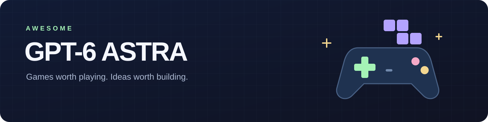

# Awesome GPT-6 Astra

  

**GPT-6 Astra से बनाए गए दिलचस्प गेमों का संग्रह।**

मज़ेदार विचार, आज़माने लायक गेम और अगले रचनाकार को प्रेरित करने वाली विकास की कहानियाँ।

[English](README.md) · [简体中文](README.zh-CN.md) · [日本語](README.ja.md) · [한국어](README.ko.md) 
[Français](README.fr.md) · [Deutsch](README.de.md) · [Español](README.es.md) · [Português (Brasil)](README.pt-BR.md) 
[Русский](README.ru.md) · [العربية](README.ar.md) · **हिन्दी** · [Bahasa Indonesia](README.id.md)

[गेम सुझाएँ](https://github.com/MartinDelophy/awesome-gpt-6-astra/issues/new?template=submit-game.yml) · [योगदान दें](CONTRIBUTING.md)

यह पेज [अंग्रेज़ी README](README.md) का अनुवाद है। नवीनतम बदलावों के लिए मूल संस्करण देखें; अनुवाद में सुधारों का स्वागत है।

## यहाँ से शुरू करें

यहाँ **43 खेल और इंटरैक्टिव परियोजनाएँ** शामिल हैं: तीन राज्यों की क्षेत्रीय रणनीति, एक-दूसरे में फँसे लकड़ी के टुकड़ों और खिसकने वाले ब्लॉकों की पहेलियाँ, मुलायम फलों को मिलाना, एक बटन से उड़ान, जादुई कालीन पर लड़ाई, बिजली के नेटवर्क से द्वीप की रक्षा, जंगल में जीवित रहना, पानी के नीचे मछली पकड़ना, सुशी रेस्तराँ चलाना और द्वीप पर खेती करना, Bay Circuit पर कार्ट रेसिंग, पेलिकन के साथ तट पर साइकिल चलाना, टेबलटॉप खिलौनों के 3D रूपांतरण और Orbital Garden। किसी शीर्षक पर क्लिक करके उसका डेमो या चलाने के निर्देशों सहित स्रोत कोड खोलें।

सूची अपडेट: **2026-09-09**। मॉडल के उपयोग की जानकारी रचनाकारों या प्रस्तुतकर्ताओं के कथनों पर आधारित है; अपुष्ट विवरण संबंधित प्रविष्टियों में चिह्नित हैं। यह तारीख सूची के रखरखाव की है, सभी गेमों के दोबारा परीक्षण की नहीं।

- **खेलने के लिए कुछ ढूँढ़ रहे हैं?** नीचे दी गई श्रेणियाँ देखें।
- **आपने कोई गेम बनाया है?** [अपना प्रोजेक्ट भेजें](https://github.com/MartinDelophy/awesome-gpt-6-astra/issues/new?template=submit-game.yml) और साथ में खेलने का लिंक या स्रोत कोड, वास्तविक गेमप्ले का स्क्रीनशॉट और GPT-6 Astra के उपयोग का विवरण दें।
- **कोई अच्छा प्रोजेक्ट मिला?** दूसरे लोगों के सार्वजनिक काम सुझाएँ और मूल रचनाकार को श्रेय दें।

यह सूची समुदाय द्वारा संचालित है और OpenAI से संबद्ध नहीं है। किसी प्रोजेक्ट का शामिल होना उसे आज़माने का निमंत्रण है, प्रदर्शन का मूल्यांकन या आधिकारिक सिफ़ारिश नहीं।

## गेम

- [एक्शन और आर्केड](#action-arcade)
- [पहेलियाँ और दिमागी खेल](#puzzles)
- [रणनीति और सिमुलेशन](#strategy-simulation)
- [RPG और रोमांच](#rpg-adventures)
- [प्लैटफ़ॉर्मर और रेसिंग](#platformers-racing)
- [प्रयोगात्मक और मल्टीप्लेयर](#experimental-multiplayer)

### एक्शन और आर्केड

शूटिंग, लड़ाई, जीवित रहने की चुनौती, लय-आधारित गेम और ऐसे खेल जिन्हें एक बार और खेलने का मन करे।

- **[Mosswing](https://mosswing-quiet-flight.jack-514.chatgpt.site/)** — एक बटन से पंख फड़फड़ाकर उड़ने वाला 3D गेम। बाधाओं के बीच से निकलें और अपना स्कोर बढ़ाएँ।
  - रचनाकार: [Ayi1337](https://github.com/Ayi1337)
  - प्लैटफ़ॉर्म: ब्राउज़र; मोबाइल के लिए डिज़ाइन किया गया है।
  - GPT-6 Astra: [रचनाकार के एक ही अनुरोध से निर्माण के परीक्षण और मूल प्रॉम्प्ट](https://github.com/Ayi1337/gpt6-astra-one-shot-games/blob/main/README.md).
  - विकास संसाधन: [स्रोत कोड](https://github.com/Ayi1337/gpt6-astra-one-shot-games/tree/main/mosswing/src) · [स्वतंत्र HTML फ़ाइल](https://github.com/Ayi1337/gpt6-astra-one-shot-games/blob/main/mosswing/mosswing.html)
  - पूर्वावलोकन: 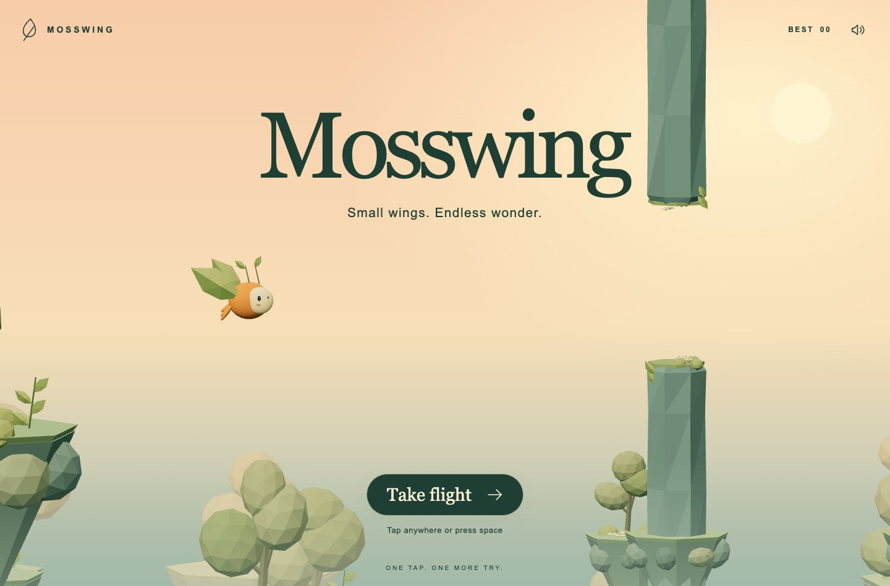

- **[Magic Carpet Wizard — A Thousand Skies](https://threapchills.github.io/MagicCarpetWizard/)** — जादुई कालीन पर गोलाकार दुनिया में उड़ें, छल्लों से गुज़रें, जादू करें और दुश्मनों व बॉस से लड़ें।
  - रचनाकार: [threapchills](https://github.com/threapchills)
  - प्लैटफ़ॉर्म: माउस और कीबोर्ड वाला डेस्कटॉप ब्राउज़र; WebGL 2 आवश्यक है।
  - GPT-6 Astra: रचनाकार ने [रिपॉज़िटरी के About खंड](https://github.com/threapchills/MagicCarpetWizard) में बताया है कि गेम GPT-6 Astra से बनाया गया है।
  - विकास संसाधन: [स्रोत कोड और चलाने के निर्देश](https://github.com/threapchills/MagicCarpetWizard) · तकनीक: Three.js, Vite.
  - पूर्वावलोकन: 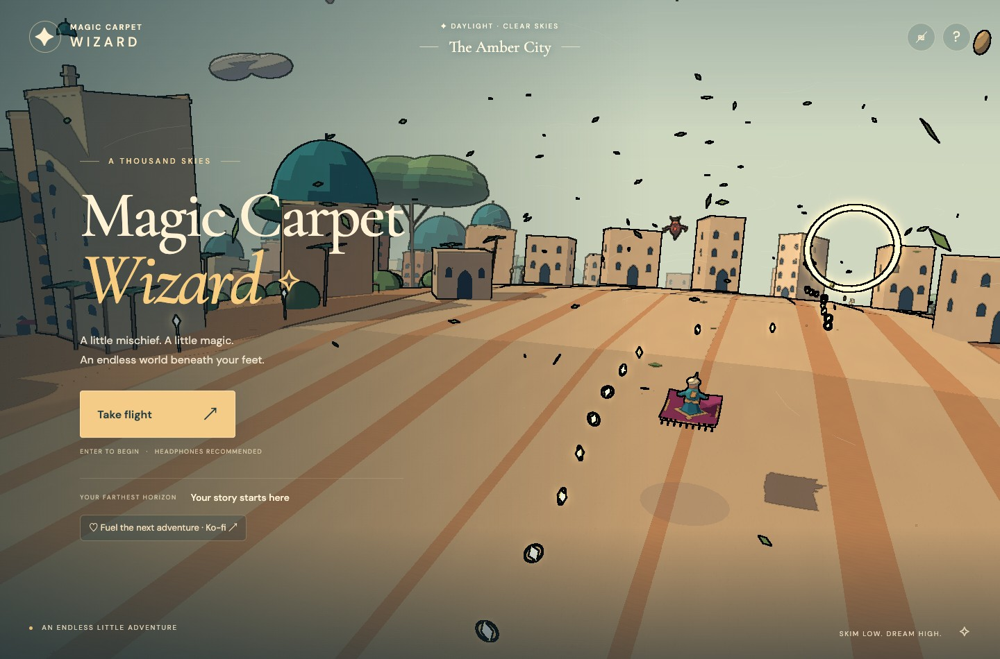

- **[THUNDERFALL / 雷霆战机 · 天穹远征](https://thunderfall.vercel.app/)** — तीन लड़ाकू विमानों, पाँच क्षेत्रों, कई चरणों वाले बॉस और स्वचालित गोलीबारी वाला बुलेट-हेल गेम।
  - रचनाकार: [jackroc](https://github.com/jackroc)
  - GPT-6 Astra: [README](works/thunderfall/README.md#创作与许可) — रचनाकार के अनुसार GPT-6 Astra ultra से बनाकर कई चरणों में सुधार किया गया।
  - [README](works/thunderfall/README.md) · [Prompt](works/thunderfall/PROMPT.md) · JavaScript, Canvas 2D, Web Audio.
  - पूर्वावलोकन: 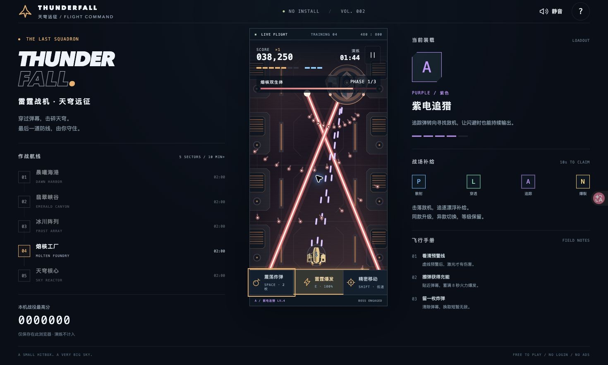

- **[IRON BASTION / 钢铁防线](https://iron-bastion.zecoba.workers.dev/)** — छह 3D क्षेत्रों में दुश्मन टैंकों की लहरों से सिग्नल टावर की रक्षा करें। ईंट की दीवारें तोड़ें और तेज़ छलाँग तथा विद्युतचुंबकीय पल्स का इस्तेमाल करें।
  - रचनाकार: [chat01.ai](https://linux.do/u/bandaot)
  - प्लेटफ़ॉर्म: WebGL 2 समर्थित ब्राउज़र, चीनी इंटरफ़ेस; निर्देशों में कीबोर्ड, माउस और टच नियंत्रण दिए गए हैं। बिना लॉगिन या भुगतान के लड़ाई शुरू की गई।
  - GPT-6 Astra: GPT-6 Astra के उपयोग और योगदान की निर्माता से पुष्टि बाकी है।
  - पूर्वावलोकन: 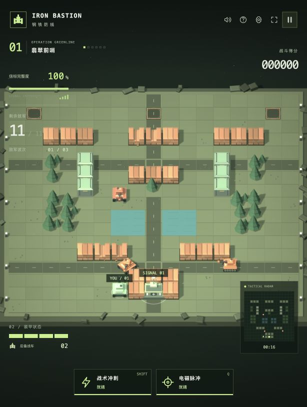

- **[Stick Fighter](https://stick-fighter-production.up.railway.app/)** — विकासाधीन स्टिक-फिगर लड़ाई का खेल, जिसमें मुक्के, किक, अपरकट, निंजा स्टार और पैरी हैं; बॉट अभ्यास तथा ऑनलाइन और दोस्तों के साथ खेलने के मेनू उपलब्ध हैं।
  - रचनाकार: [Dwayne](https://x.com/CtrlAltDwayne)
  - प्लेटफ़ॉर्म: डेस्कटॉप ब्राउज़र, कीबोर्ड; बॉट अभ्यास बिना लॉगिन उपलब्ध है। ऑनलाइन मल्टीप्लेयर और कंट्रोलर का स्वतंत्र परीक्षण नहीं हुआ।
  - GPT-6 Astra: [X](https://x.com/CtrlAltDwayne/status/2097499157967818780) — लेखक स्पष्ट रूप से कहते हैं कि यह मल्टीप्लेयर लड़ाई का खेल GPT-6 Astra से बनाया गया है और अभी विकासाधीन है।
  - पूर्वावलोकन: 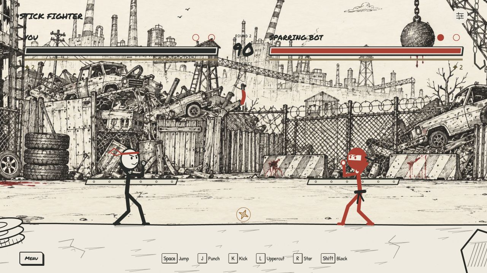

- **[Gogh Strike · Paint Clash](https://gogh-strike.surge.sh/)** — वैन गॉग से प्रेरित प्रथम-व्यक्ति पेंट मुकाबला, छह कलाकारों, विशेष हथियारों और पहले 20 अंक तक पहुँचने के लक्ष्य के साथ।
  - रचनाकार: [Peter Gostev](https://x.com/petergostev)
  - प्लेटफ़ॉर्म: डेस्कटॉप ब्राउज़र; बिना लॉगिन या भुगतान के खोला गया। मोबाइल परीक्षण नहीं हुआ।
  - GPT-6 Astra: [X](https://x.com/petergostev/status/2096015315209449578) — लेखक ने इस परियोजना के विकास में Astra के उपयोग की जानकारी दी है। [जाँच विवरण (अंग्रेज़ी)](assets/screenshots/gogh-strike/SOURCE.md).
  - पूर्वावलोकन: 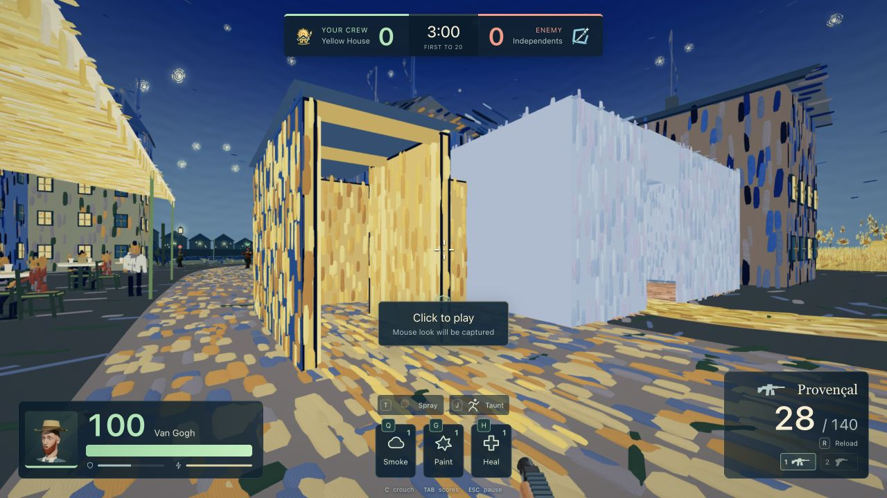

- **[ASTEROIDS · Deepfield](https://asteroids-deepfield-cockpit.dan200200.chatgpt.site/)** — चार कैमरे, रडार, दो तोपें और जड़त्वीय उड़ान वाला Asteroids-शैली का कॉकपिट खेल।
  - रचनाकार: [Eyes Wide Open](https://x.com/DantesClown)
  - प्लेटफ़ॉर्म: डेस्कटॉप ब्राउज़र; बिना लॉगिन या भुगतान के खोला गया। मोबाइल परीक्षण नहीं हुआ।
  - GPT-6 Astra: [X](https://x.com/DantesClown/status/2096085439052452064) — लेखक ने इस परियोजना के विकास में Astra के उपयोग की जानकारी दी है। [जाँच विवरण (अंग्रेज़ी)](assets/screenshots/asteroids-deepfield/SOURCE.md).
  - पूर्वावलोकन: 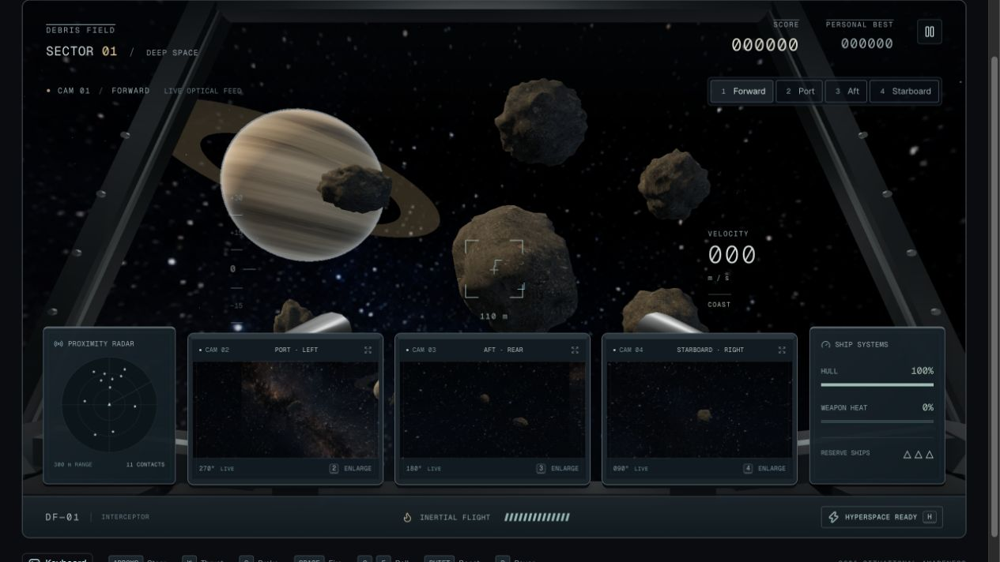

- **[BLACKWATER · Silent Harbor](https://blackwater-roan.vercel.app/)** — बरसाती मालवाहक टर्मिनल में सामरिक FPS, जिसमें विस्तृत राइफल, युद्ध HUD और नौ दुश्मन हैं।
  - रचनाकार: [hiraeth](https://x.com/WoahWurdz)
  - प्लेटफ़ॉर्म: डेस्कटॉप ब्राउज़र; बिना लॉगिन या भुगतान के खोला गया। मोबाइल परीक्षण नहीं हुआ।
  - GPT-6 Astra: [X](https://x.com/WoahWurdz/status/2095958882732355908) — लेखक ने इस परियोजना के विकास में Astra के उपयोग की जानकारी दी है। [जाँच विवरण (अंग्रेज़ी)](assets/screenshots/blackwater/SOURCE.md).
  - संसाधन: [GitHub](https://github.com/Hiraeth010/blackwater)
  - पूर्वावलोकन: 

- **[Cinderfall · Fire, Shadow & Steel](https://rogue-omega.vercel.app/)** — चार नायकों और हर वर्ग की छह क्षमताओं वाला काल्पनिक द्वंद्व क्षेत्र, AI लड़ाइयों तथा ऑनलाइन कमरों के साथ।
  - रचनाकार: [JUMPERZ](https://x.com/jumperz)
  - प्लेटफ़ॉर्म: डेस्कटॉप ब्राउज़र; बिना लॉगिन या भुगतान के खोला गया। मोबाइल परीक्षण नहीं हुआ।
  - GPT-6 Astra: [X](https://x.com/jumperz/status/2096600055301984738) — लेखक ने इस परियोजना के विकास में Astra के उपयोग की जानकारी दी है। [जाँच विवरण (अंग्रेज़ी)](assets/screenshots/cinderfall/SOURCE.md).
  - पूर्वावलोकन: 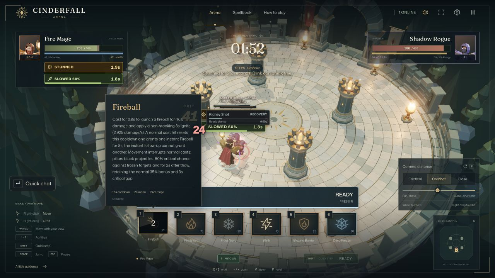

### पहेलियाँ और दिमागी खेल

तर्क की पहेलियाँ, भौतिकी की चुनौतियाँ, शब्दों के खेल और छोटे लेकिन चतुर तंत्र।

- **[瓜体实验室 / Melon Lab](https://melon-game.jack-514.chatgpt.site/)** — मुलायम फलों के आकार बदलने और आपस में टकराने पर आधारित तरबूज़ मिलाने वाला गेम।
  - रचनाकार: [Ayi1337](https://github.com/Ayi1337)
  - प्लैटफ़ॉर्म: आधुनिक ब्राउज़र; रचनाकार डाउनलोड करने योग्य स्वतंत्र HTML संस्करण भी उपलब्ध कराते हैं।
  - GPT-6 Astra: [रचनाकार के एक ही अनुरोध से निर्माण के परीक्षण और मूल प्रॉम्प्ट](https://github.com/Ayi1337/gpt6-astra-one-shot-games/blob/main/README.md).
  - विकास संसाधन: [स्रोत कोड](https://github.com/Ayi1337/gpt6-astra-one-shot-games/tree/main/melon-lab/src) · [स्वतंत्र HTML फ़ाइल](https://github.com/Ayi1337/gpt6-astra-one-shot-games/blob/main/melon-lab/%E7%93%9C%E4%BD%93%E5%AE%9E%E9%AA%8C%E5%AE%A4.html)
  - पूर्वावलोकन: 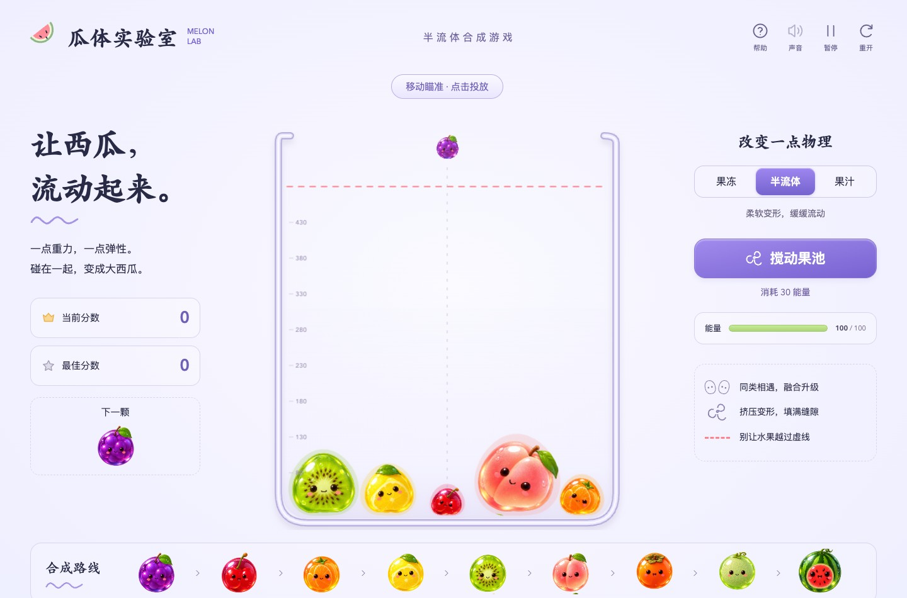

- **[Q弹消消乐](https://qbxxl.0nz.de/)** — एक ही रंग के कम से कम तीन जुड़े बुलबुले हटाएँ; बड़े समूह बम और इंद्रधनुष बनाते हैं। आराम, स्तर और समयबद्ध मोड उपलब्ध हैं।
  - रचनाकार: zding
  - प्लेटफ़ॉर्म: ब्राउज़र, चीनी इंटरफ़ेस; बिना लॉगिन या भुगतान के शुरू होना सत्यापित।
  - GPT-6 Astra: GPT-6 Astra के उपयोग और योगदान की निर्माता से पुष्टि बाकी है।
  - पूर्वावलोकन: 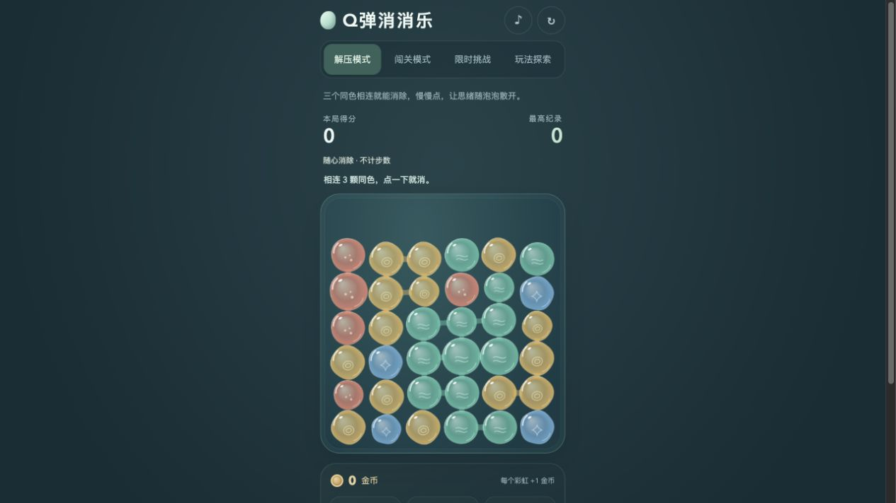

- **[榫境 / Sunjing Puzzles](https://sunjing-puzzles.vercel.app)** — 3D लकड़ी की कार्यशाला में एक-दूसरे में फँसे छह टुकड़ों की पहेली खोलें और हुआरोंग दाओ की दो स्लाइडिंग-ब्लॉक पहेलियाँ हल करें। संकेत और चाल वापस लेने की सुविधा भी है।
  - रचनाकार: [MartinDelophy](https://github.com/MartinDelophy) (परियोजना शुरू करने वाले और प्रस्तुतकर्ता)।
  - प्लैटफ़ॉर्म: WebGL 2 वाला आधुनिक ब्राउज़र; चीनी इंटरफ़ेस, माउस, कीबोर्ड और स्पर्श नियंत्रण। मुफ़्त, लॉगिन या API कुंजी की आवश्यकता नहीं; प्रगति वर्तमान ब्राउज़र में रहती है।
  - मॉडल की भागीदारी: [निर्माण का रिकॉर्ड](works/sunjing-puzzles/CREATION.md) — Codex में गेम डिज़ाइन, प्रक्रियात्मक 3D ग्राफ़िक्स, नियम, पहेली हल करने की प्रणाली और परीक्षणों पर कई चरणों में काम किया गया। GPT-6 Astra के सटीक उपयोग की पुष्टि रचनाकार से होनी बाकी है (प्रारूप के रूप में प्रस्तुति)।
  - विकास संसाधन: [स्रोत कोड और चलाने के निर्देश](works/sunjing-puzzles/README.md) · [आवश्यकताएँ](works/sunjing-puzzles/PROMPTS.md) · तकनीक: React, Vinext/Vite, Three.js.
  - पूर्वावलोकन: 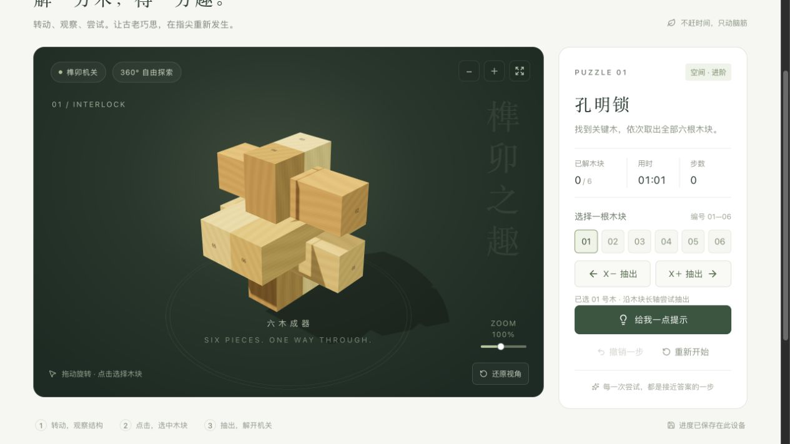

- **[二凤字阵 / Erfeng Glyph Formation](https://2feng.jay6697117.deno.net/)** — चीनी अक्षरों को जोड़ने वाला टावर डिफेंस, स्याही शैली के इंटरफ़ेस और पात्र विकास के साथ।
  - रचनाकार: [SteveZhang / jay6697117](https://github.com/jay6697117) · [X](https://x.com/stevezh10058543)
  - प्लेटफ़ॉर्म: Google लॉगिन आवश्यक। केवल लॉगिन स्क्रीन जाँची गई; गेमप्ले निर्माता के स्क्रीनशॉट पर आधारित है। WeChat उपयोगकर्ताओं को Chrome में अनुमति देने को कहा गया है।
  - GPT-6 Astra: [Issue #48](https://github.com/MartinDelophy/awesome-gpt-6-astra/issues/48) — निर्माता के अनुसार: GPT-6 Astra से गेम लॉजिक, UI लेआउट अनुकूलन और गेम आर्ट निर्माण।
  - पूर्वावलोकन: 

### रणनीति और सिमुलेशन

टावर डिफ़ेंस, रणनीतिक कार्ड गेम, प्रबंधन, निर्माण और सिमुलेशन सैंडबॉक्स।

- **[Dwellcraft · 住进想象](https://dwellcraft.vercel.app/)** — तीन 3D घर सजाएँ, सामग्री और रोशनी बदलें तथा अंदर घूमकर देखें; स्थानीय सेव और GLB आयात उपलब्ध हैं।
  - रचनाकार: [Ryan-fm](https://github.com/Ryan-fm)
  - प्लेटफ़ॉर्म: WebGL डेस्कटॉप ब्राउज़र; चीनी और अंग्रेज़ी UI। मुफ़्त, लॉगिन नहीं। वास्तविक Quest पर परीक्षण बाकी है।
  - Codex: [GitHub](https://github.com/Ryan-fm/Dwellcraft/blob/main/docs/DEVELOPMENT.md) — Codex से क्रमिक विकास का रिकॉर्ड है; सटीक GPT-6 Astra उपयोग की पुष्टि लेखक से अपेक्षित है।
  - संसाधन: [GitHub](https://github.com/Ryan-fm/Dwellcraft)
  - पूर्वावलोकन: 

- **[Little Kingdom Chess / 작은 왕국 체스](https://little-kingdom-chess.echo3042.chatgpt.site/)** — घुमाए जा सकने वाले 3D बोर्ड पर छोटे पात्रों से कंप्यूटर के विरुद्ध शतरंज खेलें; चालों का इतिहास और वापसी उपलब्ध है।
  - रचनाकार: [에코_eco](https://x.com/echo3042)
  - प्लेटफ़ॉर्म: डेस्कटॉप ब्राउज़र; बिना लॉगिन या भुगतान के खोला गया। मोबाइल परीक्षण नहीं हुआ।
  - GPT-6 Astra: [X](https://x.com/echo3042/status/2096123409029886250) — लेखक ने इस परियोजना के विकास में Astra के उपयोग की जानकारी दी है। [जाँच विवरण (अंग्रेज़ी)](assets/screenshots/little-kingdom-chess/SOURCE.md).
  - पूर्वावलोकन: 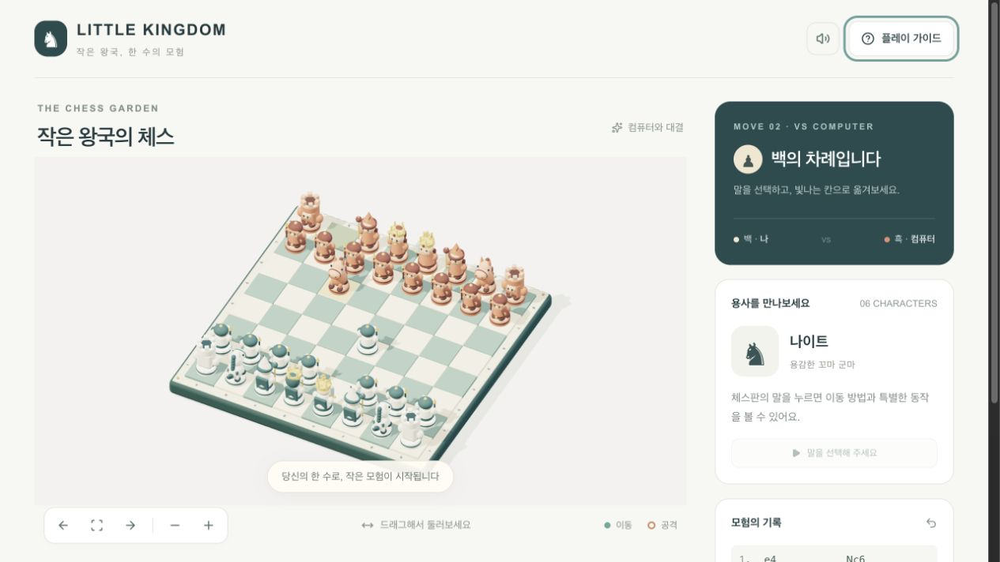

- **[JUNK RUN](https://junk-run.pages.dev/)** — कबाड़ के पुर्जों से बिना इंजन की गाड़ी बनाएँ और ढलान पर छोड़ें; शुरुआत प्रथम-व्यक्ति कार्यशाला से होती है।
  - रचनाकार: [TheLabGuy](https://x.com/hermesailab)
  - प्लेटफ़ॉर्म: डेस्कटॉप ब्राउज़र; बिना लॉगिन या भुगतान के खोला गया। मोबाइल परीक्षण नहीं हुआ।
  - GPT-6 Astra: [X](https://x.com/hermesailab/status/2097508053901840850) — लेखक ने इस परियोजना के विकास में Astra के उपयोग की जानकारी दी है। [जाँच विवरण (अंग्रेज़ी)](assets/screenshots/junk-run/SOURCE.md).
  - पूर्वावलोकन: 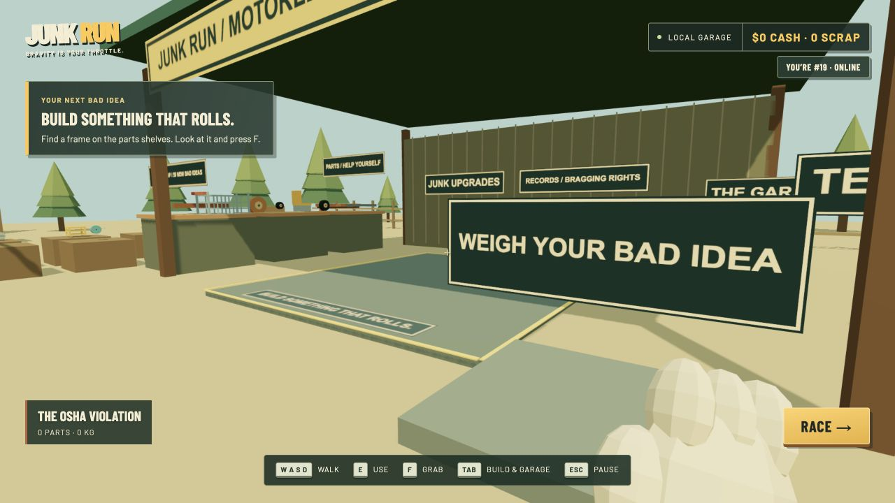

- **[Spy or Lie](https://spyorlie.com/)** — कंप्यूटर के विरुद्ध षट्भुज बोर्ड पर रणनीति खेल: छिपी पहचान वाले एजेंट रखें, झाँसा दें और दुश्मन समूहों को घेरकर लगातार कब्ज़े करें।
  - रचनाकार: [Nate Lorenzen](https://x.com/NateLorenzen)
  - प्लेटफ़ॉर्म: ब्राउज़र, अंग्रेज़ी इंटरफ़ेस; बिना लॉगिन या भुगतान के पहली चाल और कंप्यूटर का उत्तर जाँचा गया।
  - GPT-6 Astra: [X](https://x.com/NateLorenzen/status/2097504974683152559) — लेखक के अनुसार Astra ने उनके गेम डिज़ाइन को एक प्रयास में खेलने योग्य डेमो बनाया; विकास प्रक्रिया का स्वतंत्र ऑडिट नहीं हुआ।
  - पूर्वावलोकन: 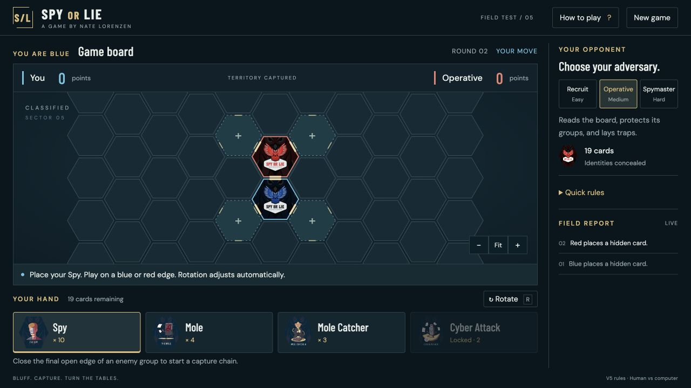

- **[三分天下 · 百将风云 / Three Kingdoms: Hundred Heroes](https://sanguo-jiangshan.vercel.app)** — वेई, शू या वू चुनकर 15 शहरों में बारी-बारी से चलने वाला क्षेत्रीय अभियान खेलें। सोना और अनाज सँभालें, अलग-अलग AI-निर्मित चित्रों वाले कुल 108 सेनापतियों का नेतृत्व करें और देश को एकजुट करने के लिए AI गुटों से मुकाबला करें।
  - रचनाकार: [MartinDelophy](https://github.com/MartinDelophy) (परियोजना शुरू करने वाले और प्रस्तुतकर्ता)।
  - प्लैटफ़ॉर्म: आधुनिक ब्राउज़र; चीनी इंटरफ़ेस, माउस और स्पर्श नियंत्रण। मुफ़्त, लॉगिन या API कुंजी की आवश्यकता नहीं; स्थानीय सेव फ़ाइलें आयात और निर्यात की जा सकती हैं।
  - GPT-6 Astra: [निर्माण का रिकॉर्ड](works/three-kingdoms/CREATION.md) — रचनाकार ने उपयोग की पुष्टि की है। Codex में कई चरणों के सहयोग से नियम, इंटरफ़ेस, AI, संतुलन और परीक्षण विकसित किए गए; भूभाग और सेनापतियों के चित्र छवि निर्माण उपकरणों से बनाए गए।
  - विकास संसाधन: [स्रोत कोड और चलाने के निर्देश](works/three-kingdoms/README.md) · [आवश्यकताएँ](works/three-kingdoms/PROMPTS.md) · तकनीक: React, TypeScript, Vinext/Vite.
  - पूर्वावलोकन: 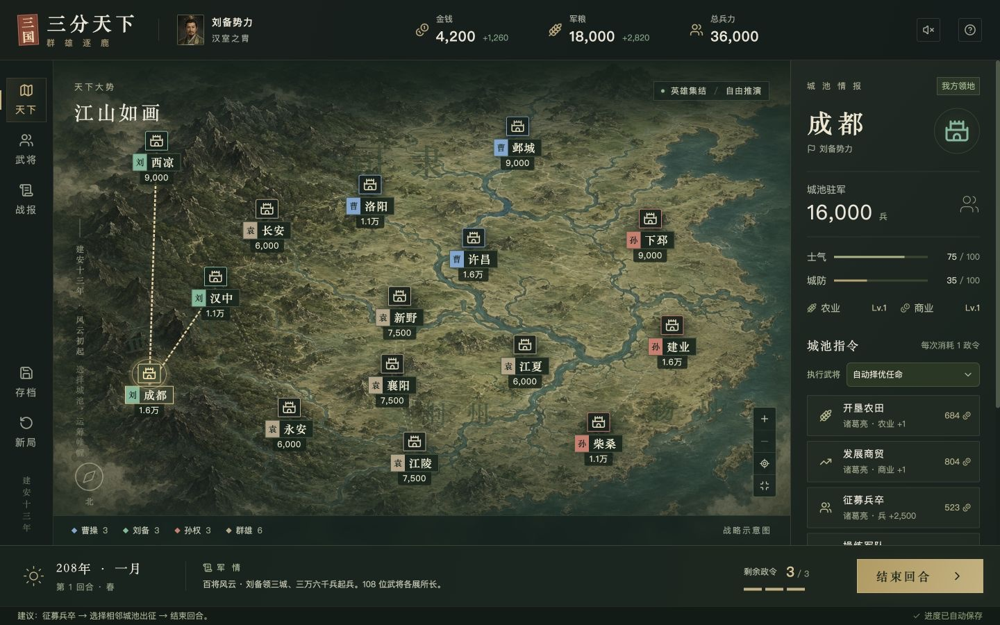

- **[Last Beacon / 最后的灯塔](https://last-beacon.loupengju.cc)** — एक छोटे द्वीप पर बिजली का नेटवर्क जोड़ें, टावर बनाएँ और उन्हें उन्नत करें। सीमित बिजली का सही बँटवारा करके दस लहरों और अंतिम बॉस से प्रकाशस्तंभ की रक्षा करें।
  - रचनाकार: [stackloomdev](https://github.com/stackloomdev)
  - प्लैटफ़ॉर्म: आधुनिक डेस्कटॉप और मोबाइल ब्राउज़र; चीनी और अंग्रेज़ी भाषाओं का समर्थन। मुफ़्त, लॉगिन या API कुंजी की ज़रूरत नहीं। वैकल्पिक ध्वनि के लिए Web Audio आवश्यक है।
  - GPT-6 Astra: [रचनाकार की विकास डायरी और मॉडल का योगदान](https://github.com/stackloomdev/last-beacon/blob/main/docs/CREATION.md) — गेम डिज़ाइन, कोड, प्रक्रियात्मक ग्राफ़िक्स और परीक्षणों में कई चरणों के दौरान उपयोग किया गया; यह एक ही अनुरोध से निर्माण का परीक्षण नहीं है।
  - विकास संसाधन: [स्रोत कोड और चलाने के निर्देश](https://github.com/stackloomdev/last-beacon) · [आवश्यकताएँ और क्रमिक सुधारों के नोट्स](https://github.com/stackloomdev/last-beacon/blob/main/docs/PROMPT.md) · तकनीक: JavaScript, Canvas 2D, Web Audio.
  - झलक: 

- **[缺氧 · 小小星球](https://hypoxia-6tu.pages.dev/)** — भूमिगत कॉलोनी का उत्तरजीविता सिमुलेशन: तीन निवासियों से खुदाई और निर्माण करवाएँ तथा ऑक्सीजन, भोजन और बिजली का प्रबंधन करें।
  - रचनाकार: dudu
  - प्लेटफ़ॉर्म: Canvas वाला ब्राउज़र, चीनी इंटरफ़ेस, माउस और कीबोर्ड; बिना लॉगिन या भुगतान के शुरू होना सत्यापित।
  - GPT-6 Astra: [Issue #28](https://github.com/MartinDelophy/awesome-gpt-6-astra/issues/28) — प्रस्तुतकर्ता के अनुसार पूरा विकास GPT-6 Astra के साथ हुआ; स्वतंत्र सत्यापन नहीं किया गया है।
  - पूर्वावलोकन: 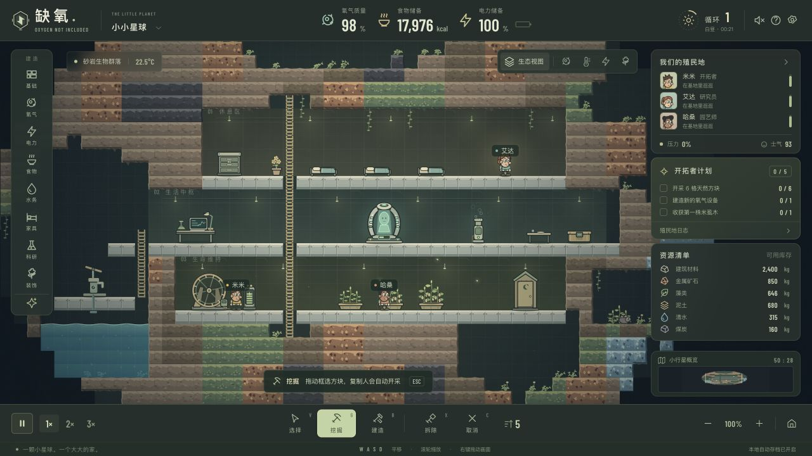

- **[魔塔 · 永夜之阶](https://ai.ywnet.xyz/work/mt.html)** — हमले और रक्षा की गणना, सीमित संसाधनों और तीन रंगों की चाबियों पर आधारित पंद्रह मंज़िला पिक्सेल टावर एडवेंचर।
  - रचनाकार: yw
  - प्लेटफ़ॉर्म: ब्राउज़र, चीनी इंटरफ़ेस; बिना लॉगिन या भुगतान के शुरू होना सत्यापित।
  - GPT-6 Astra: [Issue #38](https://github.com/MartinDelophy/awesome-gpt-6-astra/issues/38) — प्रस्तुतकर्ता ने GPT-6 Astra उपयोग अनुभाग में विकास प्रॉम्प्ट दिया है; मॉडल के सटीक योगदान का स्वतंत्र सत्यापन नहीं हुआ है।
  - पूर्वावलोकन: 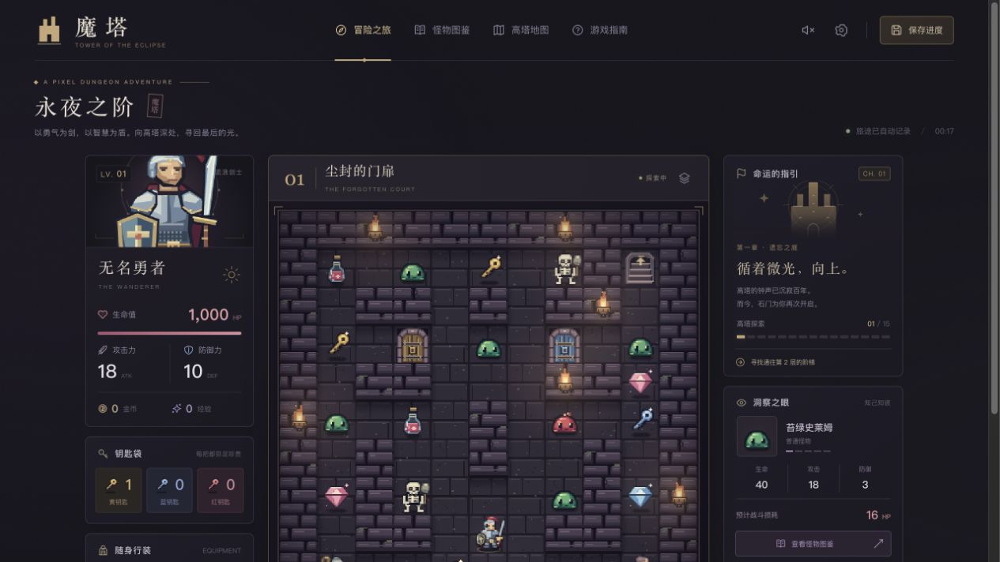

- **[永恒荒野](https://starve.pages.dev/)** — Don't Starve की पुनर्रचना के रूप में प्रस्तुत ब्राउज़र सर्वाइवल और रणनीति गेम। दिए गए स्क्रीनशॉट में जंगल की खोज, संसाधन जुटाना, सामान की सूची तथा स्वास्थ्य, भूख और मानसिक संतुलन के संकेतक दिखाई देते हैं।
  - रचनाकार: dudu
  - प्लैटफ़ॉर्म: ब्राउज़र; स्क्रीनशॉट में चीनी इंटरफ़ेस और कीबोर्ड नियंत्रण दिखते हैं। भुगतान और लॉगिन की शर्तें नहीं बताई गई हैं; डेमो की स्वतंत्र पुष्टि नहीं हुई है।
  - GPT-6 Astra: [प्रस्तुतकर्ता का कथन](https://github.com/MartinDelophy/awesome-gpt-6-astra/issues/26) — प्रस्तुतकर्ता के अनुसार पूरा विकास GPT-6 Astra ने किया है।
  - विकास संसाधन: सार्वजनिक स्रोत कोड या अलग विकास रिकॉर्ड नहीं दिया गया है।
  - झलक: 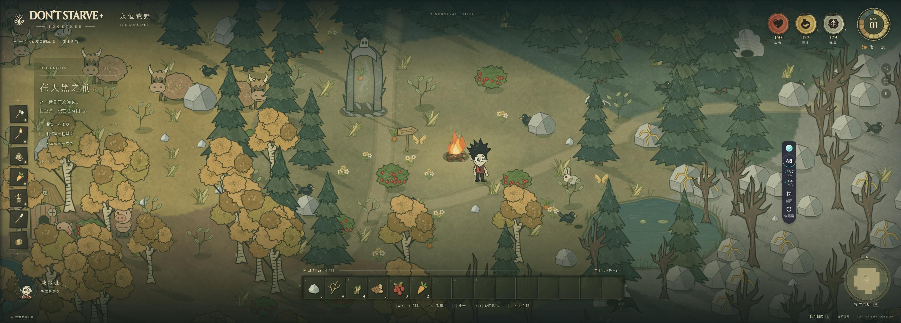

- **[潜水员戴夫 / Dave the Diver](https://dave-2cm.pages.dev/)** — Dave the Diver की ब्राउज़र में चलने वाली पुनर्रचना, जिसमें पानी के नीचे भाले से मछली पकड़ना, सुशी रेस्तराँ चलाना और द्वीप पर खेती करना शामिल है।
  - रचनाकार: dudu
  - प्लैटफ़ॉर्म: ब्राउज़र; चीनी इंटरफ़ेस, माउस और कीबोर्ड नियंत्रण। बिना लॉगिन या भुगतान के गेम खोलकर गोताखोरी शुरू करने की पुष्टि की गई।
  - GPT-6 Astra: [प्रस्तुतकर्ता का कथन](https://github.com/MartinDelophy/awesome-gpt-6-astra/issues/41) — प्रस्तुतकर्ता के अनुसार पूरा विकास GPT-6 Astra ने किया है।
  - विकास संसाधन: सार्वजनिक स्रोत कोड या अलग विकास रिकॉर्ड नहीं दिया गया है।
  - झलक: 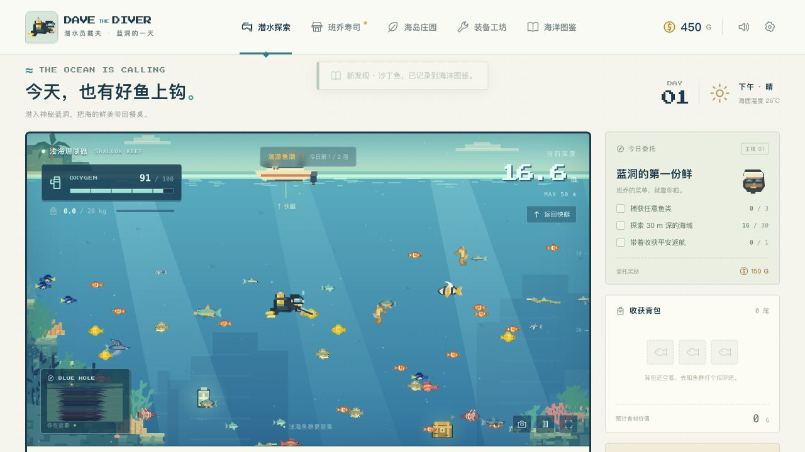

- **[No Moat](https://no-moat.petergyang.chatgpt.site/)** — स्टार्टअप थीम वाला कार्ड रॉगुलाइक: टीम बनाएँ और नकल करने वालों, बग तथा क्लाउड बिलों से लड़ें।
  - रचनाकार: [Peter Yang](https://x.com/petergyang)
  - प्लेटफ़ॉर्म: डेस्कटॉप ब्राउज़र; बिना लॉगिन या भुगतान के खोला गया। मोबाइल परीक्षण नहीं हुआ।
  - GPT-6 Astra: [X](https://x.com/petergyang/status/2096297378584375672) — लेखक ने इस परियोजना के विकास में Astra के उपयोग की जानकारी दी है। [जाँच विवरण (अंग्रेज़ी)](assets/screenshots/no-moat/SOURCE.md).
  - पूर्वावलोकन: 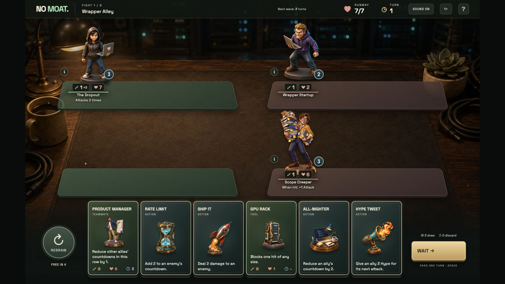

- **[The Free Game](https://vale-dos-vinhedos.lucas579686.chatgpt.site/)** — विस्तृत 3D मध्ययुगीन गाँव में सड़कें, कर्मचारी और उत्पादन शृंखलाएँ बनाएँ।
  - रचनाकार: [Lucas Marques, from Shiva](https://x.com/LucasMarquesSv)
  - प्लेटफ़ॉर्म: डेस्कटॉप ब्राउज़र; बिना लॉगिन या भुगतान के खोला गया। मोबाइल परीक्षण नहीं हुआ।
  - GPT-6 Astra: [X](https://x.com/LucasMarquesSv/status/2096772160404504583) — लेखक ने इस परियोजना के विकास में Astra के उपयोग की जानकारी दी है। [जाँच विवरण (अंग्रेज़ी)](assets/screenshots/the-free-game/SOURCE.md).
  - संसाधन: [GitHub](https://github.com/LucasMarquesShiva/the-free-game)
  - पूर्वावलोकन: 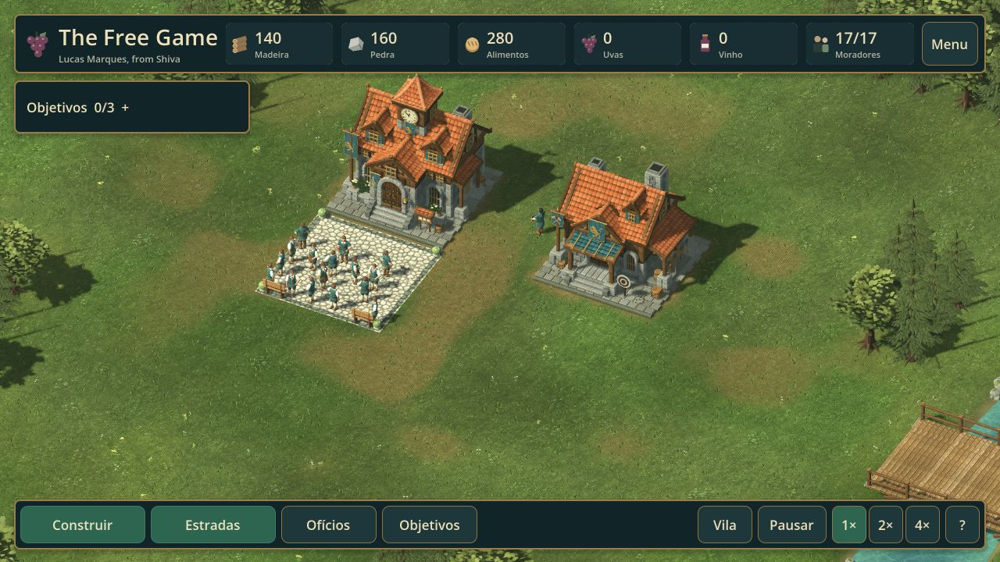

### RPG और रोमांच

भूमिका निभाना, खोजबीन, कहानी-आधारित रोमांच और इंटरैक्टिव कहानियाँ।

- **[Lumbridge / Elderwood Realms](https://elderwood-realms.rohannvarma.chatgpt.site/)** — साझा दुनिया, कौशल, संसाधन संग्रह और लड़ाई वाला रेट्रो मल्टीप्लेयर साहसिक खेल; अतिथि प्रवेश उपलब्ध है।
  - रचनाकार: [Rohan Varma](https://x.com/TheRohanVarma)
  - प्लेटफ़ॉर्म: डेस्कटॉप ब्राउज़र; बिना लॉगिन या भुगतान के खोला गया। मोबाइल परीक्षण नहीं हुआ।
  - GPT-6 Astra: [X](https://x.com/TheRohanVarma/status/2096744577332068549) — लेखक ने इस परियोजना के विकास में Astra के उपयोग की जानकारी दी है। [जाँच विवरण (अंग्रेज़ी)](assets/screenshots/lumbridge/SOURCE.md).
  - पूर्वावलोकन: 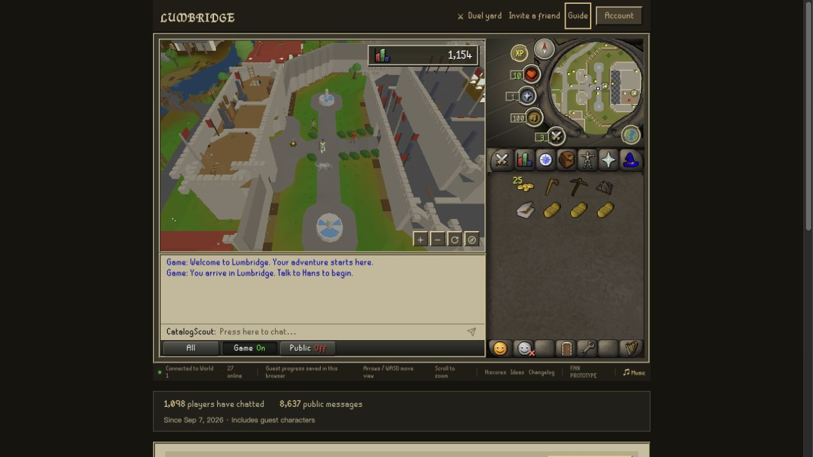

- **[Silent Meridian / 静默子午线](https://silent-meridian.stackloom.org/)** — चार अध्यायों और तेरह पहेलियों वाला रहस्यमय पॉइंट-एंड-क्लिक रोमांच: वर्तमान और उसकी प्रतिध्वनि के सुरागों की तुलना करें, सबूत जुटाएँ और 00:17 पर ठहरी वेधशाला का रहस्य सुलझाएँ।
  - रचनाकार: [stackloomdev](https://github.com/stackloomdev)
  - प्लैटफ़ॉर्म: डेस्कटॉप और मोबाइल ब्राउज़र; चीनी और अंग्रेज़ी। मुफ़्त में सीधे ऑनलाइन खेलें; लॉगिन, इंस्टॉलेशन या API कुंजी की ज़रूरत नहीं। WebGL प्रभाव वैकल्पिक हैं; समर्थन न होने पर मूल चित्र दिखाई देते हैं।
  - GPT-6 Astra: [विकास विवरण](https://github.com/stackloomdev/silent-meridian/blob/main/docs/CREATION.md) — Codex में कई चरणों के सहयोग से कहानी, पहेलियाँ, द्विभाषी पाठ, कोड, प्रोग्राम द्वारा बनाए गए 3D प्रभाव और परीक्षण तैयार किए गए।
  - संसाधन: [स्रोत और चलाने के निर्देश](https://github.com/stackloomdev/silent-meridian) · [चित्रों का स्रोत](https://github.com/stackloomdev/silent-meridian/blob/main/docs/ART.md) · तकनीक: JavaScript, WebGL, Web Audio.
  - झलक: 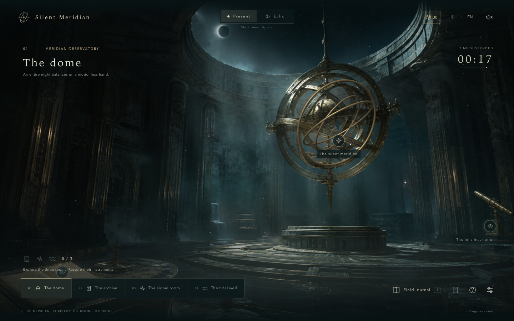

- **[热血归来 · 八荒幻世 / Mir176 Dragon Warrior](https://mir176-dragon-warrior.geekcatxx.chatgpt.site/)** — Legend से प्रेरित एक्शन RPG, जिसमें योद्धा, जादूगर और ताओवादी वर्ग, उपकरण, कालकोठरियाँ और स्वतः लड़ाई हैं।
  - रचनाकार: [知识猫AI实验室](https://x.com/GeekCatX)
  - प्लेटफ़ॉर्म: डेस्कटॉप ब्राउज़र; बिना लॉगिन या भुगतान के खोला गया। मोबाइल परीक्षण नहीं हुआ।
  - GPT-6 Astra: [X](https://x.com/GeekCatX/status/2097530887558865115) — लेखक ने इस परियोजना के विकास में Astra के उपयोग की जानकारी दी है। [जाँच विवरण (अंग्रेज़ी)](assets/screenshots/mir176/SOURCE.md).
  - पूर्वावलोकन: 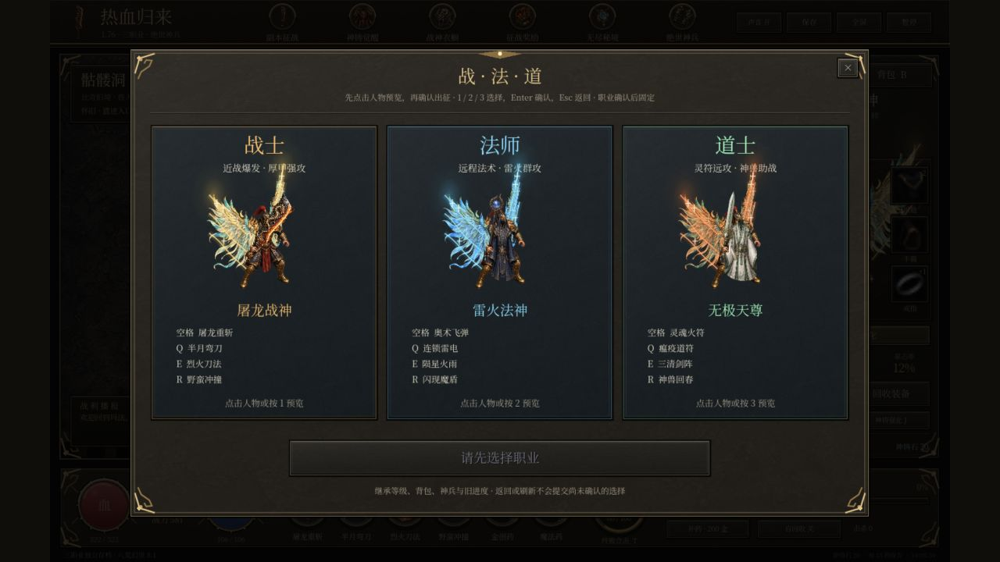

- **[Zork · The Great Underground Empire](https://zork-underground-empire.netlify.app/)** — Zork का अनौपचारिक 3D रूपांतरण, जिसमें प्रथम-व्यक्ति खोज, पहेलियाँ, लड़ाई और डायरी हैं।
  - रचनाकार: [Ethan Mollick](https://x.com/emollick)
  - प्लेटफ़ॉर्म: डेस्कटॉप ब्राउज़र; बिना लॉगिन या भुगतान के खोला गया। मोबाइल परीक्षण नहीं हुआ।
  - GPT-6 Astra: [X](https://x.com/emollick/status/2096047660662722620) — लेखक ने इस परियोजना के विकास में Astra के उपयोग की जानकारी दी है। [जाँच विवरण (अंग्रेज़ी)](assets/screenshots/zork/SOURCE.md).
  - पूर्वावलोकन: 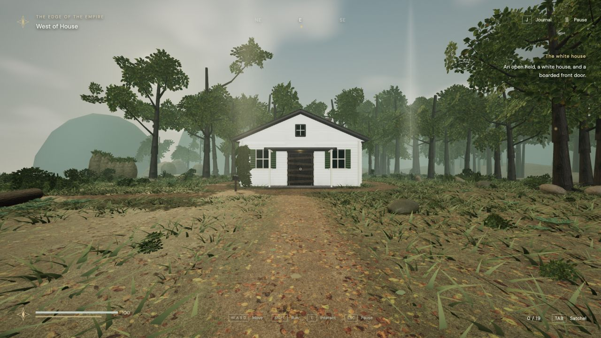

### प्लैटफ़ॉर्मर और रेसिंग

पार्कूर, प्लैटफ़ॉर्म की चुनौतियाँ, रेसिंग और गति व रास्तों पर आधारित गेम।

- **[STORM RACE](https://storm-race.vercel.app/)** — मिनी 4WD रेसिंग, जिसमें पुर्जों का विस्तृत गैराज दृश्य, बूस्ट और सूखी, बरसाती व तूफ़ानी ट्रैक स्थितियाँ हैं।
  - रचनाकार: [BubuAi](https://x.com/BubuStd)
  - प्लेटफ़ॉर्म: डेस्कटॉप ब्राउज़र; बिना लॉगिन या भुगतान के खोला गया। मोबाइल परीक्षण नहीं हुआ।
  - GPT-6 Astra: [X](https://x.com/BubuStd/status/2096587056755638553) — लेखक ने इस परियोजना के विकास में Astra के उपयोग की जानकारी दी है। [जाँच विवरण (अंग्रेज़ी)](assets/screenshots/storm-race/SOURCE.md).
  - पूर्वावलोकन: 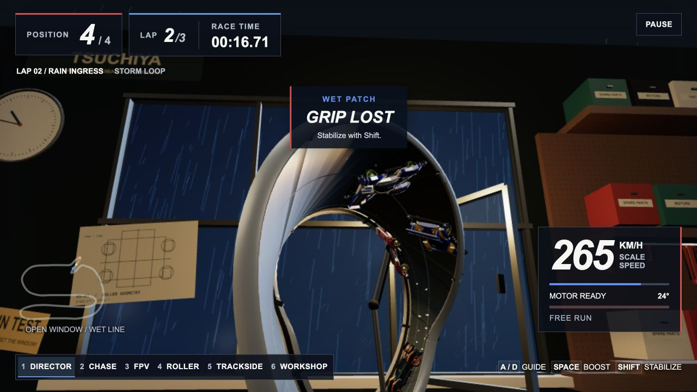

- **[FANG STARLIGHT RUN](https://fang-starlight-run.yosshy666.chatgpt.site/)** — भेड़िये को तीन चाँदनी स्तरों से ले जाएँ और डबल जंप व डैश से सिक्के और तारों के टुकड़े जुटाएँ।
  - रचनाकार: [FANGプラス最強伝説🐺](https://x.com/FANGsaikyou)
  - प्लेटफ़ॉर्म: डेस्कटॉप ब्राउज़र; बिना लॉगिन या भुगतान के खोला गया। मोबाइल परीक्षण नहीं हुआ।
  - GPT-6 Astra: [X](https://x.com/FANGsaikyou/status/2096192022596194588) — लेखक ने इस परियोजना के विकास में Astra के उपयोग की जानकारी दी है। [जाँच विवरण (अंग्रेज़ी)](assets/screenshots/fang-starlight-run/SOURCE.md).
  - पूर्वावलोकन: 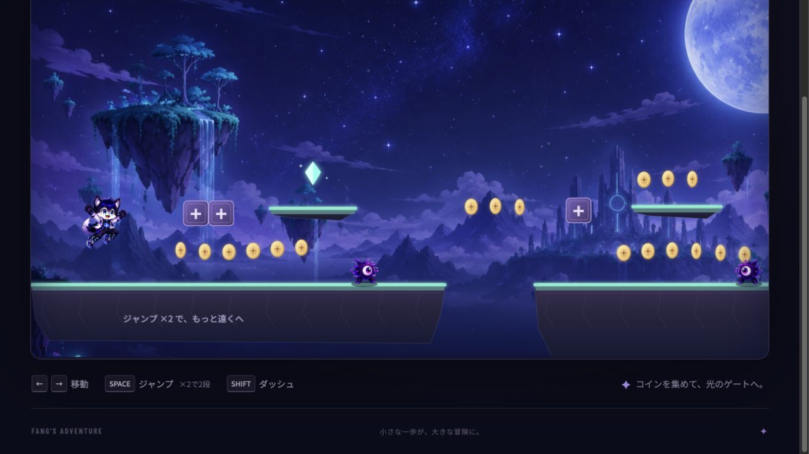

- **[Blue Bajaj Rally](https://bajaj.guzo.tech/)** — इथियोपिया से प्रेरित पहाड़ी सर्किट पर तीन पहियों वाली Bajaj चलाएँ और पाँच AI प्रतिद्वंद्वियों या घड़ी से मुकाबला करें।
  - रचनाकार: [Guzo Technologies](https://x.com/guzotech)
  - प्लेटफ़ॉर्म: डेस्कटॉप ब्राउज़र; बिना लॉगिन या भुगतान के खोला गया। मोबाइल परीक्षण नहीं हुआ।
  - GPT-6 Astra: [X](https://x.com/guzotech/status/2096209787864088638) — लेखक ने इस परियोजना के विकास में Astra के उपयोग की जानकारी दी है। [जाँच विवरण (अंग्रेज़ी)](assets/screenshots/blue-bajaj-rally/SOURCE.md).
  - पूर्वावलोकन: 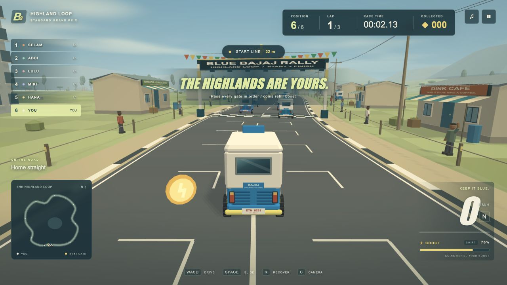

- **[APEX CLUB — Bay Kart Grand Prix](https://apex-club-racing.vercel.app)** — Bay Circuit पर तीन लैप की रेस लगाएँ, छह कार्ट में से चुनें और मोड़ से बाहर निकलते समय इस्तेमाल करने के लिए मिनी टर्बो चार्ज करें। व्यक्तिगत रैंकिंग में आगे बढ़ें या 4 बनाम 4 की टीम के लिए अंक जुटाएँ।
  - रचनाकार: Ryan
  - प्लैटफ़ॉर्म: WebGL 2 और कीबोर्ड वाला डेस्कटॉप ब्राउज़र; मुफ़्त, लॉगिन या API कुंजी की ज़रूरत नहीं। स्थानीय HTTP सर्वर या स्थिर होस्टिंग से चलता है; Three.js स्थानीय रूप से शामिल है। टीम रेस स्थानीय है: एक मानव खिलाड़ी और सात AI रेसर।
  - मॉडल की भागीदारी: [विकास का रिकॉर्ड](works/apex-club/CREATION.md) — Codex में गेमप्ले, कोड, प्रक्रियात्मक ग्राफ़िक्स और परीक्षणों पर कई चरणों में काम किया गया; GPT-6 Astra के उपयोग की पुष्टि अभी रचनाकार से होनी बाकी है।
  - विकास संसाधन: [स्रोत कोड और चलाने के निर्देश](works/apex-club/README.md) · [आवश्यकताएँ और क्रमिक सुधारों के नोट्स](works/apex-club/PROMPTS.md) · [साझा GPT बातचीत](https://chatgpt.com/s/cx_6a9e84c13c9c8191bcb7ad0801288adc) · तकनीक: JavaScript, Three.js.
  - झलक: 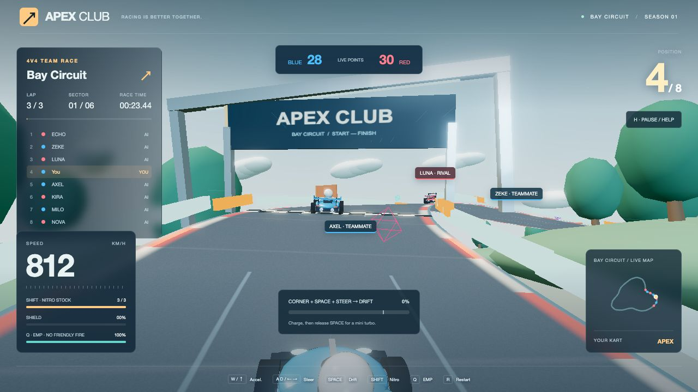

- **[PELICAN PEDAL / 鹈鹕踏浪](https://pelican-pedal.zecoba.workers.dev/)** — बदलते 3D समुद्री तट पर साइकिल चलाते पेलिकन के साथ दौड़ें: तीन लेन के बीच बदलें, कूदकर या झुककर बाधाओं से बचें, लगातार मछलियाँ इकट्ठी करें और ढाल, चुंबक तथा छह सेकंड की अजेय तेज़ दौड़ का इस्तेमाल करें।
  - रचनाकार: [chat01.ai](https://chat01.ai) (प्रस्तुति में दिया गया रचनाकार)।
  - प्लैटफ़ॉर्म: कंप्यूटर और मोबाइल ब्राउज़र, कीबोर्ड या स्पर्श नियंत्रण के साथ; प्रस्तुति के अनुसार मुफ़्त और बिना लॉगिन। डेमो की स्वतंत्र पुष्टि नहीं हुई है।
  - GPT-6 Astra: [Issue #10](https://github.com/MartinDelophy/awesome-gpt-6-astra/issues/10) — प्रस्तुतकर्ता के अनुसार गेम एक ही प्रॉम्प्ट से बनाया गया है; लिंक किए गए विकास रिकॉर्ड की स्वतंत्र पुष्टि नहीं हुई है।
  - विकास संसाधन: [साझा किया गया विकास रिकॉर्ड](https://chat01.ai/zh/chat/01M1VJ5K55803V2YK3T2NKTX33)
  - झलक: 

- **[狂飙赛车 · OVERDRIVE](https://gpt-kbsc.0nz.de/)** — पाँच AI प्रतिद्वंद्वियों के साथ 3D रेसिंग; कार और ट्रैक चयन, टाइम ट्रायल, ड्रिफ्ट और नाइट्रो उपलब्ध हैं।
  - रचनाकार: zding
  - प्लेटफ़ॉर्म: ब्राउज़र, चीनी इंटरफ़ेस; बिना लॉगिन या भुगतान के शुरू होना सत्यापित।
  - GPT-6 Astra: GPT-6 Astra के उपयोग और योगदान की निर्माता से पुष्टि बाकी है।
  - पूर्वावलोकन: 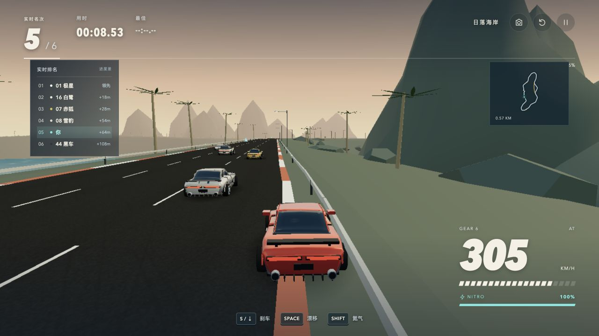

- **[零界深潜 / ABYSS PROTOCOL](https://abyss-descent.zecoba.workers.dev/)** — केवल बाएँ-दाएँ चलकर 3D कुएँ में उतरें। हिलते, टूटते और गायब होते प्लेटफ़ॉर्म पार करें, लेज़र और आरी से बचें तथा क्रिस्टल और जीवनरक्षक चिप इकट्ठा करें।
  - रचनाकार: [chat01.ai](https://linux.do/u/bandaot)
  - प्लेटफ़ॉर्म: डेस्कटॉप ब्राउज़र, चीनी इंटरफ़ेस, A/D या तीर कुंजियाँ। बिना खाते या भुगतान के शुरुआत जाँची गई; मोबाइल पर परीक्षण नहीं हुआ।
  - Codex: [Chat01](https://chat01.ai/en/chat/01M221KFTPTBQV5ARQWJM7P86Y) — साझा रिकॉर्ड में GPT-6 Pro लिखा है और खेल का निर्माण तथा कई दौर के संशोधन दर्ज हैं; GPT-6 Astra स्पष्ट रूप से नहीं लिखा है।
  - संसाधन: [HTML](https://files.chat01.ai/python-generations/9ab8f4f7-425f-4709-b741-7218d87122e6/abyss-descent.html) · [ZIP](https://files.chat01.ai/python-generations/9ab8f4f7-425f-4709-b741-7218d87122e6/abyss-descent-complete.zip)
  - पूर्वावलोकन: 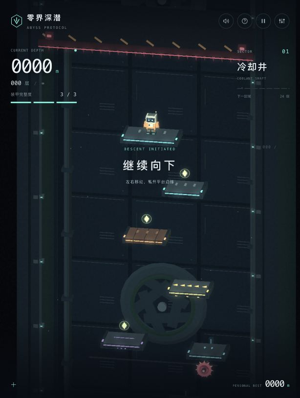

- **[疾风赛道 / Kart Racing（跑跑卡丁车）](https://qwen3-8-test.vercel.app/)** — ड्रिफ्ट, नाइट्रो और आइटम के साथ तीन लैप की दौड़; वर्तमान नाम 疾风赛道 है और 2–4 खिलाड़ियों का ऑनलाइन मोड भी है।
  - रचनाकार: [SteveZhang / jay6697117](https://github.com/jay6697117) · [X](https://x.com/stevezh10058543)
  - प्लेटफ़ॉर्म: ब्राउज़र, मुफ़्त, बिना खाते के। निर्माता के अनुसार VPN/प्रॉक्सी आवश्यक हो सकता है। सोलो शुरुआत जाँची गई; मल्टीप्लेयर नहीं।
  - GPT-6 Astra: [Issue #51](https://github.com/MartinDelophy/awesome-gpt-6-astra/issues/51) — निर्माता के अनुसार: पहला संस्करण Qwen3.8 Max से; दूसरा Astra से पूरी तरह पुनर्निर्मित।
  - पूर्वावलोकन: 

### प्रयोगात्मक और मल्टीप्लेयर

अनोखे खेल-तंत्र, ऑनलाइन प्रतियोगिता और मिलकर खेलने के अनुभव।

- **[ASTRA Arcade](https://astra-arcade.antonioleivag.chatgpt.site/)** — पहाड़ी रैली, स्नोबोर्ड और गुरुत्व-विरोधी रेस सहित छह ब्राउज़र खेल; पूरे संग्रह को एक प्रविष्टि माना गया है।
  - रचनाकार: [Antonio Leiva](https://x.com/antonioleivag)
  - प्लेटफ़ॉर्म: डेस्कटॉप ब्राउज़र; बिना लॉगिन या भुगतान के खोला गया। मोबाइल परीक्षण नहीं हुआ।
  - GPT-6 Astra: [X](https://x.com/antonioleivag/status/2096509898481651770) — लेखक ने इस परियोजना के विकास में Astra के उपयोग की जानकारी दी है। [जाँच विवरण (अंग्रेज़ी)](assets/screenshots/astra-arcade/SOURCE.md).
  - पूर्वावलोकन: 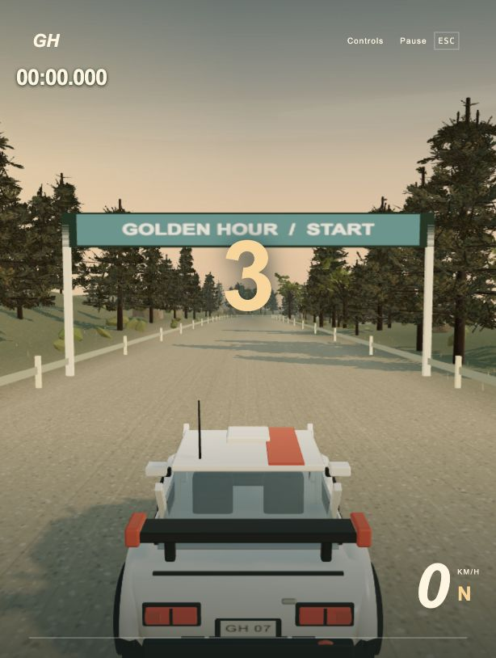

- **[Chao Party](https://chao.party/)** — Chao Garden का अनौपचारिक मल्टीप्लेयर प्रशंसक खेल: Sonic पात्र चुनें और बगीचे में Chao से बातचीत करें।
  - रचनाकार: [Hank](https://x.com/h4nkdog)
  - प्लेटफ़ॉर्म: डेस्कटॉप ब्राउज़र; बिना लॉगिन या भुगतान के खोला गया। मोबाइल परीक्षण नहीं हुआ।
  - GPT-6 Astra: [X](https://x.com/h4nkdog/status/2097308970431987857) — लेखक ने इस परियोजना के विकास में Astra के उपयोग की जानकारी दी है। [जाँच विवरण (अंग्रेज़ी)](assets/screenshots/chao-party/SOURCE.md).
  - पूर्वावलोकन: 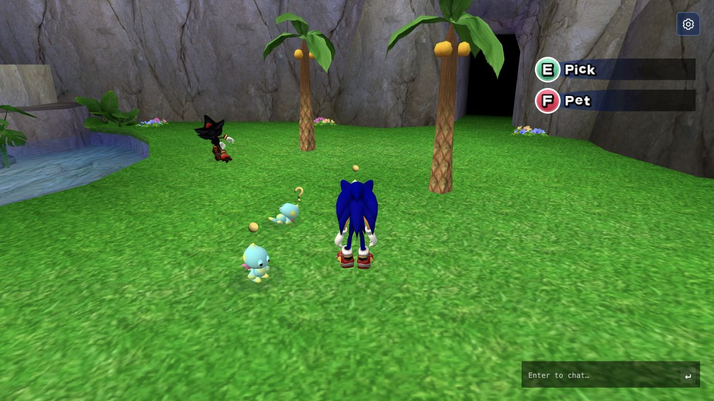

- **[ORBITAL GARDEN · 轨道花园](https://orbital-garden-one.vercel.app)** — कणों से कला बनाने वाला इंटरैक्टिव सैंडबॉक्स: 48,000 प्रकाश बिंदुओं को फूल, गुरुत्वीय छल्ले और आकाशगंगा के बीच बदलें, आकृति को प्रभावित करें और किसी पल को पोस्टर के रूप में निर्यात करें।
  - रचनाकार: [jackroc](https://github.com/jackroc)
  - प्लैटफ़ॉर्म: WebGL समर्थित आधुनिक ब्राउज़र; ऑनलाइन आज़माने के लिए शीर्षक पर क्लिक करें। मुफ़्त, लॉगिन या API कुंजी की ज़रूरत नहीं; स्वतंत्र HTML फ़ाइल ऑफ़लाइन भी चलती है। वैकल्पिक परिवेशी ध्वनि के लिए Web Audio आवश्यक है।
  - GPT-6 Astra: [निर्माण का रिकॉर्ड और मॉडल का योगदान](works/orbital-garden/README.md#模型与创作记录) — रचनाकार ने अवधारणा, कोड और पाठ के लिए GPT-6 Astra ultra का उपयोग किया और सहयोगी समीक्षा की; यह एक ही अनुरोध से निर्माण का परीक्षण नहीं है।
  - विकास संसाधन: [स्रोत कोड और चलाने के निर्देश](works/orbital-garden/README.md) · [स्वतंत्र HTML फ़ाइल](works/orbital-garden/index.html) · [Prompt](works/orbital-garden/PROMPT.md) · तकनीक: WebGL (बिना फ़्रेमवर्क), Web Audio, Canvas 2D.
  - पूर्वावलोकन: 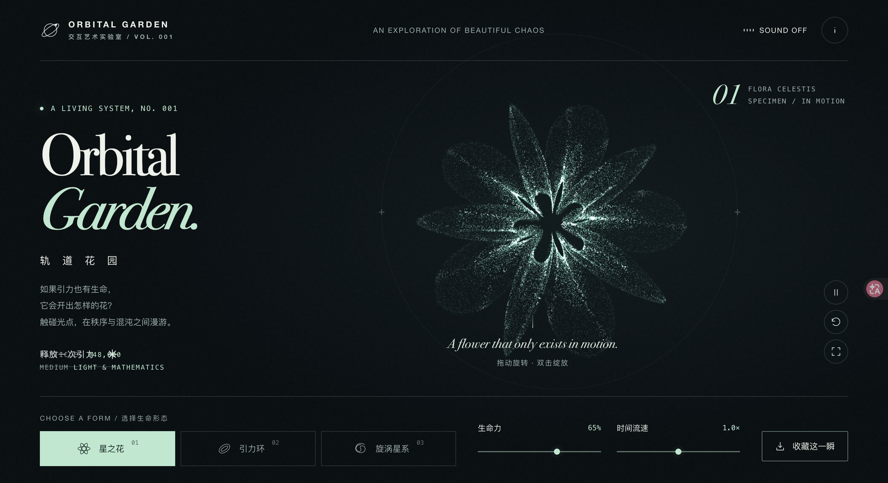

- **[Toy2Game / 在线玩具箱](https://games.asmo.top/)** — टेबलटॉप खिलौनों से बने चार 3D गेम: पेंगुइन के नीचे की बर्फ तोड़ें, खरगोशों को जालों से पार कराएँ, प्लेटफ़ॉर्म पर अंतरिक्ष यात्रियों का संतुलन बनाएँ और पार्किंग से बाहर निकलने की पहेलियाँ हल करें।
  - रचनाकार: [asmoyou](https://github.com/asmoyou)
  - प्लैटफ़ॉर्म: कंप्यूटर, टैबलेट और मोबाइल ब्राउज़र; मुफ़्त, बिना लॉगिन। एक ही स्क्रीन पर बारी-बारी से 2–4 स्थानों पर खेल सकते हैं, जिनमें कंप्यूटर प्रतिद्वंद्वी भी हो सकते हैं; एकल पहेलियाँ भी हैं। ऑनलाइन मल्टीप्लेयर नहीं है। डेमो की स्वतंत्र पुष्टि नहीं हुई है।
  - GPT-6 Astra: [रचनाकार का कथन](https://github.com/MartinDelophy/awesome-gpt-6-astra/issues/24) — रचनाकार के अनुसार, खिलौनों के विवरण और सुविधाओं की आवश्यकताओं से GPT-6 Astra ने अपने आप गेम बनाए और उनका परीक्षण किया।
  - विकास संसाधन: [स्रोत कोड और चलाने के निर्देश](https://github.com/asmoyou/toy2game) · [गैर-व्यावसायिक लाइसेंस](https://github.com/asmoyou/toy2game/blob/main/LICENSE) — स्रोत कोड उपलब्ध है; गैर-व्यावसायिक उपयोग मुफ़्त है और व्यावसायिक उपयोग के लिए लेखक की पूर्व लिखित अनुमति आवश्यक है। तकनीक: TypeScript, React, Vite, Three.js.
  - झलक: 

- **[Jelly Baby](https://jelly.scottsun.io/)** — धूप वाली लकड़ी की मेज़ पर भौतिकी का खेल: जेली को उछालें, खींचें और झूले व ट्रैम्पोलिन पर खेलें।
  - रचनाकार: [Scott](https://x.com/scottstts)
  - प्लेटफ़ॉर्म: डेस्कटॉप ब्राउज़र; बिना लॉगिन या भुगतान के खोला गया। मोबाइल परीक्षण नहीं हुआ।
  - GPT-6 Astra: [X](https://x.com/scottstts/status/2096364764054131119) — लेखक ने इस परियोजना के विकास में Astra के उपयोग की जानकारी दी है। [जाँच विवरण (अंग्रेज़ी)](assets/screenshots/jelly-baby/SOURCE.md).
  - संसाधन: [GitHub](https://github.com/scottstts/Jelly-Baby)
  - पूर्वावलोकन: 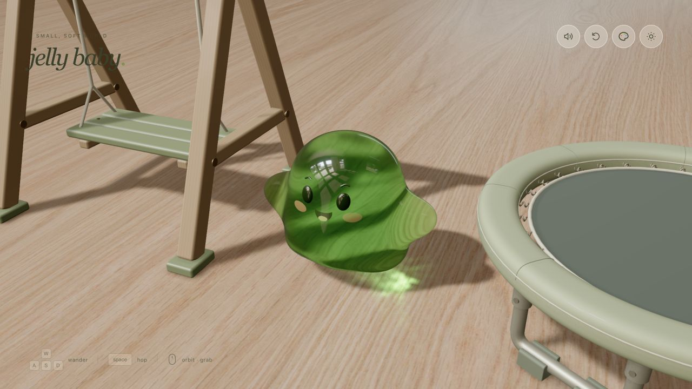

- **[泡泡坦克大作战联机版 / Toon Tank Arena](https://toon-tank-arena.jay6697117.deno.net/)** — उछलते गोलों और पावर-अप से इंद्रधनुषी कोर बचाएँ; सोलो, स्थानीय सहयोग और ऑनलाइन मुकाबले उपलब्ध हैं।
  - रचनाकार: [SteveZhang / jay6697117](https://github.com/jay6697117) · [X](https://x.com/stevezh10058543)
  - प्लेटफ़ॉर्म: ब्राउज़र, मुफ़्त, बिना खाते के। निर्माता के अनुसार VPN/प्रॉक्सी आवश्यक हो सकता है। सोलो शुरुआत जाँची गई; मल्टीप्लेयर नहीं।
  - GPT-6 Astra: [Issue #52](https://github.com/MartinDelophy/awesome-gpt-6-astra/issues/52) — निर्माता के अनुसार: पहला संस्करण GPT-6 Astra Pro से; बाद के सुधार Codex में GPT-6 Astra से।
  - पूर्वावलोकन: 

## हर प्रविष्टि में क्या शामिल है

एक उपयोगी सिफ़ारिश से आसानी से समझ आना चाहिए कि गेम क्या है, कहाँ आज़माया जा सकता है और इस सूची में क्यों है।

| जानकारी | क्या शामिल करें |
| --- | --- |
| गेम और रचनाकार | गेम का नाम और मूल रचनाकार या टीम का लिंक |
| इसमें क्या दिलचस्प है | बिना खोखले प्रचार के मुख्य खेल-तंत्र पर एक वाक्य |
| पहुँच | खेलने योग्य लिंक या चलाने के निर्देशों सहित सार्वजनिक स्रोत कोड रिपॉज़िटरी |
| गेमप्ले का स्क्रीनशॉट | कम से कम एक वास्तविक गेमप्ले स्क्रीनशॉट और सार्वजनिक रूप से उपलब्ध चित्र का URL |
| प्लैटफ़ॉर्म और आवश्यकताएँ | ब्राउज़र / डेस्कटॉप / मोबाइल; भुगतान, लॉगिन या विशेष हार्डवेयर की आवश्यकता स्पष्ट करें |
| Astra की भूमिका | GPT-6 Astra के योगदान को समझाने वाला रचनाकार का कथन, विकास डायरी या सार्वजनिक रिकॉर्ड |
| विकास संसाधन | उपलब्ध स्रोत कोड, तकनीक और निर्माण की कहानी |

मॉडल के उपयोग की जानकारी रचनाकार के सार्वजनिक विवरण के आधार पर दी जाती है; बिना प्रमाण के दावों को पुष्ट तथ्य नहीं माना जाता। खेलने योग्य प्रोटोटाइप का स्वागत है और स्रोत कोड सार्वजनिक करना वैकल्पिक है।

## सूची बनाए रखने में मदद करें

[Issue के माध्यम से गेम भेजें](https://github.com/MartinDelophy/awesome-gpt-6-astra/issues/new?template=submit-game.yml) या Pull Request खोलें। प्रविष्टि का प्रारूप [योगदान मार्गदर्शिका](CONTRIBUTING.md) में देखें।

लेखक को श्रेय देने की गलतियों, पहुँच की शर्तों में बदलाव, टूटे लिंक या अन्य गलत जानकारी की [रिपोर्ट करें](https://github.com/MartinDelophy/awesome-gpt-6-astra/issues/new?template=broken-link.yml)।

## लाइसेंस

इस रिपॉज़िटरी में सूची के मूल पाठ और मूल दृश्य सामग्री को [CC0 1.0](LICENSE) के अंतर्गत सार्वजनिक डोमेन को समर्पित किया गया है। लिंक किए गए गेम, कोड, चित्र, ट्रेडमार्क और अन्य तृतीय-पक्ष सामग्री अपने संबंधित लाइसेंस और अधिकार बनाए रखते हैं। किसी प्रोजेक्ट को सूची में शामिल करने से उसकी उपयोग अनुमतियाँ नहीं बदलतीं।
