

# Awesome GPT-6 Astra

  

**GPT-6 Astra से बनाए गए दिलचस्प गेमों का संग्रह।**

मज़ेदार विचार, आज़माने लायक गेम और अगले रचनाकार को प्रेरित करने वाली विकास की कहानियाँ।

[English](README.md) · [简体中文](README.zh-CN.md) · [日本語](README.ja.md) · [한국어](README.ko.md) 
[Français](README.fr.md) · [Deutsch](README.de.md) · [Español](README.es.md) · [Português (Brasil)](README.pt-BR.md) 
[Русский](README.ru.md) · [العربية](README.ar.md) · **हिन्दी** · [Bahasa Indonesia](README.id.md)

[गेम सुझाएँ](https://github.com/MartinDelophy/awesome-gpt-6-astra/issues/new?template=submit-game.yml) · [योगदान दें](CONTRIBUTING.md)

यह पेज [अंग्रेज़ी README](README.md) का अनुवाद है। नवीनतम बदलावों के लिए मूल संस्करण देखें; अनुवाद में सुधारों का स्वागत है।

## यहाँ से शुरू करें

यहाँ **86 खेल और इंटरैक्टिव परियोजनाएँ** शामिल हैं: तीन राज्यों की क्षेत्रीय रणनीति, एक-दूसरे में फँसे लकड़ी के टुकड़ों और खिसकने वाले ब्लॉकों की पहेलियाँ, मुलायम फलों को मिलाना, प्रक्रियात्मक शहर निर्माण वाला 2048, एक बटन से उड़ान, जादुई कालीन पर लड़ाई, पाँच स्तरों वाला बुलेट-हेल शूटर, बिजली के नेटवर्क से द्वीप की रक्षा, जंगल में जीवित रहना, पानी के नीचे मछली पकड़ना, सुशी रेस्तराँ चलाना और द्वीप पर खेती करना, Bay Circuit पर कार्ट रेसिंग, पेलिकन के साथ तट पर साइकिल चलाना, टेबलटॉप खिलौनों के 3D रूपांतरण, 3D घर की सजावट और Orbital Garden। किसी शीर्षक पर क्लिक करके सीधे ब्राउज़र में गेम खेलें।

सूची अपडेट: **2026-09-12**। मॉडल के उपयोग की जानकारी रचनाकारों या प्रस्तुतकर्ताओं के कथनों पर आधारित है; अपुष्ट विवरण संबंधित प्रविष्टियों में चिह्नित हैं। यह तारीख सूची के रखरखाव की है, सभी गेमों के दोबारा परीक्षण की नहीं।

- **खेलने के लिए कुछ ढूँढ़ रहे हैं?** नीचे दी गई श्रेणियाँ देखें।
- **आपने कोई गेम बनाया है?** [अपना प्रोजेक्ट भेजें](https://github.com/MartinDelophy/awesome-gpt-6-astra/issues/new?template=submit-game.yml) और साथ में सीधे ब्राउज़र में खेलने का लिंक, वास्तविक गेमप्ले का स्क्रीनशॉट और GPT-6 Astra के उपयोग का विवरण दें।
- **कोई अच्छा प्रोजेक्ट मिला?** दूसरे लोगों के सार्वजनिक काम सुझाएँ और मूल रचनाकार को श्रेय दें।

यह सूची समुदाय द्वारा संचालित है और OpenAI से संबद्ध नहीं है। किसी प्रोजेक्ट का शामिल होना उसे आज़माने का निमंत्रण है, प्रदर्शन का मूल्यांकन या आधिकारिक सिफ़ारिश नहीं।

## गेम

- [एक्शन और आर्केड](#action-arcade)
- [पहेलियाँ और दिमागी खेल](#puzzles)
- [रणनीति और सिमुलेशन](#strategy-simulation)
- [RPG और रोमांच](#rpg-adventures)
- [प्लैटफ़ॉर्मर और रेसिंग](#platformers-racing)
- [प्रयोगात्मक और मल्टीप्लेयर](#experimental-multiplayer)

### एक्शन और आर्केड

शूटिंग, लड़ाई, जीवित रहने की चुनौती, लय-आधारित गेम और ऐसे खेल जिन्हें एक बार और खेलने का मन करे।

- **[Mosswing](https://mosswing-quiet-flight.jack-514.chatgpt.site/)** — एक बटन से पंख फड़फड़ाकर उड़ने वाला 3D गेम। बाधाओं के बीच से निकलें और अपना स्कोर बढ़ाएँ।
  - रचनाकार: [Ayi1337](https://github.com/Ayi1337)
  - प्लैटफ़ॉर्म: ब्राउज़र; मोबाइल के लिए डिज़ाइन किया गया है।
  - GPT-6 Astra: [रचनाकार के एक ही अनुरोध से निर्माण के परीक्षण और मूल प्रॉम्प्ट](https://github.com/Ayi1337/gpt6-astra-one-shot-games/blob/main/README.md).
  - विकास संसाधन: [स्रोत कोड](https://github.com/Ayi1337/gpt6-astra-one-shot-games/tree/main/mosswing/src) · [स्वतंत्र HTML फ़ाइल](https://github.com/Ayi1337/gpt6-astra-one-shot-games/blob/main/mosswing/mosswing.html)
  - पूर्वावलोकन: 

- **[Stadium Elite — El Clásico](https://stadium-elite.mindblown.ai/)** — 3D स्टेडियम में बार्सिलोना और रियल मैड्रिड का 11 बनाम 11 फुटबॉल मैच खेलें; पास दें, शॉट लगाएँ और खिलाड़ी बदलें।
  - निर्माता: [Mindblown / @mind](https://mindblown.ai/@mind)
  - प्लेटफ़ॉर्म: डेस्कटॉप ब्राउज़र; कीबोर्ड और माउस, लॉगिन आवश्यक नहीं।
  - GPT-6 Astra: [सत्यापन विवरण](assets/screenshots/stadium-elite/SOURCE.md) — दिए गए Mindblown पोस्ट में Three.js और GPT-6 Astra का उल्लेख है।
  - पूर्वावलोकन: 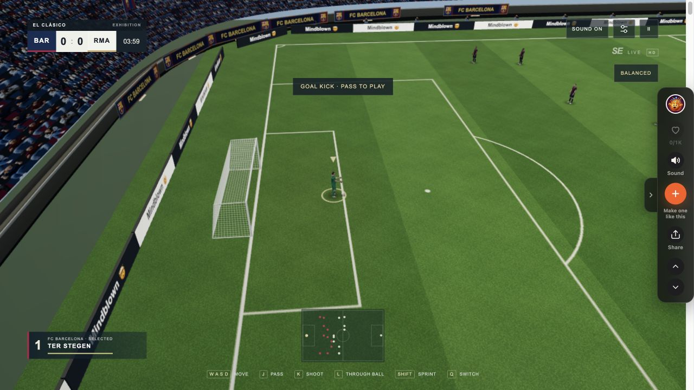

- **[Magic Carpet Wizard — A Thousand Skies](https://threapchills.github.io/MagicCarpetWizard/)** — जादुई कालीन पर गोलाकार दुनिया में उड़ें, छल्लों से गुज़रें, जादू करें और दुश्मनों व बॉस से लड़ें।
  - रचनाकार: [threapchills](https://github.com/threapchills)
  - प्लैटफ़ॉर्म: माउस और कीबोर्ड वाला डेस्कटॉप ब्राउज़र; WebGL 2 आवश्यक है।
  - GPT-6 Astra: रचनाकार ने [रिपॉज़िटरी के About खंड](https://github.com/threapchills/MagicCarpetWizard) में बताया है कि गेम GPT-6 Astra से बनाया गया है।
  - विकास संसाधन: [स्रोत कोड और चलाने के निर्देश](https://github.com/threapchills/MagicCarpetWizard) · तकनीक: Three.js, Vite.
  - पूर्वावलोकन: 

- **[THUNDERFALL / 雷霆战机 · 天穹远征](https://thunderfall.vercel.app/)** — तीन लड़ाकू विमानों, पाँच क्षेत्रों, कई चरणों वाले बॉस और स्वचालित गोलीबारी वाला बुलेट-हेल गेम।
  - रचनाकार: [jackroc](https://github.com/jackroc)
  - GPT-6 Astra: [README](works/thunderfall/README.md#创作与许可) — रचनाकार के अनुसार GPT-6 Astra ultra से बनाकर कई चरणों में सुधार किया गया।
  - [README](works/thunderfall/README.md) · [Prompt](works/thunderfall/PROMPT.md) · JavaScript, Canvas 2D, Web Audio.
  - पूर्वावलोकन: 

- **[IRON BASTION / 钢铁防线](https://iron-bastion.zecoba.workers.dev/)** — छह 3D क्षेत्रों में दुश्मन टैंकों की लहरों से सिग्नल टावर की रक्षा करें। ईंट की दीवारें तोड़ें और तेज़ छलाँग तथा विद्युतचुंबकीय पल्स का इस्तेमाल करें।
  - रचनाकार: [chat01.ai](https://linux.do/u/bandaot)
  - प्लेटफ़ॉर्म: WebGL 2 समर्थित ब्राउज़र, चीनी इंटरफ़ेस; निर्देशों में कीबोर्ड, माउस और टच नियंत्रण दिए गए हैं। बिना लॉगिन या भुगतान के लड़ाई शुरू की गई।
  - GPT-6 Astra: GPT-6 Astra के उपयोग और योगदान की निर्माता से पुष्टि बाकी है।
  - पूर्वावलोकन: 

- **[Stick Fighter](https://stick-fighter-production.up.railway.app/)** — विकासाधीन स्टिक-फिगर लड़ाई का खेल, जिसमें मुक्के, किक, अपरकट, निंजा स्टार और पैरी हैं; बॉट अभ्यास तथा ऑनलाइन और दोस्तों के साथ खेलने के मेनू उपलब्ध हैं।
  - रचनाकार: [Dwayne](https://x.com/CtrlAltDwayne)
  - प्लेटफ़ॉर्म: डेस्कटॉप ब्राउज़र, कीबोर्ड; बॉट अभ्यास बिना लॉगिन उपलब्ध है। ऑनलाइन मल्टीप्लेयर और कंट्रोलर का स्वतंत्र परीक्षण नहीं हुआ।
  - GPT-6 Astra: [X](https://x.com/CtrlAltDwayne/status/2097499157967818780) — लेखक स्पष्ट रूप से कहते हैं कि यह मल्टीप्लेयर लड़ाई का खेल GPT-6 Astra से बनाया गया है और अभी विकासाधीन है।
  - पूर्वावलोकन: 

- **[Gogh Strike · Paint Clash](https://gogh-strike.surge.sh/)** — वैन गॉग से प्रेरित प्रथम-व्यक्ति पेंट मुकाबला, छह कलाकारों, विशेष हथियारों और पहले 20 अंक तक पहुँचने के लक्ष्य के साथ।
  - रचनाकार: [Peter Gostev](https://x.com/petergostev)
  - प्लेटफ़ॉर्म: डेस्कटॉप ब्राउज़र; बिना लॉगिन या भुगतान के खोला गया। मोबाइल परीक्षण नहीं हुआ।
  - GPT-6 Astra: [X](https://x.com/petergostev/status/2096015315209449578) — लेखक ने इस परियोजना के विकास में Astra के उपयोग की जानकारी दी है। [जाँच विवरण (अंग्रेज़ी)](assets/screenshots/gogh-strike/SOURCE.md).
  - पूर्वावलोकन: 

- **[ASTEROIDS · Deepfield](https://asteroids-deepfield-cockpit.dan200200.chatgpt.site/)** — चार कैमरे, रडार, दो तोपें और जड़त्वीय उड़ान वाला Asteroids-शैली का कॉकपिट खेल।
  - रचनाकार: [Eyes Wide Open](https://x.com/DantesClown)
  - प्लेटफ़ॉर्म: डेस्कटॉप ब्राउज़र; बिना लॉगिन या भुगतान के खोला गया। मोबाइल परीक्षण नहीं हुआ।
  - GPT-6 Astra: [X](https://x.com/DantesClown/status/2096085439052452064) — लेखक ने इस परियोजना के विकास में Astra के उपयोग की जानकारी दी है। [जाँच विवरण (अंग्रेज़ी)](assets/screenshots/asteroids-deepfield/SOURCE.md).
  - पूर्वावलोकन: 

- **[BLACKWATER · Silent Harbor](https://blackwater-roan.vercel.app/)** — बरसाती मालवाहक टर्मिनल में सामरिक FPS, जिसमें विस्तृत राइफल, युद्ध HUD और नौ दुश्मन हैं।
  - रचनाकार: [hiraeth](https://x.com/WoahWurdz)
  - प्लेटफ़ॉर्म: डेस्कटॉप ब्राउज़र; बिना लॉगिन या भुगतान के खोला गया। मोबाइल परीक्षण नहीं हुआ।
  - GPT-6 Astra: [X](https://x.com/WoahWurdz/status/2095958882732355908) — लेखक ने इस परियोजना के विकास में Astra के उपयोग की जानकारी दी है। [जाँच विवरण (अंग्रेज़ी)](assets/screenshots/blackwater/SOURCE.md).
  - संसाधन: [GitHub](https://github.com/Hiraeth010/blackwater)
  - पूर्वावलोकन: 

- **[Cinderfall · Fire, Shadow & Steel](https://rogue-omega.vercel.app/)** — चार नायकों और हर वर्ग की छह क्षमताओं वाला काल्पनिक द्वंद्व क्षेत्र, AI लड़ाइयों तथा ऑनलाइन कमरों के साथ।
  - रचनाकार: [JUMPERZ](https://x.com/jumperz)
  - प्लेटफ़ॉर्म: डेस्कटॉप ब्राउज़र; बिना लॉगिन या भुगतान के खोला गया। मोबाइल परीक्षण नहीं हुआ।
  - GPT-6 Astra: [X](https://x.com/jumperz/status/2096600055301984738) — लेखक ने इस परियोजना के विकास में Astra के उपयोग की जानकारी दी है। [जाँच विवरण (अंग्रेज़ी)](assets/screenshots/cinderfall/SOURCE.md).
  - पूर्वावलोकन: 

- **[Oz Breakdance](https://satriodewantono.com/breakdance/)** — ढीले जोड़ों वाले रैगडॉल नर्तक के हाथ-पैर खींचकर सही लक्ष्यों तक पहुँचाएँ, अंक पाएँ और समय-सीमित ब्रेकडांस राउंड को लंबा करें।
  - निर्माता: [Satrio](https://x.com/satrio_d)
  - प्लैटफ़ॉर्म: डेस्कटॉप ब्राउज़र, माउस नियंत्रण; बिना साइन इन किए समय-सीमित राउंड शुरू हुआ।
  - GPT-6 Astra: [X](https://x.com/satrio_d/status/2096022866097758500) — निर्माता के अनुसार Astra ने उनके पहले से बने ब्रेकडांस गेम और उसकी प्रस्तुति को बेहतर किया। [सत्यापन टिप्पणियाँ](assets/screenshots/breakdance/SOURCE.md).
  - पूर्वावलोकन: 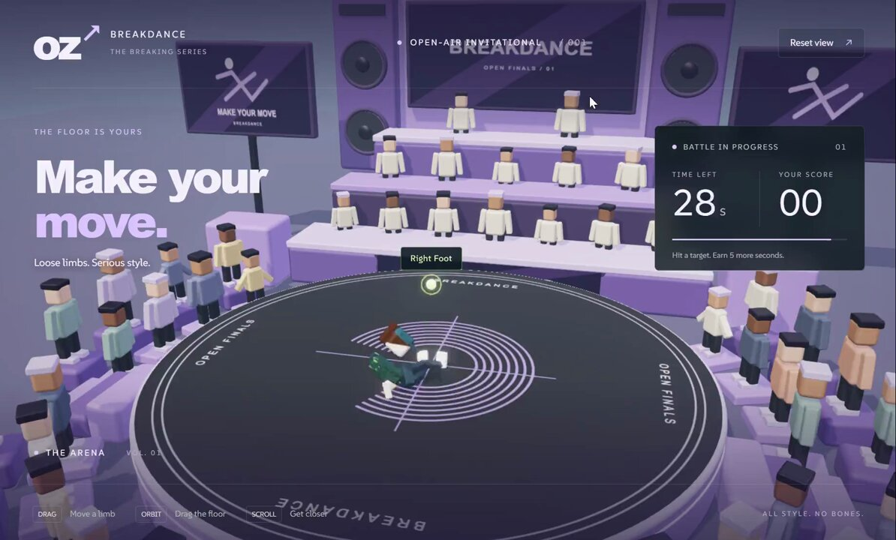

- **[Astral War](https://astralwar.io/)** — द्वितीय विश्व युद्ध की थीम वाला ब्राउज़र FPS, जिसमें सैनिक और ज़ॉम्बी के रूप, हथियारों के लोडआउट, बॉट प्रशिक्षण और लॉबी विकल्प हैं।
  - निर्माता: [Rishi](https://x.com/0xRishi)
  - प्लैटफ़ॉर्म: डेस्कटॉप ब्राउज़र, कीबोर्ड और माउस; बिना साइन इन किए बॉट प्रशिक्षण शुरू हुआ। मल्टीप्लेयर और कंट्रोलर समर्थन का परीक्षण नहीं किया गया।
  - GPT-6 Astra: [X](https://x.com/0xRishi/status/2096079660605997264) — Rishi के अनुसार Astral War को Astra, Three.js, Meshy और ElevenLabs से बनाया गया। मौजूदा साइट में Vesper का भी श्रेय है; योगदान संबंधी टिप्पणी देखें। [सत्यापन टिप्पणियाँ](assets/screenshots/astral-war/SOURCE.md).
  - पूर्वावलोकन: 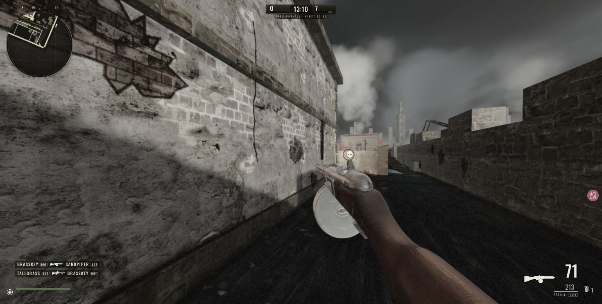

- **[FLOP CLUB](https://bubucn.com/ai-model-evals/flop-club/game/index.html)** — तीन ऊँचाइयों वाले मंचों से गोता लगाएँ, कलाबाज़ियाँ और घुमाव करें, और पानी में तैरते छल्ले को निशाना बनाकर उतरने का स्कोर बढ़ाएँ।
  - निर्माता: [BubuAi](https://x.com/BubuStd)
  - प्लैटफ़ॉर्म: ब्राउज़र; गेम का स्वतंत्र पेज बिना साइन इन या डाउनलोड के सीधे शुरू होता है। 2026-09-09 की जाँच में गोता शुरू किया गया; कीबोर्ड और दस्तावेज़ों में बताए गए टच नियंत्रण उपलब्ध हैं।
  - GPT-6 Astra: [X](https://x.com/BubuStd/status/2096402783805354091) — निर्माता के अनुसार यह Three.js का इस्तेमाल करके Astra Pro को एक ही प्रॉम्प्ट देकर बनाया गया था। [सत्यापन टिप्पणियाँ](assets/screenshots/flop-club/SOURCE.md).
  - संसाधन: [प्रोजेक्ट परिचय](https://bubucn.com/zh/ai-model-evals/flop-club)
  - पूर्वावलोकन: 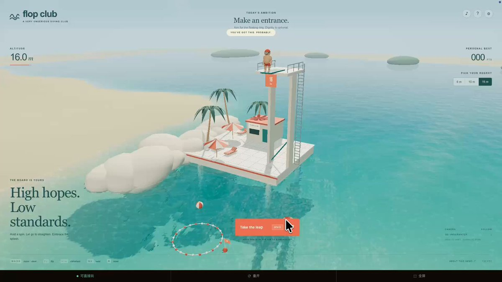

- **[Vector Dive — Beyond the Signal](https://vector-dive.openai.chatgpt.site/)** — हर चक्कर के साथ तेज़ होते नियोन वायरफ़्रेम रास्तों पर उड़ान भरें और बूस्ट व फ़ेज़ मूव का समय साधकर अधिक देर तक टिके रहें।
  - निर्माता: [Thomas Ricouard](https://x.com/Dimillian)
  - प्लैटफ़ॉर्म: डेस्कटॉप ब्राउज़र; बिना साइन इन किए स्कोर वाली उड़ान शुरू हुई। WASD से उड़ान, Space से बूस्ट और Shift से फ़ेज़ मूव।
  - GPT-6 Astra: [X](https://x.com/Dimillian/status/2097188900888322323) — निर्माता के अनुसार Astra ने नियोन/सिंथवेव शैली के दृश्य निर्देश और कॉन्सेप्ट आर्ट से गेम और संगीत बनाया। [सत्यापन टिप्पणियाँ](assets/screenshots/vector-dive/SOURCE.md).
  - पूर्वावलोकन: 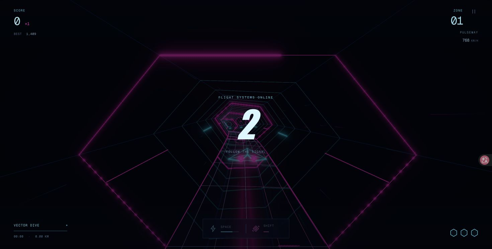

- **[Harbor Skirmish](https://gpt6astra-game.vercel.app/)** — तीन हथियारों, छतों वाले रास्तों, डैश और ग्रैपल हुक से समुद्रतटीय कस्बे को उत्पाती खरगोशों की लहरों से बचाएँ।
  - निर्माता: [OpenDesign](https://x.com/OpenDesignHQ)
  - प्लैटफ़ॉर्म: डेस्कटॉप ब्राउज़र; कीबोर्ड और माउस, बिना लॉगिन या डाउनलोड के।
  - GPT-6 Astra: [निर्माता का वक्तव्य](https://x.com/OpenDesignHQ/status/2097635757917983223) — OpenDesign ने दो मॉडलों की तुलना में इस Three.js गेम को GPT-6 Astra से बना संस्करण बताया है। [सत्यापन टिप्पणियाँ](assets/screenshots/harbor-skirmish/SOURCE.md).
  - पूर्वावलोकन: 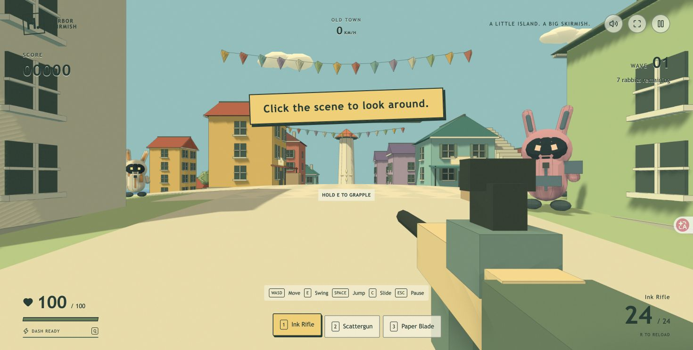

- **[UNDERGROUND — Underground Boxing](https://iamsonic.net/2026/mini-games/underground-boxing.html)** — भूमिगत 3D रिंग में तीन समय-सीमित बॉक्सिंग राउंड खेलें और मुक्कों, बचाव, चकमा देने तथा स्टैमिना के बीच संतुलन रखें।
  - निर्माता: [Sonic的奇思妙想](https://x.com/sonic0828)
  - प्लैटफ़ॉर्म: डेस्कटॉप ब्राउज़र; WASD से चलें, J/K से मुक्के मारें, L से बचाव और Space से चकमा दें; लॉगिन या डाउनलोड नहीं चाहिए।
  - GPT-6 Astra: [निर्माता का वक्तव्य](https://x.com/sonic0828/status/2097601232877781344) — निर्माता ने अपनी गेम प्रदर्शन पोस्ट शृंखला में इन मिनी-गेमों को बनाने के लिए GPT-6 Astra का नाम दिया है; बॉक्सिंग वाला जवाब इसी संस्करण का लिंक देता है। [सत्यापन टिप्पणियाँ](assets/screenshots/underground-boxing/SOURCE.md).
  - संसाधन: [निर्माता का रिलीज़ लिंक](https://x.com/sonic0828/status/2097601584410796401)
  - पूर्वावलोकन: 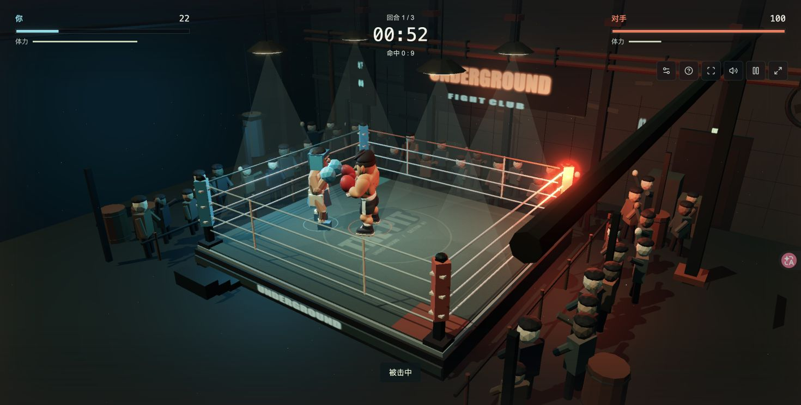

- **[Urban Champion 3D](https://iamsonic.net/2026/mini-games/urban-champion.html)** — सूर्यास्त के समय सड़क पर ऊँचे और नीचे मुक्के चलाएँ, जवाबी वार रोकें और गिरते गमलों से बचते हुए प्रतिद्वंद्वी को मैनहोल में धकेलें।
  - निर्माता: [Sonic的奇思妙想](https://x.com/sonic0828)
  - प्लैटफ़ॉर्म: डेस्कटॉप ब्राउज़र; A/D से चलें, J/K से मुक्के, U/I से बचाव और Space से चकमा; लॉगिन नहीं चाहिए।
  - GPT-6 Astra: [निर्माता का वक्तव्य](https://x.com/sonic0828/status/2097601232877781344) — निर्माता की GPT-6 Astra गेम प्रदर्शनी में इस सड़क की लड़ाई वाले गेम के लिंक के साथ अलग रिलीज़ जवाब शामिल है। [सत्यापन टिप्पणियाँ](assets/screenshots/urban-champion-3d/SOURCE.md).
  - संसाधन: [निर्माता का रिलीज़ लिंक](https://x.com/sonic0828/status/2097601861658587376)
  - पूर्वावलोकन: 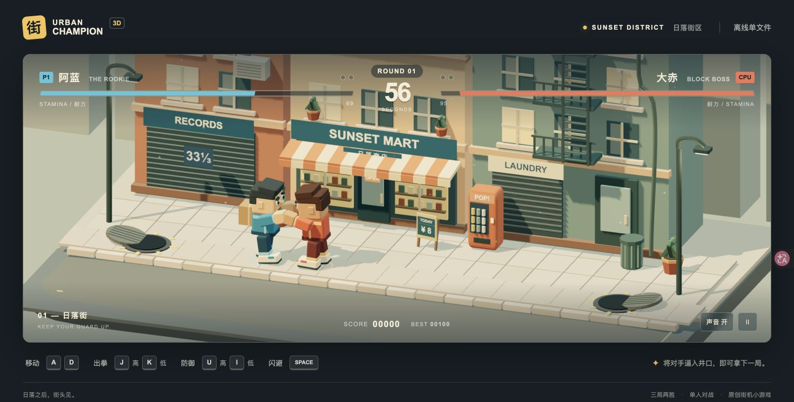

- **[Zero District — Shells 3D](https://iamsonic.net/2026/mini-games/shells-3d/play.html)** — स्वचालित गोलीबारी, चलकर चकमा देने, अनुभव बटोरने और अपग्रेड चुनने के साथ शहर की तीन मिनट की घेराबंदी में जीवित रहें।
  - निर्माता: [Sonic的奇思妙想](https://x.com/sonic0828)
  - प्लैटफ़ॉर्म: ब्राउज़र; WASD या खींचकर चलने का नियंत्रण, स्वचालित निशाना; लॉगिन या डाउनलोड नहीं चाहिए।
  - GPT-6 Astra: [निर्माता का वक्तव्य](https://x.com/sonic0828/status/2097601232877781344) — निर्माता ने संग्रह की घोषणा में GPT-6 Astra का नाम दिया और अलग जवाब में इस 3D सर्वाइवल संस्करण का लिंक साझा किया। [सत्यापन टिप्पणियाँ](assets/screenshots/zero-district-shells-3d/SOURCE.md).
  - संसाधन: [निर्माता का रिलीज़ लिंक](https://x.com/sonic0828/status/2097602391122264310)
  - पूर्वावलोकन: 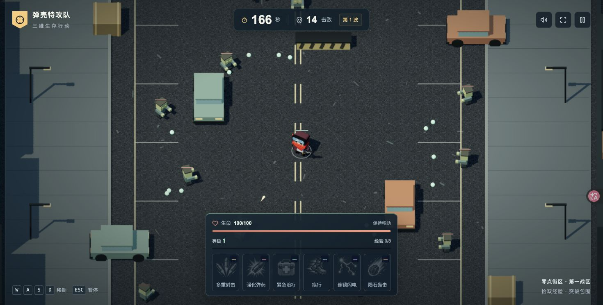

- **[ASCII DISTRICT](https://ascii-district.vercel.app/)** — ASCII अक्षरों से बने प्रथम-व्यक्ति अखाड़े में दौड़ने, कूदने और फिसलने का इस्तेमाल कर कंप्यूटर वायरस दुश्मनों की लहरों से लड़ें।
  - निर्माता: [Acker Code](https://x.com/acker_code)
  - प्लैटफ़ॉर्म: डेस्कटॉप ब्राउज़र; कीबोर्ड और माउस, बिना लॉगिन के। माउस लॉक करने के लिए अखाड़े पर क्लिक करें; Esc से छोड़ें।
  - GPT-6 Astra: [निर्माता का वक्तव्य](https://x.com/acker_code/status/2097542957070975286) — निर्माता ने इस ASCII कला वाले शूटर को बनाने के लिए स्पष्ट रूप से Codex और GPT-6 Astra को श्रेय दिया है। [सत्यापन टिप्पणियाँ](assets/screenshots/ascii-district/SOURCE.md).
  - पूर्वावलोकन: 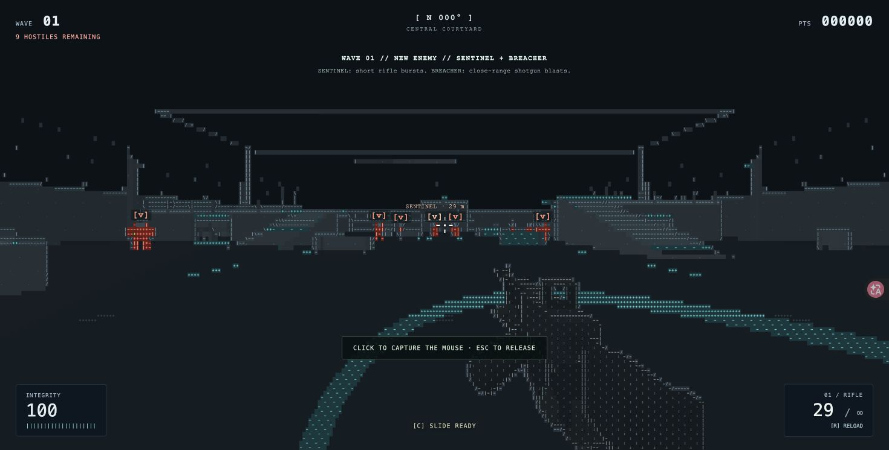

- **[Aura Farming: Unbothered](https://www.aigameshare.com/games/aura-farming-game)** — ड्रैगन बोट पर नाचते कैपीबारा का संतुलन बनाएँ, लहरों के विरुद्ध झुकें और 40 सेकंड का टाइमर समाप्त होने से पहले छह चालें पूरी करें।
  - निर्माता: [nilni / @nil](https://www.aigameshare.com/profile/nil)
  - प्लैटफ़ॉर्म: डेस्कटॉप ब्राउज़र; बिना साइन इन किए मुफ़्त खेलें। Play क्लिक करें; खाते की सुविधाएँ वैकल्पिक हैं।
  - GPT-6 Astra: [निर्माता का गेम पेज](https://www.aigameshare.com/games/aura-farming-game) — निर्माता ने गेम के लिए GPT-6 Astra और Codex के साथ Blender, Three.js, ImageGen और WebAudio को श्रेय दिया है। [सत्यापन टिप्पणियाँ](assets/screenshots/aura-farming/SOURCE.md).
  - पूर्वावलोकन: 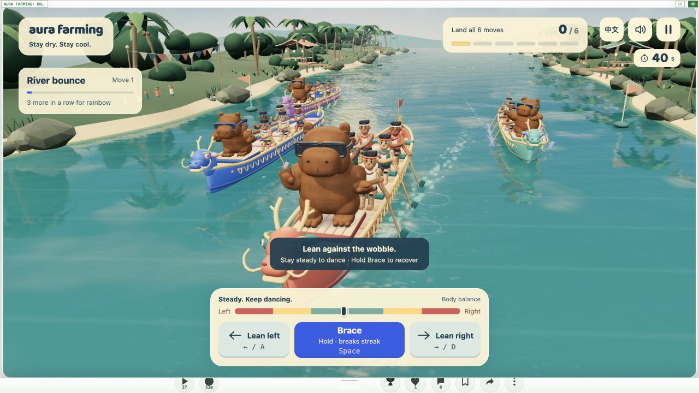

### पहेलियाँ और दिमागी खेल

तर्क की पहेलियाँ, भौतिकी की चुनौतियाँ, शब्दों के खेल और छोटे लेकिन चतुर तंत्र।

- **[瓜体实验室 / Melon Lab](https://melon-game.jack-514.chatgpt.site/)** — मुलायम फलों के आकार बदलने और आपस में टकराने पर आधारित तरबूज़ मिलाने वाला गेम।
  - रचनाकार: [Ayi1337](https://github.com/Ayi1337)
  - प्लैटफ़ॉर्म: आधुनिक ब्राउज़र; रचनाकार डाउनलोड करने योग्य स्वतंत्र HTML संस्करण भी उपलब्ध कराते हैं।
  - GPT-6 Astra: [रचनाकार के एक ही अनुरोध से निर्माण के परीक्षण और मूल प्रॉम्प्ट](https://github.com/Ayi1337/gpt6-astra-one-shot-games/blob/main/README.md).
  - विकास संसाधन: [स्रोत कोड](https://github.com/Ayi1337/gpt6-astra-one-shot-games/tree/main/melon-lab/src) · [स्वतंत्र HTML फ़ाइल](https://github.com/Ayi1337/gpt6-astra-one-shot-games/blob/main/melon-lab/%E7%93%9C%E4%BD%93%E5%AE%9E%E9%AA%8C%E5%AE%A4.html)
  - पूर्वावलोकन: 

- **[Q弹消消乐](https://qbxxl.0nz.de/)** — एक ही रंग के कम से कम तीन जुड़े बुलबुले हटाएँ; बड़े समूह बम और इंद्रधनुष बनाते हैं। आराम, स्तर और समयबद्ध मोड उपलब्ध हैं।
  - रचनाकार: zding
  - प्लेटफ़ॉर्म: ब्राउज़र, चीनी इंटरफ़ेस; बिना लॉगिन या भुगतान के शुरू होना सत्यापित।
  - GPT-6 Astra: GPT-6 Astra के उपयोग और योगदान की निर्माता से पुष्टि बाकी है।
  - पूर्वावलोकन: 

- **[榫境 / Sunjing Puzzles](https://sunjing-puzzles.vercel.app)** — 3D लकड़ी की कार्यशाला में एक-दूसरे में फँसे छह टुकड़ों की पहेली खोलें और हुआरोंग दाओ की दो स्लाइडिंग-ब्लॉक पहेलियाँ हल करें। संकेत और चाल वापस लेने की सुविधा भी है।
  - रचनाकार: [MartinDelophy](https://github.com/MartinDelophy) (परियोजना शुरू करने वाले और प्रस्तुतकर्ता)।
  - प्लैटफ़ॉर्म: WebGL 2 वाला आधुनिक ब्राउज़र; चीनी इंटरफ़ेस, माउस, कीबोर्ड और स्पर्श नियंत्रण। मुफ़्त, लॉगिन या API कुंजी की आवश्यकता नहीं; प्रगति वर्तमान ब्राउज़र में रहती है।
  - मॉडल की भागीदारी: [निर्माण का रिकॉर्ड](works/sunjing-puzzles/CREATION.md) — Codex में गेम डिज़ाइन, प्रक्रियात्मक 3D ग्राफ़िक्स, नियम, पहेली हल करने की प्रणाली और परीक्षणों पर कई चरणों में काम किया गया। GPT-6 Astra के सटीक उपयोग की पुष्टि रचनाकार से होनी बाकी है (प्रारूप के रूप में प्रस्तुति)।
  - विकास संसाधन: [स्रोत कोड और चलाने के निर्देश](works/sunjing-puzzles/README.md) · [आवश्यकताएँ](works/sunjing-puzzles/PROMPTS.md) · तकनीक: React, Vinext/Vite, Three.js.
  - पूर्वावलोकन: 

- **[CityMaker](https://citymaker.0to1app.com)** — 4×4 शहरी ब्लॉक पर खेला जाने वाला 2048 पज़ल: एक जैसे भवन जोड़कर हर शहर में पारंपरिक घरों से पहचानी जाने वाली स्काईलाइन तक ग्यारह वास्तु स्तर चढ़ें। बारह शहर उपलब्ध हैं और दृश्य को हर बार 45° घुमाया जा सकता है।
  - निर्माता: [Derek Wang](https://github.com/derek-wangpch)
  - प्लैटफ़ॉर्म: WebGL वाले डेस्कटॉप और मोबाइल ब्राउज़र; अंग्रेज़ी, सरलीकृत चीनी और पारंपरिक चीनी। मुफ़्त, बिना लॉगिन या API कुंजी के; हर शहर की प्रगति मौजूदा ब्राउज़र में सहेजी जाती है। iOS की होम स्क्रीन पर इंस्टॉल किया जा सकता है।
  - GPT-6 Astra: [निर्माण का विवरण](https://github.com/derek-wangpch/OpenCityMaker/blob/master/docs/CREATION.md) — निर्माता के अनुसार सभी 132 भवन मॉडलों की प्रक्रियात्मक ज्यामिति GPT-6 Astra से बनाई गई। संदर्भों पर आधारित प्रक्रिया में कई कोणों से अध्ययन, पहले बाहरी आकृति के अनुसार भवन के आयतन बनाना और स्क्रीनशॉट से सत्यापन शामिल था; यह एक ही प्रॉम्प्ट वाला परीक्षण नहीं था।
  - संसाधन: [स्रोत कोड और सेटअप](https://github.com/derek-wangpch/OpenCityMaker) · [सत्यापन टिप्पणियाँ](https://github.com/derek-wangpch/OpenCityMaker/blob/master/QA.md) · इस्तेमाल की गई तकनीकें: React, TypeScript, Vite और Three.js; सभी 132 भवन मॉडल मौलिक प्रक्रियात्मक ज्यामिति से बने हैं।
  - पूर्वावलोकन: 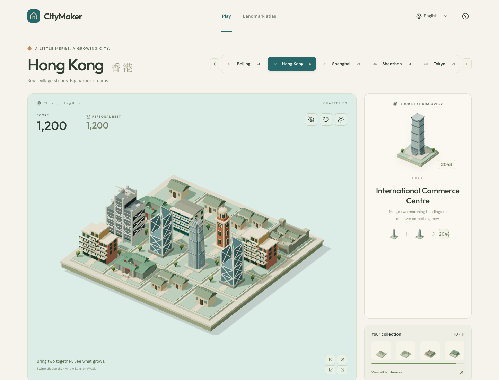

- **[Bonkshot](https://bonkshot.com/)** — गुलेल पीछे खींचें और छोटे Bonker को लकड़ी के सहारों पर छोड़कर ढाँचे गिराएँ और लक्ष्य हटाएँ।
  - निर्माता: [edmund5](https://x.com/edmund5)
  - प्लैटफ़ॉर्म: ब्राउज़र; निशाना लगाने के लिए खींचें और छोड़कर दागें। बिना साइन इन किए खेल सकते हैं; Google साइन इन वैकल्पिक है।
  - GPT-6 Astra: [निर्माता का वक्तव्य](https://x.com/edmund5/status/2097603093819261002) — निर्माता ने गेम के लिए GPT-6 Astra और Three.js को श्रेय दिया है, जबकि पृष्ठभूमि संगीत Suno से बनाया गया। [सत्यापन टिप्पणियाँ](assets/screenshots/bonkshot/SOURCE.md).
  - पूर्वावलोकन: 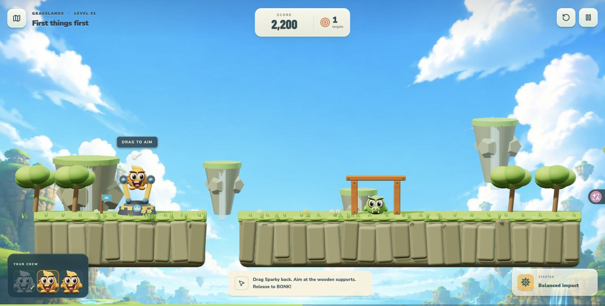

- **[Greenhouse Escape Room: The Last Seed](https://www.aigameshare.com/games/greenhouse-escape-room)** — बंद ग्रीनहाउस का अन्वेषण करें, ताँबे की पानी की पाइपें ठीक करें, पौधों और परावर्तित प्रकाश को व्यवस्थित करें और उसका अंतिम बीज बचाएँ।
  - निर्माता: [nilni / @nil](https://www.aigameshare.com/profile/nil)
  - प्लैटफ़ॉर्म: ब्राउज़र; Play, फिर Begin क्लिक करें। मुफ़्त, बिना साइन इन के; अंग्रेज़ी और चीनी में नियंत्रण।
  - GPT-6 Astra: [निर्माता का गेम पेज](https://www.aigameshare.com/games/greenhouse-escape-room) — निर्माता ने GPT-6 Astra और Codex को विकास के उपकरण बताया है, साथ में ImageGen और WebAudio भी हैं। [सत्यापन टिप्पणियाँ](assets/screenshots/greenhouse-escape-room/SOURCE.md).
  - पूर्वावलोकन: 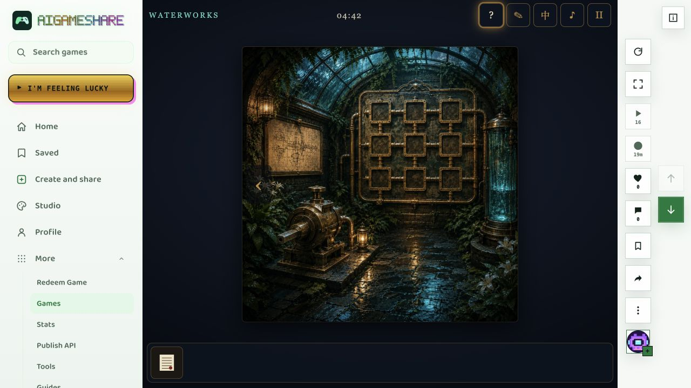

### रणनीति और सिमुलेशन

टावर डिफ़ेंस, रणनीतिक कार्ड गेम, प्रबंधन, निर्माण और सिमुलेशन सैंडबॉक्स।

- **[Tidehook](https://tidehook-mallow.vercel.app/)** — छोटी टगबोट Mallow को तीन तटीय यात्राओं पर चलाएँ। ऐसे समुद्री सामान को खींचें जिसके वजन से गति पकड़ना और मुड़ना बदलता है, उसे बंदरगाह की क्रेन तक पहुँचाएँ और अंत में प्रकाशस्तंभ का लेंस वापस लाएँ।
  - रचनाकार: [Emile du Toit / Mafuta Games](https://mafuta.itch.io/)
  - प्लैटफ़ॉर्म: डेस्कटॉप या लैपटॉप ब्राउज़र, अंग्रेज़ी इंटरफ़ेस; मुफ़्त, लॉगिन या इंस्टॉलेशन की ज़रूरत नहीं। कीबोर्ड या पानी पर क्लिक करके चलाएँ; प्रगति मौजूदा ब्राउज़र में सहेजी जाती है। वास्तविक फ़ोन पर खेलना सत्यापित नहीं है।
  - GPT-6 Astra: [रचनाकार का बयान](https://github.com/MartinDelophy/awesome-gpt-6-astra/issues/74) — रचनाकार ने Codex में GPT-6 Astra से Canvas गेम, खींचने की भौतिकी, क्रेन को माल सौंपने की प्रक्रिया, इंटरफ़ेस, मौसम और ऑडियो को कई चरणों में बनवाया और सुधरवाया; डिज़ाइन का निर्देशन और खेलकर जाँच स्वयं की। चित्र अलग से इमेज जनरेशन से बनाए गए; संगीत और ध्वनि प्रभाव Web Audio से संश्लेषित होते हैं।
  - संसाधन: [itch.io](https://mafuta.itch.io/tidehook) · [गेमप्ले वीडियो](https://youtu.be/wlEh8gnDOnU) · साधारण JavaScript, Canvas 2D, Vite और Web Audio; सोर्स कोड का रिपॉज़िटरी निजी है। [सत्यापन और स्क्रीनशॉट का स्रोत (अंग्रेज़ी)](assets/screenshots/tidehook/SOURCE.md)
  - पूर्वावलोकन: 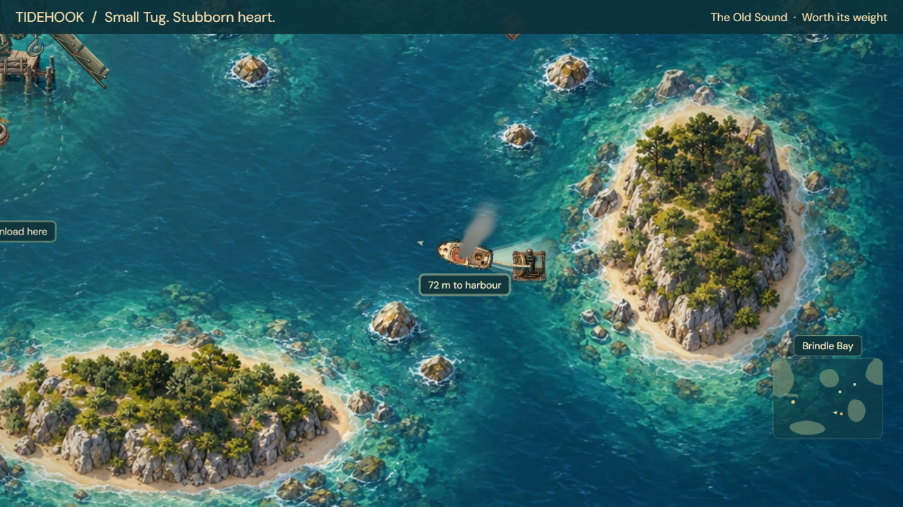

- **[Dwellcraft · 住进想象](https://dwellcraft.vercel.app/)** — तीन 3D घर सजाएँ, सामग्री और रोशनी बदलें तथा अंदर घूमकर देखें; स्थानीय सेव और GLB आयात उपलब्ध हैं।
  - रचनाकार: [Ryan-fm](https://github.com/Ryan-fm)
  - प्लेटफ़ॉर्म: WebGL डेस्कटॉप ब्राउज़र; चीनी और अंग्रेज़ी UI। मुफ़्त, लॉगिन नहीं। वास्तविक Quest पर परीक्षण बाकी है।
  - Codex: [GitHub](https://github.com/Ryan-fm/Dwellcraft/blob/main/docs/DEVELOPMENT.md) — Codex से क्रमिक विकास का रिकॉर्ड है; सटीक GPT-6 Astra उपयोग की पुष्टि लेखक से अपेक्षित है।
  - संसाधन: [GitHub](https://github.com/Ryan-fm/Dwellcraft)
  - पूर्वावलोकन: 

- **[Little Kingdom Chess / 작은 왕국 체스](https://little-kingdom-chess.echo3042.chatgpt.site/)** — घुमाए जा सकने वाले 3D बोर्ड पर छोटे पात्रों से कंप्यूटर के विरुद्ध शतरंज खेलें; चालों का इतिहास और वापसी उपलब्ध है।
  - रचनाकार: [에코_eco](https://x.com/echo3042)
  - प्लेटफ़ॉर्म: डेस्कटॉप ब्राउज़र; बिना लॉगिन या भुगतान के खोला गया। मोबाइल परीक्षण नहीं हुआ।
  - GPT-6 Astra: [X](https://x.com/echo3042/status/2096123409029886250) — लेखक ने इस परियोजना के विकास में Astra के उपयोग की जानकारी दी है। [जाँच विवरण (अंग्रेज़ी)](assets/screenshots/little-kingdom-chess/SOURCE.md).
  - पूर्वावलोकन: 

- **[JUNK RUN](https://junk-run.pages.dev/)** — कबाड़ के पुर्जों से बिना इंजन की गाड़ी बनाएँ और ढलान पर छोड़ें; शुरुआत प्रथम-व्यक्ति कार्यशाला से होती है।
  - रचनाकार: [TheLabGuy](https://x.com/hermesailab)
  - प्लेटफ़ॉर्म: डेस्कटॉप ब्राउज़र; बिना लॉगिन या भुगतान के खोला गया। मोबाइल परीक्षण नहीं हुआ।
  - GPT-6 Astra: [X](https://x.com/hermesailab/status/2097508053901840850) — लेखक ने इस परियोजना के विकास में Astra के उपयोग की जानकारी दी है। [जाँच विवरण (अंग्रेज़ी)](assets/screenshots/junk-run/SOURCE.md).
  - पूर्वावलोकन: 

- **[Spy or Lie](https://spyorlie.com/)** — कंप्यूटर के विरुद्ध षट्भुज बोर्ड पर रणनीति खेल: छिपी पहचान वाले एजेंट रखें, झाँसा दें और दुश्मन समूहों को घेरकर लगातार कब्ज़े करें।
  - रचनाकार: [Nate Lorenzen](https://x.com/NateLorenzen)
  - प्लेटफ़ॉर्म: ब्राउज़र, अंग्रेज़ी इंटरफ़ेस; बिना लॉगिन या भुगतान के पहली चाल और कंप्यूटर का उत्तर जाँचा गया।
  - GPT-6 Astra: [X](https://x.com/NateLorenzen/status/2097504974683152559) — लेखक के अनुसार Astra ने उनके गेम डिज़ाइन को एक प्रयास में खेलने योग्य डेमो बनाया; विकास प्रक्रिया का स्वतंत्र ऑडिट नहीं हुआ।
  - पूर्वावलोकन: 

- **[三分天下 · 百将风云 / Three Kingdoms: Hundred Heroes](https://sanguo-jiangshan.vercel.app)** — वेई, शू या वू चुनकर 15 शहरों में बारी-बारी से चलने वाला क्षेत्रीय अभियान खेलें। सोना और अनाज सँभालें, अलग-अलग AI-निर्मित चित्रों वाले कुल 108 सेनापतियों का नेतृत्व करें और देश को एकजुट करने के लिए AI गुटों से मुकाबला करें।
  - रचनाकार: [MartinDelophy](https://github.com/MartinDelophy) (परियोजना शुरू करने वाले और प्रस्तुतकर्ता)।
  - प्लैटफ़ॉर्म: आधुनिक ब्राउज़र; चीनी इंटरफ़ेस, माउस और स्पर्श नियंत्रण। मुफ़्त, लॉगिन या API कुंजी की आवश्यकता नहीं; स्थानीय सेव फ़ाइलें आयात और निर्यात की जा सकती हैं।
  - GPT-6 Astra: [निर्माण का रिकॉर्ड](works/three-kingdoms/CREATION.md) — रचनाकार ने उपयोग की पुष्टि की है। Codex में कई चरणों के सहयोग से नियम, इंटरफ़ेस, AI, संतुलन और परीक्षण विकसित किए गए; भूभाग और सेनापतियों के चित्र छवि निर्माण उपकरणों से बनाए गए।
  - विकास संसाधन: [स्रोत कोड और चलाने के निर्देश](works/three-kingdoms/README.md) · [आवश्यकताएँ](works/three-kingdoms/PROMPTS.md) · तकनीक: React, TypeScript, Vinext/Vite.
  - पूर्वावलोकन: 

- **[Last Beacon / 最后的灯塔](https://last-beacon.loupengju.cc)** — एक छोटे द्वीप पर बिजली का नेटवर्क जोड़ें, टावर बनाएँ और उन्हें उन्नत करें। सीमित बिजली का सही बँटवारा करके दस लहरों और अंतिम बॉस से प्रकाशस्तंभ की रक्षा करें।
  - रचनाकार: [stackloomdev](https://github.com/stackloomdev)
  - प्लैटफ़ॉर्म: आधुनिक डेस्कटॉप और मोबाइल ब्राउज़र; चीनी और अंग्रेज़ी भाषाओं का समर्थन। मुफ़्त, लॉगिन या API कुंजी की ज़रूरत नहीं। वैकल्पिक ध्वनि के लिए Web Audio आवश्यक है।
  - GPT-6 Astra: [रचनाकार की विकास डायरी और मॉडल का योगदान](https://github.com/stackloomdev/last-beacon/blob/main/docs/CREATION.md) — गेम डिज़ाइन, कोड, प्रक्रियात्मक ग्राफ़िक्स और परीक्षणों में कई चरणों के दौरान उपयोग किया गया; यह एक ही अनुरोध से निर्माण का परीक्षण नहीं है।
  - विकास संसाधन: [स्रोत कोड और चलाने के निर्देश](https://github.com/stackloomdev/last-beacon) · [आवश्यकताएँ और क्रमिक सुधारों के नोट्स](https://github.com/stackloomdev/last-beacon/blob/main/docs/PROMPT.md) · तकनीक: JavaScript, Canvas 2D, Web Audio.
  - झलक: 

- **[缺氧 · 小小星球](https://hypoxia-6tu.pages.dev/)** — भूमिगत कॉलोनी का उत्तरजीविता सिमुलेशन: तीन निवासियों से खुदाई और निर्माण करवाएँ तथा ऑक्सीजन, भोजन और बिजली का प्रबंधन करें।
  - रचनाकार: dudu
  - प्लेटफ़ॉर्म: Canvas वाला ब्राउज़र, चीनी इंटरफ़ेस, माउस और कीबोर्ड; बिना लॉगिन या भुगतान के शुरू होना सत्यापित।
  - GPT-6 Astra: [Issue #28](https://github.com/MartinDelophy/awesome-gpt-6-astra/issues/28) — प्रस्तुतकर्ता के अनुसार पूरा विकास GPT-6 Astra के साथ हुआ; स्वतंत्र सत्यापन नहीं किया गया है।
  - पूर्वावलोकन: 

- **[魔塔 · 永夜之阶](https://ai.ywnet.xyz/work/mt.html)** — हमले और रक्षा की गणना, सीमित संसाधनों और तीन रंगों की चाबियों पर आधारित पंद्रह मंज़िला पिक्सेल टावर एडवेंचर।
  - रचनाकार: yw
  - प्लेटफ़ॉर्म: ब्राउज़र, चीनी इंटरफ़ेस; बिना लॉगिन या भुगतान के शुरू होना सत्यापित।
  - GPT-6 Astra: [Issue #38](https://github.com/MartinDelophy/awesome-gpt-6-astra/issues/38) — प्रस्तुतकर्ता ने GPT-6 Astra उपयोग अनुभाग में विकास प्रॉम्प्ट दिया है; मॉडल के सटीक योगदान का स्वतंत्र सत्यापन नहीं हुआ है।
  - पूर्वावलोकन: 

- **[永恒荒野](https://starve.pages.dev/)** — Don't Starve की पुनर्रचना के रूप में प्रस्तुत ब्राउज़र सर्वाइवल और रणनीति गेम। दिए गए स्क्रीनशॉट में जंगल की खोज, संसाधन जुटाना, सामान की सूची तथा स्वास्थ्य, भूख और मानसिक संतुलन के संकेतक दिखाई देते हैं।
  - रचनाकार: dudu
  - प्लैटफ़ॉर्म: ब्राउज़र; स्क्रीनशॉट में चीनी इंटरफ़ेस और कीबोर्ड नियंत्रण दिखते हैं। भुगतान और लॉगिन की शर्तें नहीं बताई गई हैं; डेमो की स्वतंत्र पुष्टि नहीं हुई है।
  - GPT-6 Astra: [प्रस्तुतकर्ता का कथन](https://github.com/MartinDelophy/awesome-gpt-6-astra/issues/26) — प्रस्तुतकर्ता के अनुसार पूरा विकास GPT-6 Astra ने किया है।
  - विकास संसाधन: सार्वजनिक स्रोत कोड या अलग विकास रिकॉर्ड नहीं दिया गया है।
  - झलक: 

- **[潜水员戴夫 / Dave the Diver](https://dave-2cm.pages.dev/)** — Dave the Diver की ब्राउज़र में चलने वाली पुनर्रचना, जिसमें पानी के नीचे भाले से मछली पकड़ना, सुशी रेस्तराँ चलाना और द्वीप पर खेती करना शामिल है।
  - रचनाकार: dudu
  - प्लैटफ़ॉर्म: ब्राउज़र; चीनी इंटरफ़ेस, माउस और कीबोर्ड नियंत्रण। बिना लॉगिन या भुगतान के गेम खोलकर गोताखोरी शुरू करने की पुष्टि की गई।
  - GPT-6 Astra: [प्रस्तुतकर्ता का कथन](https://github.com/MartinDelophy/awesome-gpt-6-astra/issues/41) — प्रस्तुतकर्ता के अनुसार पूरा विकास GPT-6 Astra ने किया है।
  - विकास संसाधन: सार्वजनिक स्रोत कोड या अलग विकास रिकॉर्ड नहीं दिया गया है।
  - झलक: 

- **[No Moat](https://no-moat.petergyang.chatgpt.site/)** — स्टार्टअप थीम वाला कार्ड रॉगुलाइक: टीम बनाएँ और नकल करने वालों, बग तथा क्लाउड बिलों से लड़ें।
  - रचनाकार: [Peter Yang](https://x.com/petergyang)
  - प्लेटफ़ॉर्म: डेस्कटॉप ब्राउज़र; बिना लॉगिन या भुगतान के खोला गया। मोबाइल परीक्षण नहीं हुआ।
  - GPT-6 Astra: [X](https://x.com/petergyang/status/2096297378584375672) — लेखक ने इस परियोजना के विकास में Astra के उपयोग की जानकारी दी है। [जाँच विवरण (अंग्रेज़ी)](assets/screenshots/no-moat/SOURCE.md).
  - पूर्वावलोकन: 

- **[The Free Game](https://vale-dos-vinhedos.lucas579686.chatgpt.site/)** — विस्तृत 3D मध्ययुगीन गाँव में सड़कें, कर्मचारी और उत्पादन शृंखलाएँ बनाएँ।
  - रचनाकार: [Lucas Marques, from Shiva](https://x.com/LucasMarquesSv)
  - प्लेटफ़ॉर्म: डेस्कटॉप ब्राउज़र; बिना लॉगिन या भुगतान के खोला गया। मोबाइल परीक्षण नहीं हुआ।
  - GPT-6 Astra: [X](https://x.com/LucasMarquesSv/status/2096772160404504583) — लेखक ने इस परियोजना के विकास में Astra के उपयोग की जानकारी दी है। [जाँच विवरण (अंग्रेज़ी)](assets/screenshots/the-free-game/SOURCE.md).
  - संसाधन: [GitHub](https://github.com/LucasMarquesShiva/the-free-game)
  - पूर्वावलोकन: 

- **[AGI of Empires — The Compute Wars](https://agiofempires.com/)** — फ़ंडिंग और GPU जुटाएँ, डेटा सेंटर और सेनाएँ बनाएँ, और प्रतिद्वंद्वी AI प्रयोगशालाओं से पहले ASI तक पहुँचें या उनके मुख्यालय नष्ट करें।
  - निर्माता: [timour kosters](https://x.com/timourxyz)
  - प्लैटफ़ॉर्म: डेस्कटॉप ब्राउज़र; मुफ़्त व्यंग्यात्मक रीयल-टाइम रणनीति गेम। कंप्यूटर के विरुद्ध शुरुआती मैच और संसाधन संग्रह को बिना साइन इन किए सत्यापित किया गया।
  - GPT-6 Astra: [X](https://x.com/timourxyz/status/2096662786692776293) — निर्माता के अनुसार उन्होंने Age of Empires से प्रेरित यह गेम Astra के साथ दो दिनों में विकसित किया। [सत्यापन टिप्पणियाँ](assets/screenshots/agi-of-empires/SOURCE.md).
  - पूर्वावलोकन: 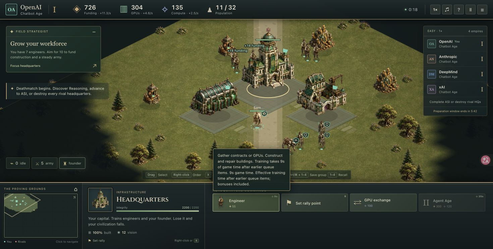

- **[Atlas Go](https://atlas-go.borisxp.chatgpt.site/)** — सड़कों के नेटवर्क और अनोखे ग्राफ़ बोर्ड पर गो खेलें; एक ही डिवाइस पर बारी-बारी खेलने और दोस्तों के साथ मैच के विकल्प हैं।
  - निर्माता: [Boris Power](https://x.com/BorisMPower)
  - प्लैटफ़ॉर्म: ब्राउज़र; स्थानीय बोर्ड बिना साइन इन किए खुला। दोस्तों के साथ ऑनलाइन मैच का परीक्षण नहीं किया गया।
  - GPT-6 Astra: [X](https://x.com/BorisMPower/status/2096784808399843582) — निर्माता के अनुसार मनमाने ग्राफ़ पर चलने वाला यह मल्टीप्लेयर गो गेम Astra को एक ही प्रॉम्प्ट देकर बनाया गया। [सत्यापन टिप्पणियाँ](assets/screenshots/atlas-go/SOURCE.md).
  - पूर्वावलोकन: 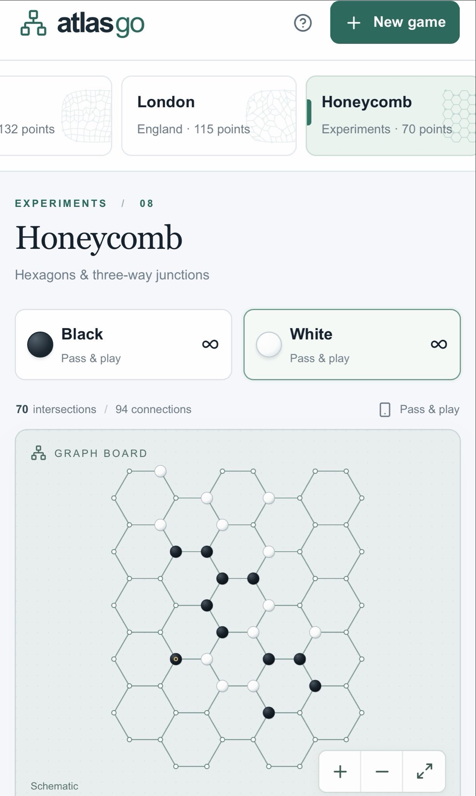

- **[Ironwood — The Art of Industry](https://ironwood.sparkles.dev/)** — कच्चा माल इकट्ठा करें, मशीनों को बिजली दें और कन्वेयर बेल्ट जोड़कर खुली जगह को चलती हुई फ़ैक्टरी में बदलें।
  - निर्माता: [Dan](https://x.com/aidaniil)
  - प्लैटफ़ॉर्म: डेस्कटॉप ब्राउज़र; अतिथि ट्यूटोरियल बिना साइन इन के खुलता है, लेकिन प्रगति सहेजने के लिए लॉगिन ज़रूरी है। मल्टीप्लेयर का स्वतंत्र परीक्षण नहीं किया गया।
  - GPT-6 Astra: [X](https://x.com/aidaniil/status/2096426970930106530) — निर्माता के अनुसार उन्होंने अपने भाई के साथ Satisfactory और Besiege से प्रेरणा लेकर Astra, Blender MCP और Cloudflare Durable Objects से इसे बनाया। [सत्यापन टिप्पणियाँ](assets/screenshots/ironwood/SOURCE.md).
  - पूर्वावलोकन: 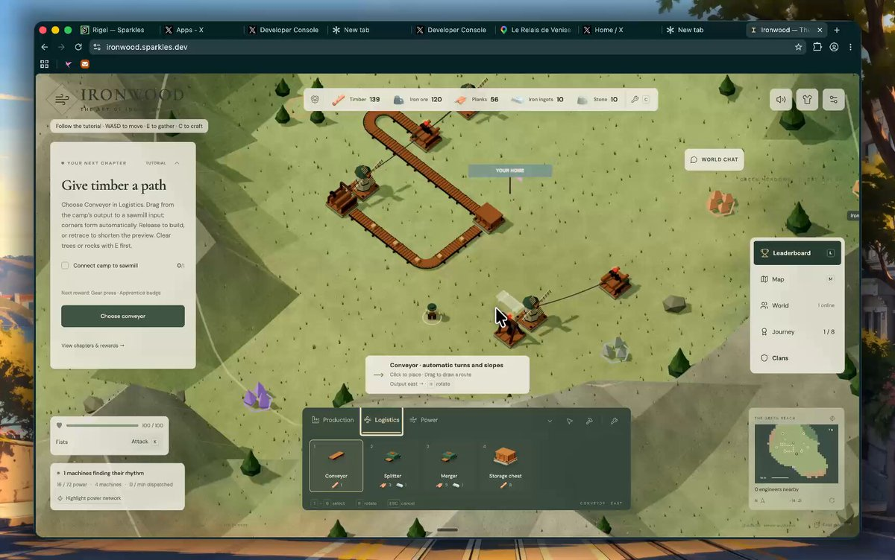

- **[DUST FRONT](https://dust-front.mustafaakin.dev/)** — एकल-खिलाड़ी RTS में बेस बनाएँ, ठिकानों पर कब्ज़ा करें और ज़मीनी व हवाई सेना को निर्देश दें।
  - निर्माता: [Mustafa Akın](https://x.com/mustafaakin)
  - प्लेटफ़ॉर्म: डेस्कटॉप ब्राउज़र; कीबोर्ड और माउस, लॉगिन आवश्यक नहीं।
  - GPT-6 Astra: [सत्यापन विवरण](assets/screenshots/dust-front/SOURCE.md) — दिए गए Mustafa Akın पोस्ट के अनुसार ChatGPT Astra और Blender MCP से एसेट निर्माण सहित लगभग 40 प्रॉम्प्ट में काम किया गया।
  - पूर्वावलोकन: 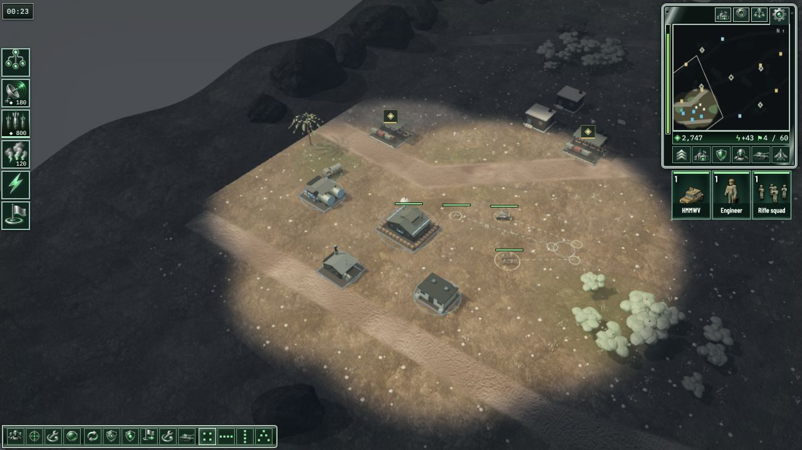

- **[前线指令 / Frontline Command](https://fluffy-biscotti-dad318.netlify.app/)** — आधुनिक युद्ध पर आधारित रियल-टाइम रणनीति गेम में बेस बनाएँ, संसाधन क्षेत्रों के लिए लड़ें और AI सेनाओं के विरुद्ध टैंक, पैदल सेना, विमान और ड्रोन की कमान सँभालें। जासूसों और खुफिया तंत्र से बढ़त हासिल करें।
  - रचनाकार: [嘟啊嘟](https://x.com/HDLhN783wtLkpPR)
  - प्लैटफ़ॉर्म: कंप्यूटर का ब्राउज़र, चीनी इंटरफ़ेस, माउस और कीबोर्ड; बिना लॉगिन, भुगतान या इंस्टॉलेशन के सिंगल-प्लेयर मैच शुरू करके देखा गया।
  - GPT-6 Astra: [X](https://x.com/HDLhN783wtLkpPR/status/2097321360641122393) — लिंक की गई पोस्ट में रचनाकार ने इस RTS को बनाने का श्रेय “GPT Astra” को दिया है; मॉडल का सटीक संस्करण और विकास की विस्तृत प्रक्रिया नहीं बताई गई है।
  - संदर्भ: [प्रस्तुति](https://github.com/MartinDelophy/awesome-gpt-6-astra/issues/66) · [सत्यापन के नोट्स (अंग्रेज़ी)](assets/screenshots/frontline-command/SOURCE.md)
  - पूर्वावलोकन: 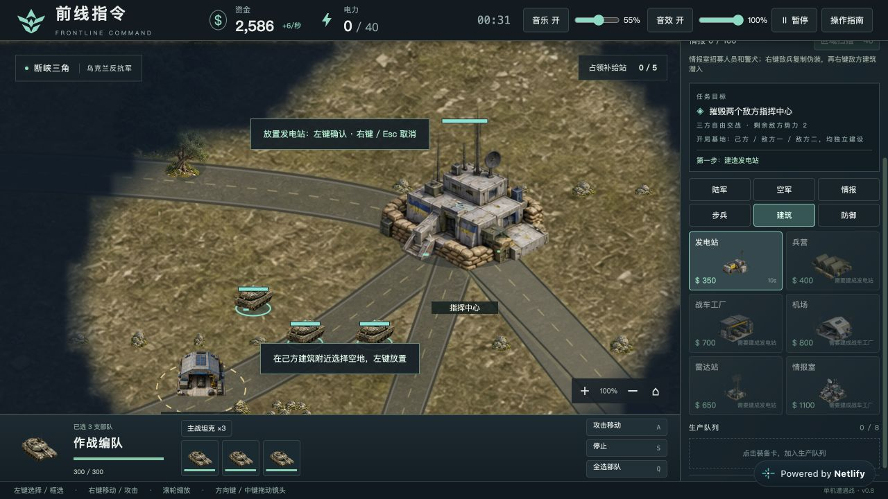

- **[Coin Pusher Roguelite: Mintfall](https://www.aigameshare.com/games/coin-pusher-roguelite-mintfall)** — 3D कॉइन पुशर में निशाना लगाएँ, विशेष सिक्कों और अवशेषों का मेल बनाएँ, और सीमित सिक्के डालने के मौकों में लक्ष्य स्कोर पाकर छह राउंड पार करें।
  - निर्माता: [nilni / @nil](https://www.aigameshare.com/profile/nil)
  - प्लैटफ़ॉर्म: ब्राउज़र; Play क्लिक करें, मुफ़्त और बिना साइन इन के। खाते से सेव करने का विकल्प उपलब्ध है।
  - GPT-6 Astra: [निर्माता का गेम पेज](https://www.aigameshare.com/games/coin-pusher-roguelite-mintfall) — निर्माता ने GPT-6 Astra के साथ GPT-5.6 Sol और Codex को श्रेय दिया है; गेम पेज उनके अलग-अलग योगदान स्पष्ट नहीं करता। [सत्यापन टिप्पणियाँ](assets/screenshots/mintfall/SOURCE.md).
  - पूर्वावलोकन: 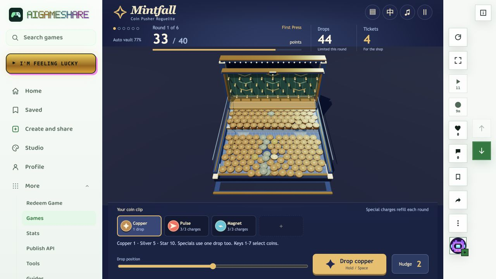

- **[Westward — The Oregon Trail](https://biswaz.me/westward/)** — वैगन दल को पश्चिम की ओर ले जाएँ, भोजन का राशन बाँटें, मरम्मत और शिकार सँभालें, और Oregon Trail पर निर्णय लें।
  - निर्माता: [Biswas](https://x.com/bis_waz)
  - प्लैटफ़ॉर्म: डेस्कटॉप ब्राउज़र; दिए गए काल्पनिक दल से शुरू करें, बिना साइन इन या इंस्टॉलेशन के।
  - GPT-6 Astra: [X](https://x.com/bis_waz/status/2098023593468907747) — Biswas के अनुसार उन्होंने GPT-6 Astra से The Oregon Trail का यह आधुनिक 3D संस्करण बनाया और खेलने योग्य गेम का लिंक दिया है। [सत्यापन टिप्पणियाँ](assets/screenshots/westward/SOURCE.md).
  - पूर्वावलोकन: 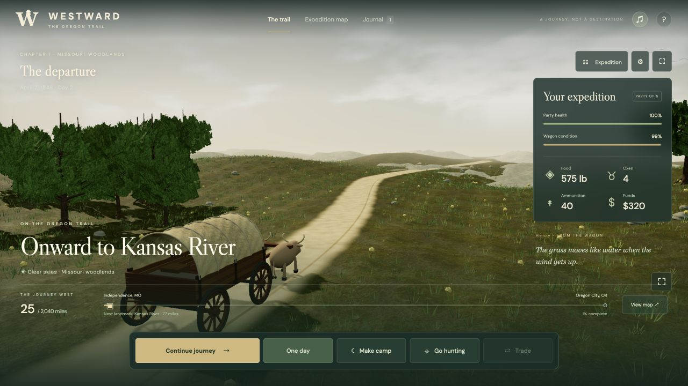

### RPG और रोमांच

भूमिका निभाना, खोजबीन, कहानी-आधारित रोमांच और इंटरैक्टिव कहानियाँ।

- **[The Sunshard](https://mindblown.ai/games/the-sunshard)** — वॉक्सेल शैली की एक्शन RPG में Spark Bolt और Sunburst से Hollowborn से लड़ें, टेलीपोर्ट करके खतरे से बचें और सूर्य-द्वार को जगाएँ।
  - निर्माता: [Mindblown / @mind](https://mindblown.ai/@mind) · [Mindblown](https://mindblown.ai/) · [X](https://x.com/mindblown_ai)
  - प्लेटफ़ॉर्म: डेस्कटॉप ब्राउज़र; कीबोर्ड और माउस, लॉगिन आवश्यक नहीं।
  - GPT-6 Astra: इस गेम में मॉडल का उपयोग अपुष्ट है। दिए गए निर्माता के उत्तर में सूची में जोड़ने की अनुमति है, लेकिन मॉडल या उसकी भूमिका नहीं बताई गई है। [सत्यापन विवरण](assets/screenshots/the-sunshard/SOURCE.md).
  - पूर्वावलोकन: 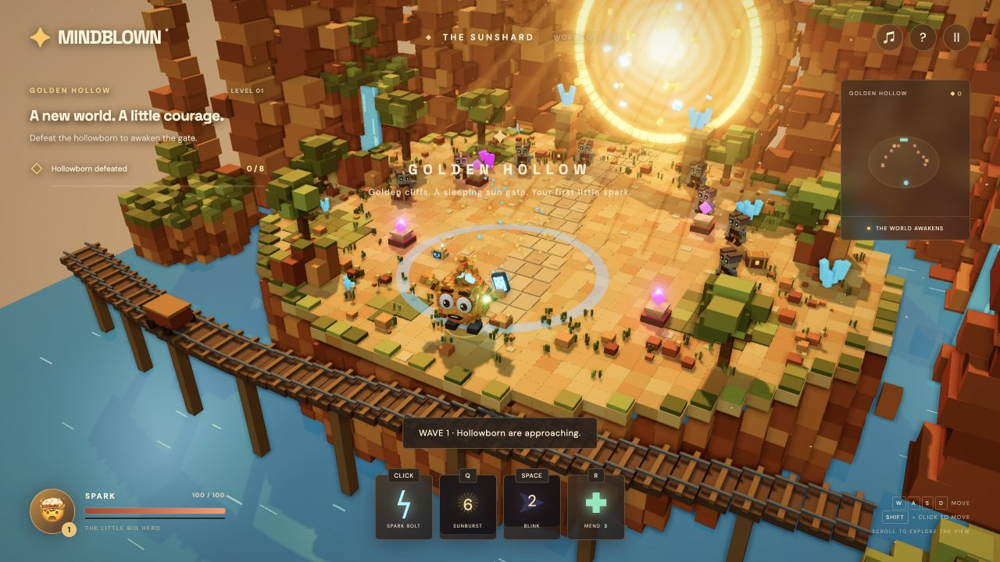

- **[Lumbridge / Elderwood Realms](https://elderwood-realms.rohannvarma.chatgpt.site/)** — साझा दुनिया, कौशल, संसाधन संग्रह और लड़ाई वाला रेट्रो मल्टीप्लेयर साहसिक खेल; अतिथि प्रवेश उपलब्ध है।
  - रचनाकार: [Rohan Varma](https://x.com/TheRohanVarma)
  - प्लेटफ़ॉर्म: डेस्कटॉप ब्राउज़र; बिना लॉगिन या भुगतान के खोला गया। मोबाइल परीक्षण नहीं हुआ।
  - GPT-6 Astra: [X](https://x.com/TheRohanVarma/status/2096744577332068549) — लेखक ने इस परियोजना के विकास में Astra के उपयोग की जानकारी दी है। [जाँच विवरण (अंग्रेज़ी)](assets/screenshots/lumbridge/SOURCE.md).
  - पूर्वावलोकन: 

- **[Silent Meridian / 静默子午线](https://silent-meridian.stackloom.org/)** — चार अध्यायों और तेरह पहेलियों वाला रहस्यमय पॉइंट-एंड-क्लिक रोमांच: वर्तमान और उसकी प्रतिध्वनि के सुरागों की तुलना करें, सबूत जुटाएँ और 00:17 पर ठहरी वेधशाला का रहस्य सुलझाएँ।
  - रचनाकार: [stackloomdev](https://github.com/stackloomdev)
  - प्लैटफ़ॉर्म: डेस्कटॉप और मोबाइल ब्राउज़र; चीनी और अंग्रेज़ी। मुफ़्त में सीधे ऑनलाइन खेलें; लॉगिन, इंस्टॉलेशन या API कुंजी की ज़रूरत नहीं। WebGL प्रभाव वैकल्पिक हैं; समर्थन न होने पर मूल चित्र दिखाई देते हैं।
  - GPT-6 Astra: [विकास विवरण](https://github.com/stackloomdev/silent-meridian/blob/main/docs/CREATION.md) — Codex में कई चरणों के सहयोग से कहानी, पहेलियाँ, द्विभाषी पाठ, कोड, प्रोग्राम द्वारा बनाए गए 3D प्रभाव और परीक्षण तैयार किए गए।
  - संसाधन: [स्रोत और चलाने के निर्देश](https://github.com/stackloomdev/silent-meridian) · [चित्रों का स्रोत](https://github.com/stackloomdev/silent-meridian/blob/main/docs/ART.md) · तकनीक: JavaScript, WebGL, Web Audio.
  - झलक: 

- **[热血归来 · 八荒幻世 / Mir176 Dragon Warrior](https://mir176-dragon-warrior.geekcatxx.chatgpt.site/)** — Legend से प्रेरित एक्शन RPG, जिसमें योद्धा, जादूगर और ताओवादी वर्ग, उपकरण, कालकोठरियाँ और स्वतः लड़ाई हैं।
  - रचनाकार: [知识猫AI实验室](https://x.com/GeekCatX)
  - प्लेटफ़ॉर्म: डेस्कटॉप ब्राउज़र; बिना लॉगिन या भुगतान के खोला गया। मोबाइल परीक्षण नहीं हुआ।
  - GPT-6 Astra: [X](https://x.com/GeekCatX/status/2097530887558865115) — लेखक ने इस परियोजना के विकास में Astra के उपयोग की जानकारी दी है। [जाँच विवरण (अंग्रेज़ी)](assets/screenshots/mir176/SOURCE.md).
  - पूर्वावलोकन: 

- **[Zork · The Great Underground Empire](https://zork-underground-empire.netlify.app/)** — Zork का अनौपचारिक 3D रूपांतरण, जिसमें प्रथम-व्यक्ति खोज, पहेलियाँ, लड़ाई और डायरी हैं।
  - रचनाकार: [Ethan Mollick](https://x.com/emollick)
  - प्लेटफ़ॉर्म: डेस्कटॉप ब्राउज़र; बिना लॉगिन या भुगतान के खोला गया। मोबाइल परीक्षण नहीं हुआ।
  - GPT-6 Astra: [X](https://x.com/emollick/status/2096047660662722620) — लेखक ने इस परियोजना के विकास में Astra के उपयोग की जानकारी दी है। [जाँच विवरण (अंग्रेज़ी)](assets/screenshots/zork/SOURCE.md).
  - पूर्वावलोकन: 

- **[The Simpsons: Hit & Run — Browser Recreation](https://vheissu.github.io/hit-and-run-web/)** — मिशन, ट्रैफ़िक और पुलिस की पीछा-दौड़ वाले इस अनौपचारिक ब्राउज़र पुनर्निर्माण में पैदल और कार से Springfield घूमें।
  - निर्माता: [Dwayne](https://x.com/CtrlAltDwayne)
  - प्लैटफ़ॉर्म: डेस्कटॉप ब्राउज़र; शुरुआती बड़े एसेट डाउनलोड के बाद पहला मिशन बिना साइन इन किए लोड हुआ। पूरे अभियान को पूरा करने का परीक्षण नहीं किया गया।
  - GPT-6 Astra: [X](https://x.com/CtrlAltDwayne/status/2096872309936287887) — निर्माता ने GPT-6 Astra से गेम को वेब के लिए दोबारा बनाने का विवरण दिया है; रिपॉज़िटरी में लोडिंग के लिए Claude की सहायता का भी श्रेय है। मूल गेम एसेट के अधिकार उनके अधिकारधारकों के पास रहते हैं। [सत्यापन टिप्पणियाँ](assets/screenshots/hit-and-run-web/SOURCE.md).
  - संसाधन: [स्रोत कोड और सेटअप](https://github.com/Vheissu/hit-and-run-web)
  - पूर्वावलोकन: 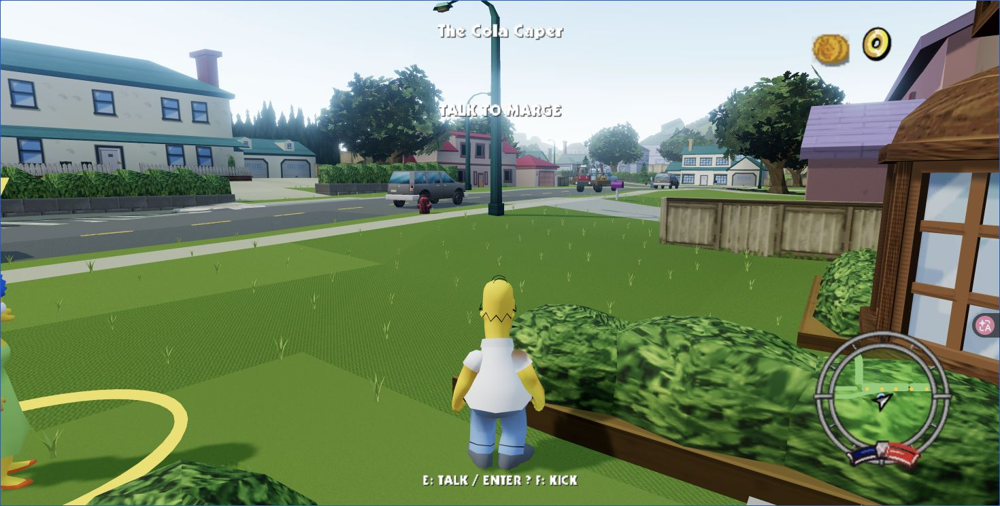

- **[Where the Wind Wanders](https://app.usecrayon.ai/play/a9a3c165-74b3-4ff6-9588-ad97f829ddb5)** — धूप से भरी 2.5D घाटी में रास्तों पर घूमें और शांत अन्वेषण वाले इस रोमांच में हवा के तीन पत्र इकट्ठा करें।
  - निर्माता: [Tushar](https://x.com/TusharXo)
  - प्लैटफ़ॉर्म: ब्राउज़र, Crayon पर होस्ट किया गया; सार्वजनिक गेम पेज और उसमें लगे प्लेयर की जाँच की गई।
  - GPT-6 Astra: [X](https://x.com/TusharXo/status/2096037482739683574) — Tushar ने Astra से रास्ते और एसेट बनाने का विवरण दिया है; बाद की पोस्ट Astra, Three.js और Crayon से बने खेलने योग्य संस्करण की घोषणा करती है। [सत्यापन टिप्पणियाँ](assets/screenshots/crayon-adventure/SOURCE.md).
  - संसाधन: [निर्माता की रिलीज़ घोषणा](https://x.com/TusharXo/status/2096741535891251261)
  - पूर्वावलोकन: 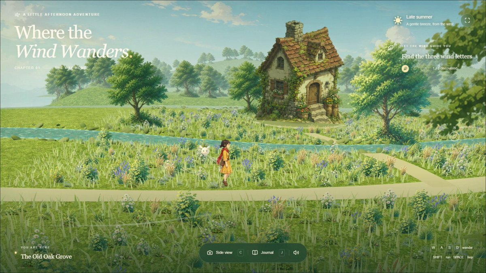

- **[ALIBI — The Last Light](https://alibi-blackthorn-manor.vercel.app/)** — पॉइंट-एंड-क्लिक हत्या रहस्य में Blackthorn Manor की जाँच करें, दृश्यों को परखें और सुरागों से हत्यारे का पता लगाएँ।
  - निर्माता: [Christos Antonopoulos](https://x.com/Christos_antono)
  - प्लैटफ़ॉर्म: ब्राउज़र; इंटरैक्टिव हवेली का प्रवेश बिना साइन इन किए खुला। बाद में उत्पन्न होने वाले दृश्यों का पूरा परीक्षण नहीं किया गया।
  - GPT-6 Astra: [X](https://x.com/Christos_antono/status/2096435122669297892) — निर्माता ने इस जनरेटिव जासूसी गेम के लिए GPT Astra और H3 Max दोनों को श्रेय दिया है। [सत्यापन टिप्पणियाँ](assets/screenshots/alibi-blackthorn-manor/SOURCE.md).
  - पूर्वावलोकन: 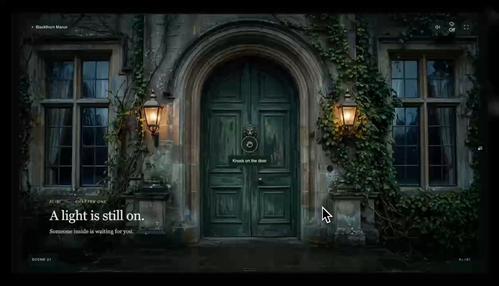

- **[Skyward: The Gathering](https://edge-city-skyward-quests.vercel.app/)** — तैरते द्वीपों का अन्वेषण करें, बस्तियों के बीच कूदें और ग्लाइड करें, और निवासियों के लिए मिशन पूरे करें।
  - निर्माता: [timour kosters](https://x.com/timourxyz)
  - प्लैटफ़ॉर्म: डेस्कटॉप ब्राउज़र, कीबोर्ड और माउस; मिशन वाले संस्करण के पेज और नियंत्रणों की जाँच की गई।
  - GPT-6 Astra: [X](https://x.com/timourxyz/status/2096379521926840339) — निर्माता के अनुसार Astra ने Edge City की जगहों से प्रेरित NPC और मिशन वाला खेलने योग्य 3D गेम बनाया। [सत्यापन टिप्पणियाँ](assets/screenshots/skyward-gathering/SOURCE.md).
  - पूर्वावलोकन: 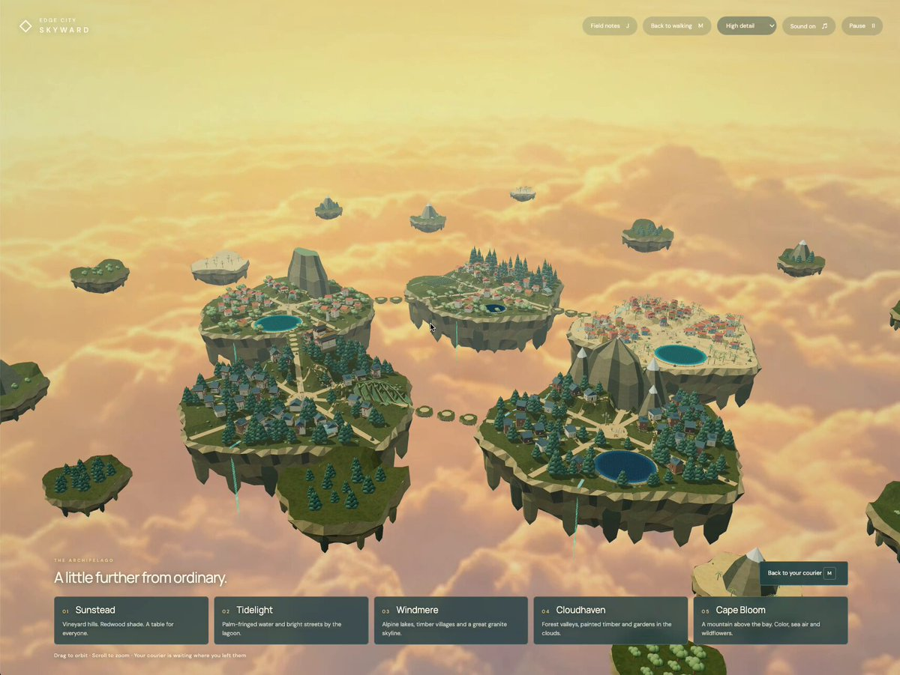

- **[Anna & Leo · The Starstone Adventure](https://anna-leo-starstone.vercel.app/)** — Anna के संगीत वाले जादू और Leo की महाशक्तियों के बीच बदलकर सुरों वाले फूल जगाएँ और Wonder Garden का अन्वेषण करें।
  - निर्माता: [Dharma Utomo](https://x.com/dharmautomo)
  - प्लैटफ़ॉर्म: ब्राउज़र; शुरुआती मिशन बिना साइन इन किए शुरू हुआ। WASD से चलें, Space से कूदें, E से शक्ति और Tab से नायक बदलें।
  - GPT-6 Astra: [X](https://x.com/dharmautomo/status/2096573649235091967) — निर्माता के अनुसार GPT-6 Astra ने इस 3D रोमांच को बनाने में मदद की; उन्होंने अपने बच्चों के खेलने के परीक्षण का वीडियो भी साझा किया। [सत्यापन टिप्पणियाँ](assets/screenshots/anna-leo-starstone/SOURCE.md).
  - पूर्वावलोकन: 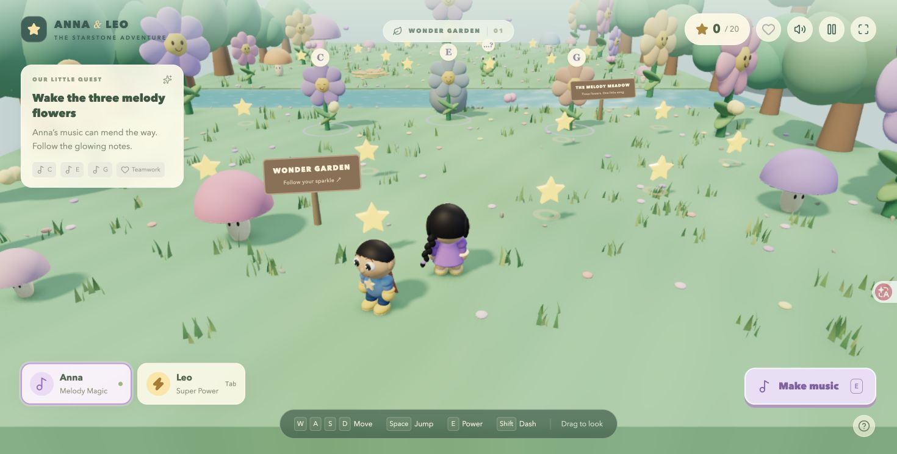

- **[The Legend of Deller](https://rain-court-js.umodeler-inc-4323.chatgpt.site/)** — Rainmist Haven घूमें और तलवार के कॉम्बो, तत्त्व-आधारित कौशल तथा बचाव की चालों के साथ कालकोठरियों की ओर बढ़ें।
  - निर्माता: [UModeler X PicoBerry](https://x.com/UModeler)
  - प्लैटफ़ॉर्म: डेस्कटॉप ब्राउज़र; कीबोर्ड और माउस, बिना लॉगिन के। शुरुआती 3D एसेट पूरी तरह लोड होने दें।
  - GPT-6 Astra: [निर्माता का वक्तव्य](https://x.com/UModeler/status/2097792348407099553) — निर्माता के अनुसार PicoBerry ने एसेट बनाए और GPT-6 Astra ने उन्हें इस्तेमाल करने वाला Three.js एक्शन RPG बनाया। [सत्यापन टिप्पणियाँ](assets/screenshots/the-legend-of-deller/SOURCE.md).
  - संसाधन: [निर्माता का रिलीज़ लिंक](https://x.com/UModeler/status/2097792351129178451)
  - पूर्वावलोकन: 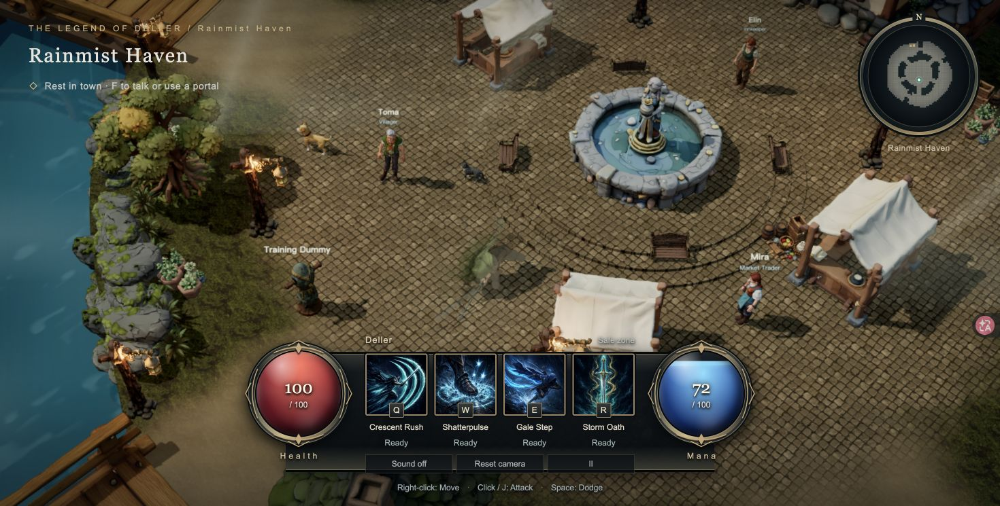

- **[Dungeon of Astra](https://wavedash.com/games/dungeon-of-astra)** — दल में साथी भर्ती करें, सौ मंज़िला कालकोठरी में उतरें और स्थायी मृत्यु वाले अभियान में तलवार, आग के गोलों और साथियों की भूमिकाओं को मिलाएँ।
  - निर्माता: [tonysuri / @tonysurix](https://x.com/tonysurix)
  - प्लैटफ़ॉर्म: Wavedash पर डेस्कटॉप ब्राउज़र; मूल गेम बिना साइन इन किए शुरू होता है। वैकल्पिक खाते और पैसे देकर पात्रों को समय से पहले खोलने की सुविधा उपलब्ध है।
  - GPT-6 Astra: [निर्माता का वक्तव्य](https://x.com/tonysurix/status/2097873333551616355) — निर्माता ने स्पष्ट कहा है कि यह दल के साथ कालकोठरी खोजने वाला गेम GPT-6 Astra से बनाया गया। [सत्यापन टिप्पणियाँ](assets/screenshots/dungeon-of-astra/SOURCE.md).
  - पूर्वावलोकन: 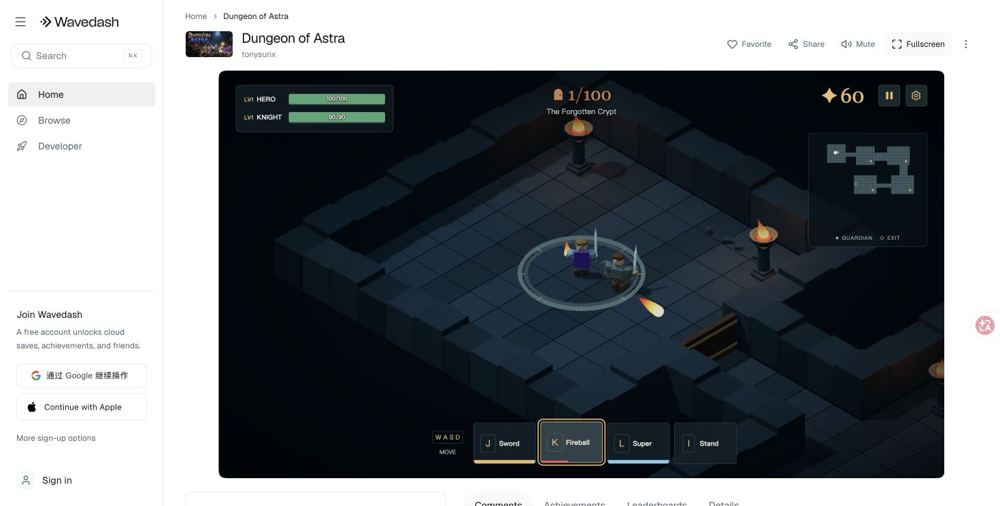

- **[Sunlandia — The Forgotten Shore](https://sunlandia.smallweblab.com/)** — जहाज़ डूबने के बाद एक द्वीप खोजें, प्रथम-व्यक्ति दृष्टि से सुराग जाँचें और प्रकाशस्तंभ की ओर जाते हुए परिवेश की पहेलियाँ सुलझाएँ।
  - निर्माता: [Ramon Linares / Small Web Lab](https://github.com/RamonLinares)
  - प्लैटफ़ॉर्म: डेस्कटॉप ब्राउज़र; द्वीप लोड होने दें, फिर Begin expedition चुनें। मुफ़्त, बिना खाते या इंस्टॉलेशन के।
  - GPT-6 Astra: [निर्माता की विकास डायरी](https://smallweblab.com/posts/sunlandia/) — निर्माता ने GPT-5.6 Sol से शुरुआत की, Fable की मदद ली और GPT-6 Astra से गेम पूरा किया। [सत्यापन टिप्पणियाँ](assets/screenshots/sunlandia/SOURCE.md).
  - पूर्वावलोकन: 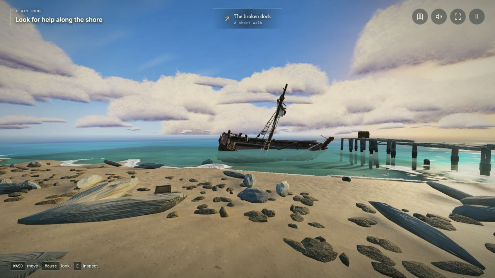

- **[NÁCAR](https://nacar-microcosmo.preda2005.chatgpt.site/)** — पानी से भरे घोंघे के खोल के भीतर एक सूक्ष्म जीव बढ़ाएँ, पोषक तत्व जुटाएँ और अन्वेषण के साथ शरीर के नए अंग विकसित करें।
  - निर्माता: [Marcio Lima / @Preda2005](https://x.com/Preda2005)
  - प्लैटफ़ॉर्म: ब्राउज़र; मुफ़्त बीटा, बिना साइन इन के; चीनी सहित पाँच इंटरफ़ेस भाषाएँ।
  - GPT-6 Astra: [निर्माता की पोस्ट शृंखला](https://x.com/Preda2005/status/2097954217180921928) — Marcio के अनुसार उन्होंने जीव के विकास का यह विचार GPT-6 Astra को समझाया और इसे लिंक किए गए बीटा में विकसित किया। [सत्यापन टिप्पणियाँ](assets/screenshots/nacar/SOURCE.md).
  - पूर्वावलोकन: 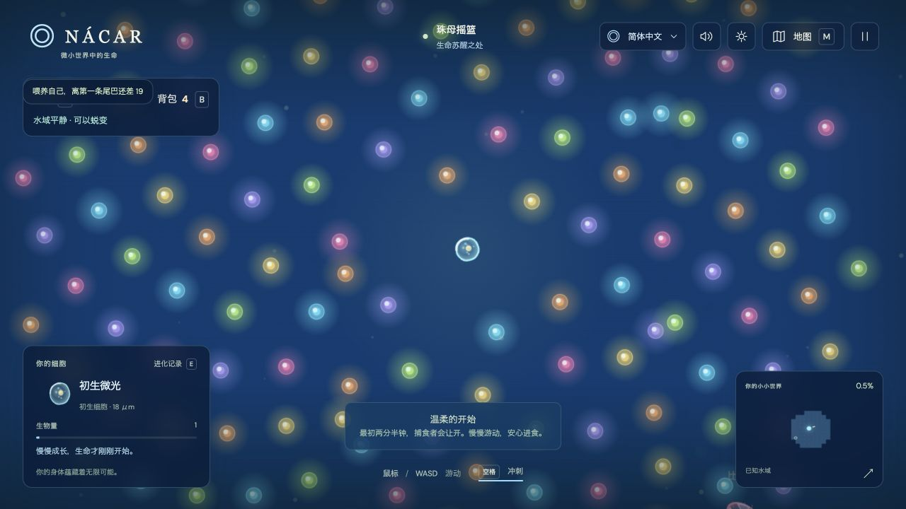

### प्लैटफ़ॉर्मर और रेसिंग

पार्कूर, प्लैटफ़ॉर्म की चुनौतियाँ, रेसिंग और गति व रास्तों पर आधारित गेम।

- **[Barrelbound: The Lost Cargo](https://barrelbound.vercel.app/)** — Rocco या Pip चुनें और जंगल के तीन प्लैटफ़ॉर्मिंग स्तरों में डबल जंप करें, बैरल फेंकें और खदान की ट्रॉली चलाएँ। खोया माल वापस जुटाते हुए अंतिम बॉस तक पहुँचें।
  - रचनाकार: [Emile du Toit / Mafuta Games](https://mafuta.itch.io/)
  - प्लैटफ़ॉर्म: डेस्कटॉप या लैपटॉप ब्राउज़र, अंग्रेज़ी इंटरफ़ेस; मुफ़्त, लॉगिन या इंस्टॉलेशन की ज़रूरत नहीं। कीबोर्ड नियंत्रण; कंट्रोलर समर्थन रचनाकार के बयान पर आधारित है।
  - GPT-6 Astra: [रचनाकार का बयान](https://github.com/MartinDelophy/awesome-gpt-6-astra/issues/73) — रचनाकार ने Codex में GPT-6 Astra से कोड, गेम की यांत्रिकी, क्रमिक सुधार और परीक्षण कराए, जबकि डिज़ाइन का निर्देशन और खेलकर जाँच स्वयं की। चित्र अलग से इमेज जनरेशन से बनाए गए; संगीत और ध्वनि प्रभाव Web Audio से संश्लेषित होते हैं।
  - संसाधन: [itch.io](https://mafuta.itch.io/barrelbound) · [गेमप्ले वीडियो](https://youtu.be/X87UqF_n3ro) · Phaser 3, Vite और Web Audio; सोर्स कोड का रिपॉज़िटरी निजी है। [सत्यापन और स्क्रीनशॉट का स्रोत (अंग्रेज़ी)](assets/screenshots/barrelbound/SOURCE.md)
  - पूर्वावलोकन: 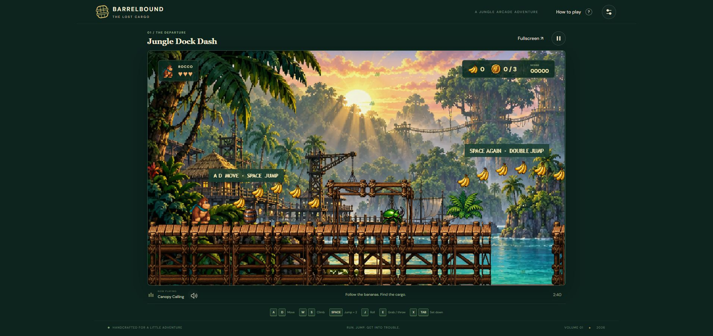

- **[STORM RACE](https://storm-race.vercel.app/)** — मिनी 4WD रेसिंग, जिसमें पुर्जों का विस्तृत गैराज दृश्य, बूस्ट और सूखी, बरसाती व तूफ़ानी ट्रैक स्थितियाँ हैं।
  - रचनाकार: [BubuAi](https://x.com/BubuStd)
  - प्लेटफ़ॉर्म: डेस्कटॉप ब्राउज़र; बिना लॉगिन या भुगतान के खोला गया। मोबाइल परीक्षण नहीं हुआ।
  - GPT-6 Astra: [X](https://x.com/BubuStd/status/2096587056755638553) — लेखक ने इस परियोजना के विकास में Astra के उपयोग की जानकारी दी है। [जाँच विवरण (अंग्रेज़ी)](assets/screenshots/storm-race/SOURCE.md).
  - पूर्वावलोकन: 

- **[FANG STARLIGHT RUN](https://fang-starlight-run.yosshy666.chatgpt.site/)** — भेड़िये को तीन चाँदनी स्तरों से ले जाएँ और डबल जंप व डैश से सिक्के और तारों के टुकड़े जुटाएँ।
  - रचनाकार: [FANGプラス最強伝説🐺](https://x.com/FANGsaikyou)
  - प्लेटफ़ॉर्म: डेस्कटॉप ब्राउज़र; बिना लॉगिन या भुगतान के खोला गया। मोबाइल परीक्षण नहीं हुआ।
  - GPT-6 Astra: [X](https://x.com/FANGsaikyou/status/2096192022596194588) — लेखक ने इस परियोजना के विकास में Astra के उपयोग की जानकारी दी है। [जाँच विवरण (अंग्रेज़ी)](assets/screenshots/fang-starlight-run/SOURCE.md).
  - पूर्वावलोकन: 

- **[Blue Bajaj Rally](https://bajaj.guzo.tech/)** — इथियोपिया से प्रेरित पहाड़ी सर्किट पर तीन पहियों वाली Bajaj चलाएँ और पाँच AI प्रतिद्वंद्वियों या घड़ी से मुकाबला करें।
  - रचनाकार: [Guzo Technologies](https://x.com/guzotech)
  - प्लेटफ़ॉर्म: डेस्कटॉप ब्राउज़र; बिना लॉगिन या भुगतान के खोला गया। मोबाइल परीक्षण नहीं हुआ।
  - GPT-6 Astra: [X](https://x.com/guzotech/status/2096209787864088638) — लेखक ने इस परियोजना के विकास में Astra के उपयोग की जानकारी दी है। [जाँच विवरण (अंग्रेज़ी)](assets/screenshots/blue-bajaj-rally/SOURCE.md).
  - पूर्वावलोकन: 

- **[APEX CLUB — Bay Kart Grand Prix](https://apex-club-racing.vercel.app)** — Bay Circuit पर तीन लैप की रेस लगाएँ, छह कार्ट में से चुनें और मोड़ से बाहर निकलते समय इस्तेमाल करने के लिए मिनी टर्बो चार्ज करें। व्यक्तिगत रैंकिंग में आगे बढ़ें या 4 बनाम 4 की टीम के लिए अंक जुटाएँ।
  - रचनाकार: Ryan
  - प्लैटफ़ॉर्म: WebGL 2 और कीबोर्ड वाला डेस्कटॉप ब्राउज़र; मुफ़्त, लॉगिन या API कुंजी की ज़रूरत नहीं। स्थानीय HTTP सर्वर या स्थिर होस्टिंग से चलता है; Three.js स्थानीय रूप से शामिल है। टीम रेस स्थानीय है: एक मानव खिलाड़ी और सात AI रेसर।
  - मॉडल की भागीदारी: [विकास का रिकॉर्ड](works/apex-club/CREATION.md) — Codex में गेमप्ले, कोड, प्रक्रियात्मक ग्राफ़िक्स और परीक्षणों पर कई चरणों में काम किया गया; GPT-6 Astra के उपयोग की पुष्टि अभी रचनाकार से होनी बाकी है।
  - विकास संसाधन: [स्रोत कोड और चलाने के निर्देश](works/apex-club/README.md) · [आवश्यकताएँ और क्रमिक सुधारों के नोट्स](works/apex-club/PROMPTS.md) · [साझा GPT बातचीत](https://chatgpt.com/s/cx_6a9e84c13c9c8191bcb7ad0801288adc) · तकनीक: JavaScript, Three.js.
  - झलक: 

- **[PELICAN PEDAL / 鹈鹕踏浪](https://pelican-pedal.zecoba.workers.dev/)** — बदलते 3D समुद्री तट पर साइकिल चलाते पेलिकन के साथ दौड़ें: तीन लेन के बीच बदलें, कूदकर या झुककर बाधाओं से बचें, लगातार मछलियाँ इकट्ठी करें और ढाल, चुंबक तथा छह सेकंड की अजेय तेज़ दौड़ का इस्तेमाल करें।
  - रचनाकार: [chat01.ai](https://chat01.ai) (प्रस्तुति में दिया गया रचनाकार)।
  - प्लैटफ़ॉर्म: कंप्यूटर और मोबाइल ब्राउज़र, कीबोर्ड या स्पर्श नियंत्रण के साथ; प्रस्तुति के अनुसार मुफ़्त और बिना लॉगिन। डेमो की स्वतंत्र पुष्टि नहीं हुई है।
  - GPT-6 Astra: [Issue #10](https://github.com/MartinDelophy/awesome-gpt-6-astra/issues/10) — प्रस्तुतकर्ता के अनुसार गेम एक ही प्रॉम्प्ट से बनाया गया है; लिंक किए गए विकास रिकॉर्ड की स्वतंत्र पुष्टि नहीं हुई है।
  - विकास संसाधन: [साझा किया गया विकास रिकॉर्ड](https://chat01.ai/zh/chat/01M1VJ5K55803V2YK3T2NKTX33)
  - झलक: 

- **[狂飙赛车 · OVERDRIVE](https://gpt-kbsc.0nz.de/)** — पाँच AI प्रतिद्वंद्वियों के साथ 3D रेसिंग; कार और ट्रैक चयन, टाइम ट्रायल, ड्रिफ्ट और नाइट्रो उपलब्ध हैं।
  - रचनाकार: zding
  - प्लेटफ़ॉर्म: ब्राउज़र, चीनी इंटरफ़ेस; बिना लॉगिन या भुगतान के शुरू होना सत्यापित।
  - GPT-6 Astra: GPT-6 Astra के उपयोग और योगदान की निर्माता से पुष्टि बाकी है।
  - पूर्वावलोकन: 

- **[零界深潜 / ABYSS PROTOCOL](https://abyss-descent.zecoba.workers.dev/)** — केवल बाएँ-दाएँ चलकर 3D कुएँ में उतरें। हिलते, टूटते और गायब होते प्लेटफ़ॉर्म पार करें, लेज़र और आरी से बचें तथा क्रिस्टल और जीवनरक्षक चिप इकट्ठा करें।
  - रचनाकार: [chat01.ai](https://linux.do/u/bandaot)
  - प्लेटफ़ॉर्म: डेस्कटॉप ब्राउज़र, चीनी इंटरफ़ेस, A/D या तीर कुंजियाँ। बिना खाते या भुगतान के शुरुआत जाँची गई; मोबाइल पर परीक्षण नहीं हुआ।
  - Codex: [Chat01](https://chat01.ai/en/chat/01M221KFTPTBQV5ARQWJM7P86Y) — साझा रिकॉर्ड में GPT-6 Pro लिखा है और खेल का निर्माण तथा कई दौर के संशोधन दर्ज हैं; GPT-6 Astra स्पष्ट रूप से नहीं लिखा है।
  - संसाधन: [HTML](https://files.chat01.ai/python-generations/9ab8f4f7-425f-4709-b741-7218d87122e6/abyss-descent.html) · [ZIP](https://files.chat01.ai/python-generations/9ab8f4f7-425f-4709-b741-7218d87122e6/abyss-descent-complete.zip)
  - पूर्वावलोकन: 

- **[疾风赛道 / Kart Racing（跑跑卡丁车）](https://qwen3-8-test.vercel.app/)** — ड्रिफ्ट, नाइट्रो और आइटम के साथ तीन लैप की दौड़; वर्तमान नाम 疾风赛道 है और 2–4 खिलाड़ियों का ऑनलाइन मोड भी है।
  - रचनाकार: [SteveZhang / jay6697117](https://github.com/jay6697117) · [X](https://x.com/stevezh10058543)
  - प्लेटफ़ॉर्म: ब्राउज़र, मुफ़्त, बिना खाते के। निर्माता के अनुसार VPN/प्रॉक्सी आवश्यक हो सकता है। सोलो शुरुआत जाँची गई; मल्टीप्लेयर नहीं।
  - GPT-6 Astra: [Issue #51](https://github.com/MartinDelophy/awesome-gpt-6-astra/issues/51) — निर्माता के अनुसार: पहला संस्करण Qwen3.8 Max से; दूसरा Astra से पूरी तरह पुनर्निर्मित।
  - पूर्वावलोकन: 

- **[TIDAL RUSH — Paradise GP](https://tidal-rush-paradise-gp.skirano.chatgpt.site/)** — उष्णकटिबंधीय कार्ट ट्रैक पर ड्रिफ़्ट करें, आइटम इस्तेमाल करें और तीन चक्करों में सात प्रतिद्वंद्वियों से रेस करें।
  - निर्माता: [Pietro Schirano](https://x.com/skirano)
  - प्लैटफ़ॉर्म: ब्राउज़र; तीन चक्करों की रेस बिना साइन इन किए शुरू हुई। ड्राइविंग, ड्रिफ़्ट और आइटम के लिए कीबोर्ड नियंत्रण, साथ में स्क्रीन पर टच बटन।
  - GPT-6 Astra: [मॉडल के उपयोग का प्रमाण](https://openai.com/index/gpt-6-astra/) — OpenAI के Astra लॉन्च पेज में इस इंटरैक्टिव कार्ट गेम का लिंक है और Pietro Schirano को श्रेय दिया गया है। X पर इसकी जानकारी देने वाली पोस्ट समुदाय की साझा पोस्ट है, निर्माता की अपनी पोस्ट नहीं। [सत्यापन टिप्पणियाँ](assets/screenshots/tidal-rush/SOURCE.md).
  - संसाधन: [X पर गेम की जानकारी](https://x.com/alexgetmancom/status/2095598460921614825)
  - पूर्वावलोकन: 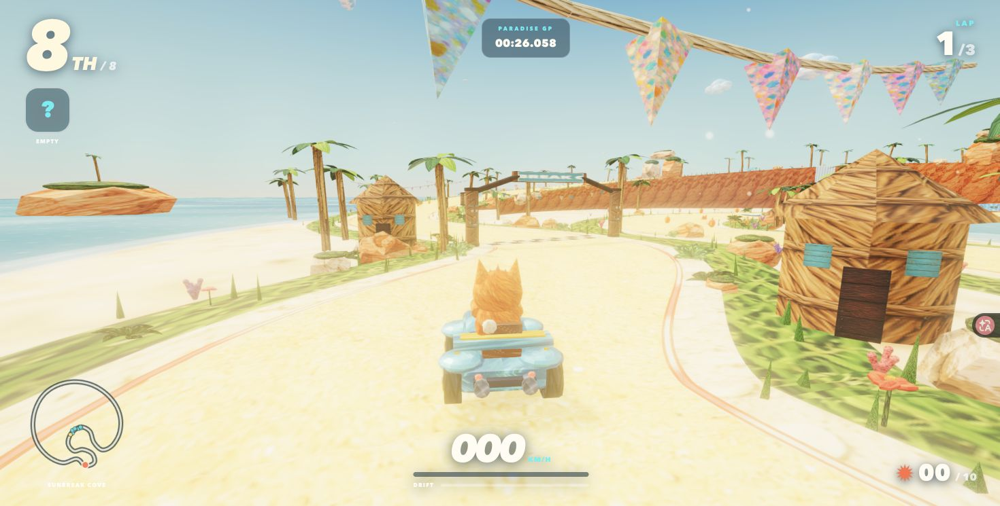

- **[LUNA — Crimson Requiem / 紅月のレクイエム](https://luna-crimson-requiem.ponsuke.chatgpt.site/)** — गॉथिक पिक्सेल आर्ट वाले स्तर में कूदें, दुश्मनों पर वार करें, ऊपर से कूदकर उन्हें कुचलें या हमला बुलाएँ—एक छोटा साइड-स्क्रॉलिंग रोमांच।
  - निर्माता: [音羽ぽんすけ](https://x.com/ponsuke_otowa)
  - प्लैटफ़ॉर्म: ब्राउज़र, जापानी इंटरफ़ेस; कीबोर्ड नियंत्रण और निर्माता द्वारा बताया गया स्मार्टफ़ोन समर्थन। एक स्तर उपलब्ध है।
  - GPT-6 Astra: [X](https://x.com/ponsuke_otowa/status/2096531744933425299) — निर्माता के अनुसार Astra से विकास में लगभग 25 मिनट लगे और चलने के एनीमेशन में एक सुधार किया गया; संगीत का श्रेय अलग से Suno को है। [सत्यापन टिप्पणियाँ](assets/screenshots/luna-crimson-requiem/SOURCE.md).
  - पूर्वावलोकन: 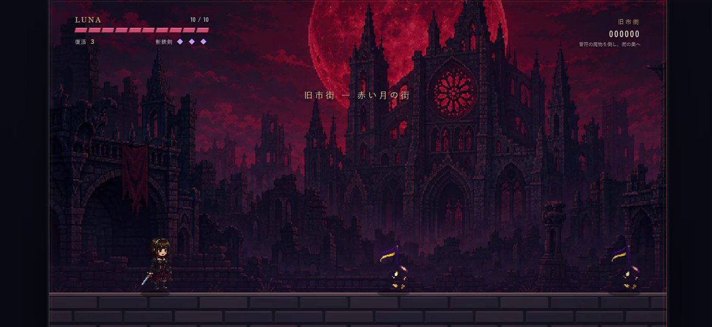

- **[Strange Orbit](https://app.usecrayon.ai/play/47df78e2-1410-45d1-833c-196e1161c0b8)** — ग्रह के छल्लों पर अंतरिक्ष यात्री साइकिल चालकों की रेस करें, तारों की धूल इकट्ठा करें, प्रतिद्वंद्वियों के पीछे चलकर हवा का प्रतिरोध घटाएँ और Orbital Cup में बूस्ट लें।
  - निर्माता: [Crayon](https://x.com/usecrayon)
  - प्लैटफ़ॉर्म: Crayon पर ब्राउज़र; कीबोर्ड और दस्तावेज़ों में बताए गए टच नियंत्रण। सार्वजनिक पेज में रेस, समय-परीक्षण और अंतहीन भ्रमण के मोड हैं।
  - GPT-6 Astra: [X](https://x.com/usecrayon/status/2097468975995302167) — Crayon ने इस अंतरिक्ष साइकिल गेम के लिए GPT-6 Astra, Crayon Pro और Three.js को श्रेय दिया है। [सत्यापन टिप्पणियाँ](assets/screenshots/crayon-space-bike/SOURCE.md).
  - पूर्वावलोकन: 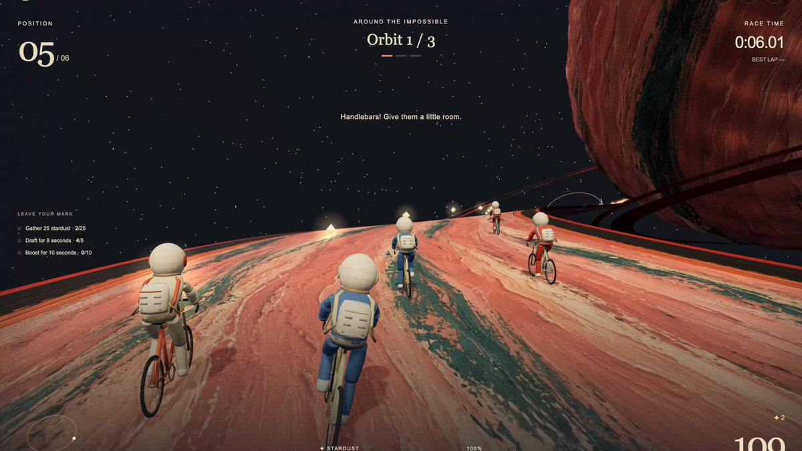

- **[One More Vine — Into the Wild](https://onemorevine.bennash.dev/)** — जंगल के चार स्तरों में दौड़ें, कूदें और बेलों पर झूलें, खज़ाने जुटाएँ, मगरमच्छों से बचें और अपना समय सुधारें।
  - निर्माता: [Ben Nash](https://x.com/bennash)
  - प्लैटफ़ॉर्म: ब्राउज़र, कीबोर्ड और स्क्रीन पर गति नियंत्रण; पहला स्तर और निर्देश बिना साइन इन किए लोड हुए।
  - GPT-6 Astra: [X](https://x.com/bennash/status/2096282758930645170) — निर्माता ने स्पष्ट रूप से इसे GPT-6 Astra से बना, Pitfall से प्रेरित चार स्तरों वाला गेम बताया है। [सत्यापन टिप्पणियाँ](assets/screenshots/one-more-vine/SOURCE.md).
  - पूर्वावलोकन: 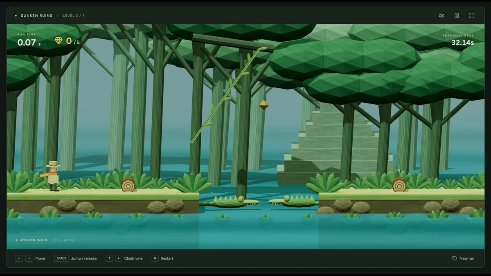

- **[混合马里奥Ⅱ · 忍者龙剑传 × 坦克大战 / Mario Mix II](https://aha-xiaoq.github.io/games/mario-mix-2/play.html)** — Ninja Gaiden के Ryu Hayabusa और Battle City के टैंक के साथ Mario की भूमिगत दुनिया 1-2 में जाएँ: र्यू के साथ साइड-स्क्रॉलिंग में कूदें, दीवारें चढ़ें और लड़ें, टैंक के साथ ऊपर से दिखने वाली लड़ाइयाँ खेलें, या निंजा से टैंक तक की रिले में राजकुमारी को बचाएँ।
  - रचनाकार: [在下_小Q（Aha-xiaoQ）](https://github.com/Aha-xiaoQ)
  - प्लैटफ़ॉर्म: कंप्यूटर का ब्राउज़र, चीनी इंटरफ़ेस, कीबोर्ड का उपयोग सुझाया गया है; मुफ़्त, लॉगिन या इंस्टॉलेशन की ज़रूरत नहीं।
  - GPT-6 Astra: [Issue #65](https://github.com/MartinDelophy/awesome-gpt-6-astra/issues/65) — रचनाकार के अनुसार, गेम के कोड और इंटरैक्शन को कई चरणों में विकसित और डीबग करने के लिए GPT-6 Astra का उपयोग किया गया। खेल की दिशा और लगातार फ़ीडबैक रचनाकार ने दिया; यह एक ही प्रॉम्प्ट से बना गेम नहीं है।
  - संसाधन: [परियोजना का परिचय](https://aha-xiaoq.github.io/games/mario-mix-2/) · [वीडियो](https://www.bilibili.com/video/BV1erYt69EFP/) · [सत्यापन और चित्रों के स्रोत (अंग्रेज़ी)](assets/screenshots/mario-mix-2/SOURCE.md)
  - अधिकार: यह अनौपचारिक फ़ैन गेम है; पुराने पात्रों, चित्रों और संगीत के अधिकार उनके संबंधित अधिकारधारकों के पास हैं। सामग्री का श्रेय मूल गेम के पृष्ठ पर दिया गया है।
  - पूर्वावलोकन: 
  - स्क्रीनशॉट: 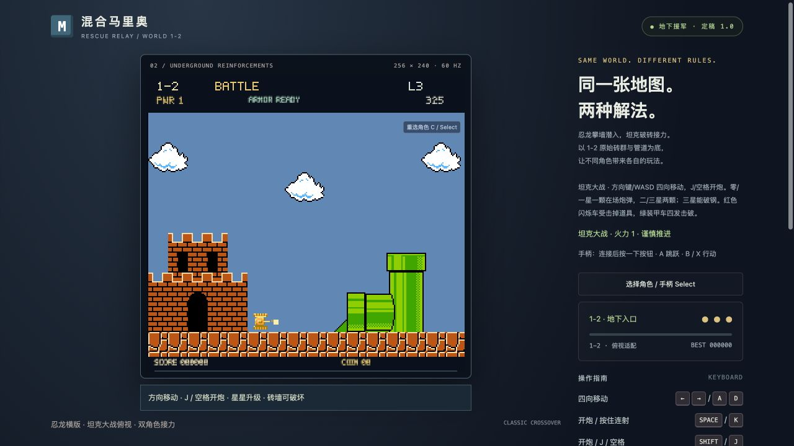

- **[Bengaluru ORR Rush](https://orr-rush-bengaluru.ravitheja.chatgpt.site/)** — बेंगलुरु के ट्रैफ़िक में रेस करें, गड्ढों और डिलीवरी बाइकों से बचें और जगह बनाने के लिए बूस्ट या बगल की ओर झटका इस्तेमाल करें।
  - निर्माता: [Ravi Theja](https://x.com/ravithejads)
  - प्लैटफ़ॉर्म: डेस्कटॉप ब्राउज़र; कीबोर्ड नियंत्रण और वैकल्पिक ऑटो-थ्रॉटल, बिना लॉगिन के।
  - GPT-6 Astra: [निर्माता का वक्तव्य](https://x.com/ravithejads/status/2097181044625887392) — निर्माता ने बेंगलुरु की सड़क रेसिंग वाले इस गेम का श्रेय GPT-6 Astra को दिया है। [सत्यापन टिप्पणियाँ](assets/screenshots/bengaluru-orr-rush/SOURCE.md).
  - पूर्वावलोकन: 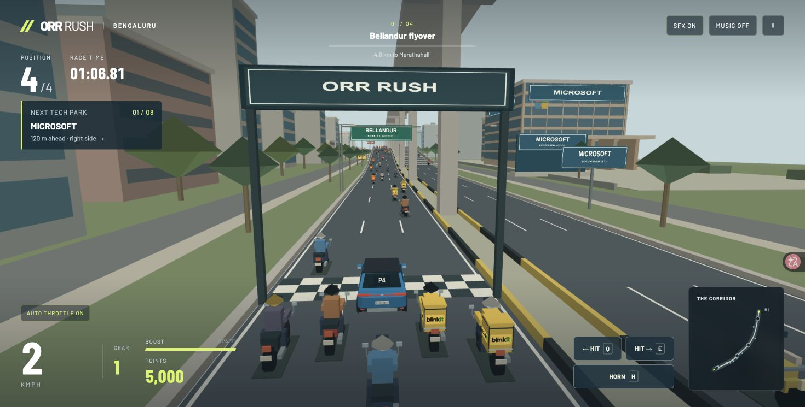

- **[SKICROSS — Alpine Downhill](https://iamsonic.net/2026/mini-games/skicross.html)** — तीन स्की खिलाड़ियों के विरुद्ध पहाड़ से नीचे रेस करें, गेट और बाधाएँ पार करें, और हिमस्खलन से आगे रहें।
  - निर्माता: [Sonic的奇思妙想](https://x.com/sonic0828)
  - प्लैटफ़ॉर्म: डेस्कटॉप ब्राउज़र; A/D से दिशा, Space से छलाँग और Shift से बूस्ट; लॉगिन या डाउनलोड नहीं चाहिए।
  - GPT-6 Astra: [निर्माता का वक्तव्य](https://x.com/sonic0828/status/2097601232877781344) — निर्माता ने मिनी-गेम संग्रह का श्रेय GPT-6 Astra को दिया और अलग जवाब में यह स्की गेम साझा किया। [सत्यापन टिप्पणियाँ](assets/screenshots/skicross/SOURCE.md).
  - संसाधन: [निर्माता का रिलीज़ लिंक](https://x.com/sonic0828/status/2097601732297814300)
  - पूर्वावलोकन: 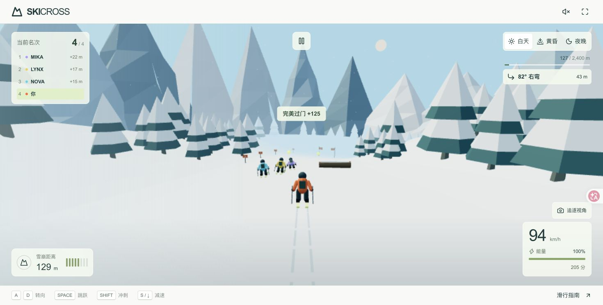

- **[Itsy Bitsy Spider · One More Climb](https://game-bench.piccini.app/games/gpt-6-astra/)** — काई वाली दीवार चढ़ें, पकड़ की ताकत लौटाने के लिए मक्खियाँ पकड़ें और बारिश के मकड़ी को बहा देने से पहले आश्रय वाले छेदों में छिपें।
  - निर्माता: [Luiz Piccini](https://piccini.app/)
  - प्लैटफ़ॉर्म: ब्राउज़र; मुफ़्त, बिना साइन इन के। WASD या स्क्रीन वाला जॉयस्टिक।
  - GPT-6 Astra: [निर्माता का Game Bench](https://game-bench.piccini.app/) — Game Bench ने इस प्रकाशित परिणाम को GPT-6 Astra canary, high, दिनांक 2026-09-05 के रूप में चिह्नित किया है; यह उसके साझा गेम निर्देशों से बना है। [सत्यापन टिप्पणियाँ](assets/screenshots/itsy-bitsy-spider/SOURCE.md).
  - पूर्वावलोकन: 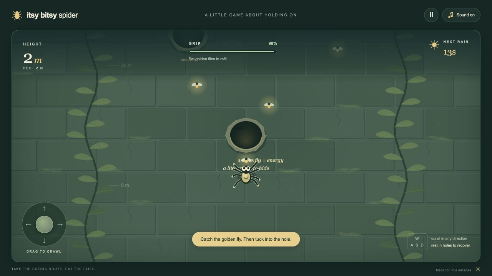

- **[Desi Mayhem](https://desimayhem.com/)** — भारतीय शहरों के ट्रैफ़िक में मोटरसाइकिल रेस करें, बसों और ऑटो के बीच निकलें और लात, मुक्के तथा बूस्ट इस्तेमाल करें।
  - निर्माता: [Kishore](https://x.com/GetKishore)
  - प्लैटफ़ॉर्म: डेस्कटॉप ब्राउज़र; मुफ़्त, बिना खाते के। पहली सवारी से पहले बनाए गए राइडर उपनाम को स्वीकारें या बदलें।
  - GPT-6 Astra: [निर्माता की विकास संबंधी पोस्ट शृंखला](https://x.com/GetKishore/status/2097906401159102811) — Kishore ने सड़क के संदर्भों और ट्रैफ़िक, टक्करों व राइडर की लड़ाई के बार-बार परीक्षण से Astra में बने 3D गेम को सुधारने का विवरण दिया है। [सत्यापन टिप्पणियाँ](assets/screenshots/desi-mayhem/SOURCE.md).
  - पूर्वावलोकन: 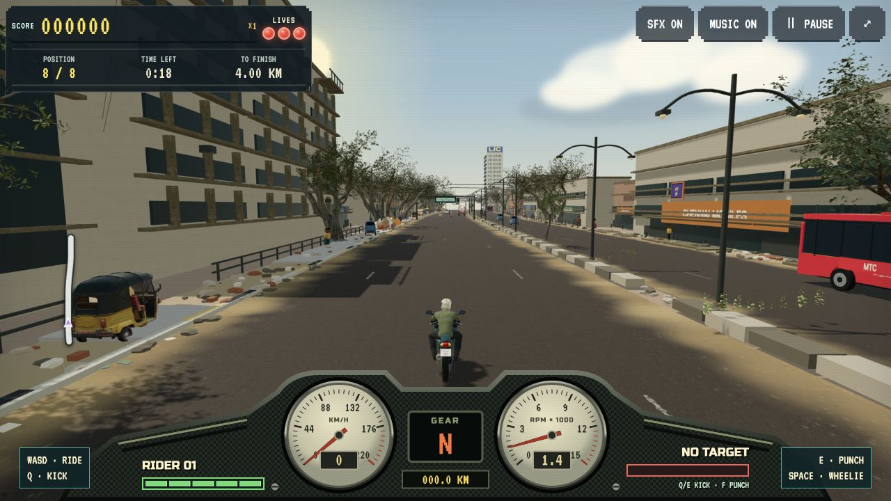

- **[Cosmic Tides](https://app.usecrayon.ai/play/362ae1e7-29bd-4fbc-9103-00649265d942)** — आकाशगंगीय महासागर पर यान चलाएँ, चमकते गेटों का रास्ता पकड़ें और दो चक्करों की रेस या अंतहीन बहाव में से चुनें।
  - निर्माता: [Aniket J](https://x.com/aniketjart)
  - प्लैटफ़ॉर्म: ब्राउज़र; 3D एसेट लोड होने दें, फिर Ride the current चुनें। मुफ़्त, बिना साइन इन के।
  - GPT-6 Astra: [X](https://x.com/aniketjart/status/2098207146647433534) — Aniket ने गेम के लिए GPT-6 Astra, Blender MCP और Crayon को श्रेय दिया है; उनके अनुसार यह एक प्रयोग है जिसमें गेमप्ले को आगे सुधारने की योजना है। [सत्यापन टिप्पणियाँ](assets/screenshots/cosmic-tides/SOURCE.md).
  - पूर्वावलोकन: 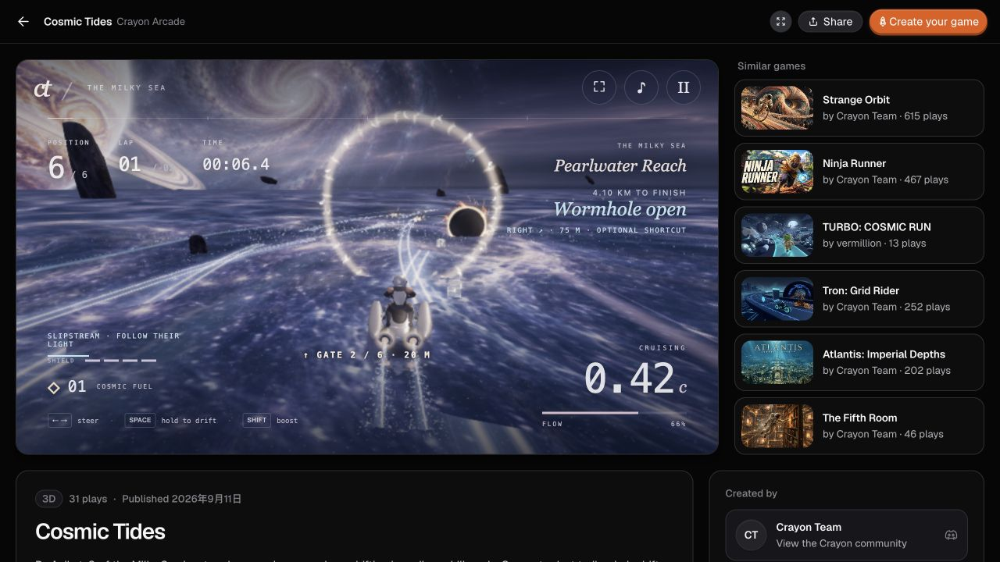

### प्रयोगात्मक और मल्टीप्लेयर

अनोखे खेल-तंत्र, ऑनलाइन प्रतियोगिता और मिलकर खेलने के अनुभव।

- **[ASTRA Arcade](https://astra-arcade.antonioleivag.chatgpt.site/)** — पहाड़ी रैली, स्नोबोर्ड और गुरुत्व-विरोधी रेस सहित छह ब्राउज़र खेल; पूरे संग्रह को एक प्रविष्टि माना गया है।
  - रचनाकार: [Antonio Leiva](https://x.com/antonioleivag)
  - प्लेटफ़ॉर्म: डेस्कटॉप ब्राउज़र; बिना लॉगिन या भुगतान के खोला गया। मोबाइल परीक्षण नहीं हुआ।
  - GPT-6 Astra: [X](https://x.com/antonioleivag/status/2096509898481651770) — लेखक ने इस परियोजना के विकास में Astra के उपयोग की जानकारी दी है। [जाँच विवरण (अंग्रेज़ी)](assets/screenshots/astra-arcade/SOURCE.md).
  - पूर्वावलोकन: 

- **[Chao Party](https://chao.party/)** — Chao Garden का अनौपचारिक मल्टीप्लेयर प्रशंसक खेल: Sonic पात्र चुनें और बगीचे में Chao से बातचीत करें।
  - रचनाकार: [Hank](https://x.com/h4nkdog)
  - प्लेटफ़ॉर्म: डेस्कटॉप ब्राउज़र; बिना लॉगिन या भुगतान के खोला गया। मोबाइल परीक्षण नहीं हुआ।
  - GPT-6 Astra: [X](https://x.com/h4nkdog/status/2097308970431987857) — लेखक ने इस परियोजना के विकास में Astra के उपयोग की जानकारी दी है। [जाँच विवरण (अंग्रेज़ी)](assets/screenshots/chao-party/SOURCE.md).
  - पूर्वावलोकन: 

- **[ORBITAL GARDEN · 轨道花园](https://orbital-garden-one.vercel.app)** — कणों से कला बनाने वाला इंटरैक्टिव सैंडबॉक्स: 48,000 प्रकाश बिंदुओं को फूल, गुरुत्वीय छल्ले और आकाशगंगा के बीच बदलें, आकृति को प्रभावित करें और किसी पल को पोस्टर के रूप में निर्यात करें।
  - रचनाकार: [jackroc](https://github.com/jackroc)
  - प्लैटफ़ॉर्म: WebGL समर्थित आधुनिक ब्राउज़र; ऑनलाइन आज़माने के लिए शीर्षक पर क्लिक करें। मुफ़्त, लॉगिन या API कुंजी की ज़रूरत नहीं; स्वतंत्र HTML फ़ाइल ऑफ़लाइन भी चलती है। वैकल्पिक परिवेशी ध्वनि के लिए Web Audio आवश्यक है।
  - GPT-6 Astra: [निर्माण का रिकॉर्ड और मॉडल का योगदान](works/orbital-garden/README.md#模型与创作记录) — रचनाकार ने अवधारणा, कोड और पाठ के लिए GPT-6 Astra ultra का उपयोग किया और सहयोगी समीक्षा की; यह एक ही अनुरोध से निर्माण का परीक्षण नहीं है।
  - विकास संसाधन: [स्रोत कोड और चलाने के निर्देश](works/orbital-garden/README.md) · [स्वतंत्र HTML फ़ाइल](works/orbital-garden/index.html) · [Prompt](works/orbital-garden/PROMPT.md) · तकनीक: WebGL (बिना फ़्रेमवर्क), Web Audio, Canvas 2D.
  - पूर्वावलोकन: 

- **[Toy2Game / 在线玩具箱](https://games.asmo.top/)** — टेबलटॉप खिलौनों से बने चार 3D गेम: पेंगुइन के नीचे की बर्फ तोड़ें, खरगोशों को जालों से पार कराएँ, प्लेटफ़ॉर्म पर अंतरिक्ष यात्रियों का संतुलन बनाएँ और पार्किंग से बाहर निकलने की पहेलियाँ हल करें।
  - रचनाकार: [asmoyou](https://github.com/asmoyou)
  - प्लैटफ़ॉर्म: कंप्यूटर, टैबलेट और मोबाइल ब्राउज़र; मुफ़्त, बिना लॉगिन। एक ही स्क्रीन पर बारी-बारी से 2–4 स्थानों पर खेल सकते हैं, जिनमें कंप्यूटर प्रतिद्वंद्वी भी हो सकते हैं; एकल पहेलियाँ भी हैं। ऑनलाइन मल्टीप्लेयर नहीं है। डेमो की स्वतंत्र पुष्टि नहीं हुई है।
  - GPT-6 Astra: [रचनाकार का कथन](https://github.com/MartinDelophy/awesome-gpt-6-astra/issues/24) — रचनाकार के अनुसार, खिलौनों के विवरण और सुविधाओं की आवश्यकताओं से GPT-6 Astra ने अपने आप गेम बनाए और उनका परीक्षण किया।
  - विकास संसाधन: [स्रोत कोड और चलाने के निर्देश](https://github.com/asmoyou/toy2game) · [गैर-व्यावसायिक लाइसेंस](https://github.com/asmoyou/toy2game/blob/main/LICENSE) — स्रोत कोड उपलब्ध है; गैर-व्यावसायिक उपयोग मुफ़्त है और व्यावसायिक उपयोग के लिए लेखक की पूर्व लिखित अनुमति आवश्यक है। तकनीक: TypeScript, React, Vite, Three.js.
  - झलक: 

- **[Jelly Baby](https://jelly.scottsun.io/)** — धूप वाली लकड़ी की मेज़ पर भौतिकी का खेल: जेली को उछालें, खींचें और झूले व ट्रैम्पोलिन पर खेलें।
  - रचनाकार: [Scott](https://x.com/scottstts)
  - प्लेटफ़ॉर्म: डेस्कटॉप ब्राउज़र; बिना लॉगिन या भुगतान के खोला गया। मोबाइल परीक्षण नहीं हुआ।
  - GPT-6 Astra: [X](https://x.com/scottstts/status/2096364764054131119) — लेखक ने इस परियोजना के विकास में Astra के उपयोग की जानकारी दी है। [जाँच विवरण (अंग्रेज़ी)](assets/screenshots/jelly-baby/SOURCE.md).
  - संसाधन: [GitHub](https://github.com/scottstts/Jelly-Baby)
  - पूर्वावलोकन: 

- **[泡泡坦克大作战联机版 / Toon Tank Arena](https://toon-tank-arena.jay6697117.deno.net/)** — उछलते गोलों और पावर-अप से इंद्रधनुषी कोर बचाएँ; सोलो, स्थानीय सहयोग और ऑनलाइन मुकाबले उपलब्ध हैं।
  - रचनाकार: [SteveZhang / jay6697117](https://github.com/jay6697117) · [X](https://x.com/stevezh10058543)
  - प्लेटफ़ॉर्म: ब्राउज़र, मुफ़्त, बिना खाते के। निर्माता के अनुसार VPN/प्रॉक्सी आवश्यक हो सकता है। सोलो शुरुआत जाँची गई; मल्टीप्लेयर नहीं।
  - GPT-6 Astra: [Issue #52](https://github.com/MartinDelophy/awesome-gpt-6-astra/issues/52) — निर्माता के अनुसार: पहला संस्करण GPT-6 Astra Pro से; बाद के सुधार Codex में GPT-6 Astra से।
  - पूर्वावलोकन: 

- **[Above the Rooftops](https://app.usecrayon.ai/play/d09bb865-2259-42e2-86cc-fb609a9d6f28)** — पतंग रंगें और शहर की छतों के ऊपर उड़ाएँ; स्वतंत्र उड़ान या समय-सीमित आसमानी रोशनी की चुनौती में डोर का तनाव संतुलित रखें।
  - निर्माता: [Tushar / @TusharXo](https://x.com/TusharXo)
  - प्लैटफ़ॉर्म: ब्राउज़र; पात्र चुनें, छत पर जाएँ और Fly चुनें। मुफ़्त, बिना साइन इन के।
  - GPT-6 Astra: [X](https://x.com/TusharXo/status/2098156783181467801) — Tushar ने इस Three.js पतंग गेम के लिए स्पष्ट रूप से GPT-6 Astra और Crayon को श्रेय दिया है और दृश्यों के लिए Images 2.5 का उल्लेख किया है। [सत्यापन टिप्पणियाँ](assets/screenshots/above-the-rooftops/SOURCE.md).
  - पूर्वावलोकन: 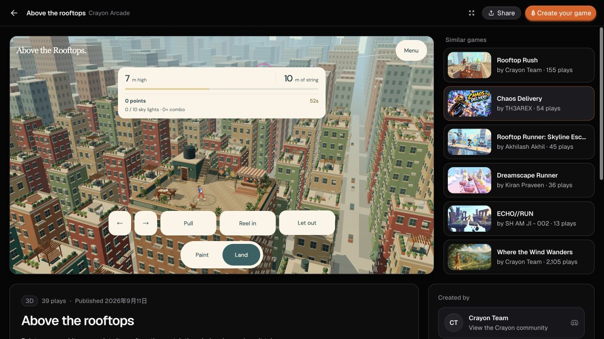

## हर प्रविष्टि में क्या शामिल है

एक उपयोगी सिफ़ारिश से आसानी से समझ आना चाहिए कि गेम क्या है, कहाँ आज़माया जा सकता है और इस सूची में क्यों है।

| जानकारी | क्या शामिल करें |
| --- | --- |
| गेम और रचनाकार | गेम का नाम और मूल रचनाकार या टीम का लिंक |
| इसमें क्या दिलचस्प है | बिना खोखले प्रचार के मुख्य खेल-तंत्र पर एक वाक्य |
| पहुँच | बिना डाउनलोड, इंस्टॉलेशन, स्थानीय सेटअप या लॉगिन के सीधे ब्राउज़र में खेलने का लिंक |
| गेमप्ले का स्क्रीनशॉट | कम से कम एक वास्तविक गेमप्ले स्क्रीनशॉट और सार्वजनिक रूप से उपलब्ध चित्र का URL |
| प्लैटफ़ॉर्म और आवश्यकताएँ | ब्राउज़र / डेस्कटॉप / मोबाइल; भुगतान, लॉगिन या विशेष हार्डवेयर की आवश्यकता स्पष्ट करें |
| Astra की भूमिका | GPT-6 Astra के योगदान को समझाने वाला रचनाकार का कथन, विकास डायरी या सार्वजनिक रिकॉर्ड |
| विकास संसाधन | उपलब्ध स्रोत कोड, तकनीक और निर्माण की कहानी |

मॉडल के उपयोग की जानकारी रचनाकार के सार्वजनिक विवरण के आधार पर दी जाती है; बिना प्रमाण के दावों को पुष्ट तथ्य नहीं माना जाता। खेलने योग्य प्रोटोटाइप का स्वागत है और स्रोत कोड सार्वजनिक करना वैकल्पिक है।

## सूची बनाए रखने में मदद करें

[Issue के माध्यम से गेम भेजें](https://github.com/MartinDelophy/awesome-gpt-6-astra/issues/new?template=submit-game.yml) या Pull Request खोलें। प्रविष्टि का प्रारूप [योगदान मार्गदर्शिका](CONTRIBUTING.md) में देखें।

लेखक को श्रेय देने की गलतियों, पहुँच की शर्तों में बदलाव, टूटे लिंक या अन्य गलत जानकारी की [रिपोर्ट करें](https://github.com/MartinDelophy/awesome-gpt-6-astra/issues/new?template=broken-link.yml)।

## लाइसेंस

इस रिपॉज़िटरी में सूची के मूल पाठ और मूल दृश्य सामग्री को [CC0 1.0](LICENSE) के अंतर्गत सार्वजनिक डोमेन को समर्पित किया गया है। लिंक किए गए गेम, कोड, चित्र, ट्रेडमार्क और अन्य तृतीय-पक्ष सामग्री अपने संबंधित लाइसेंस और अधिकार बनाए रखते हैं। किसी प्रोजेक्ट को सूची में शामिल करने से उसकी उपयोग अनुमतियाँ नहीं बदलतीं।
