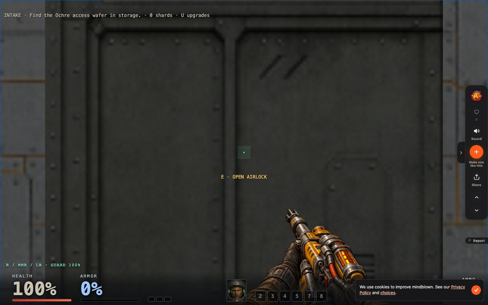
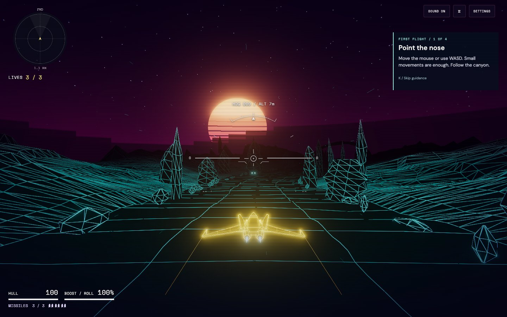
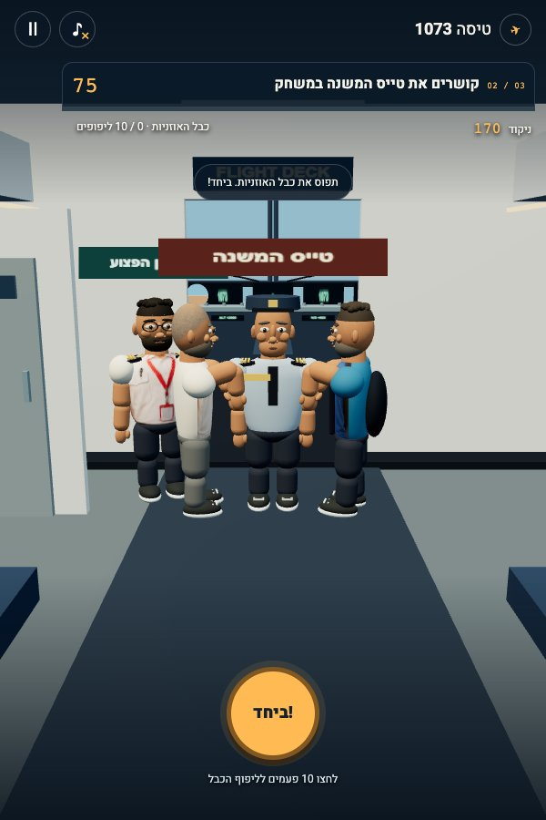
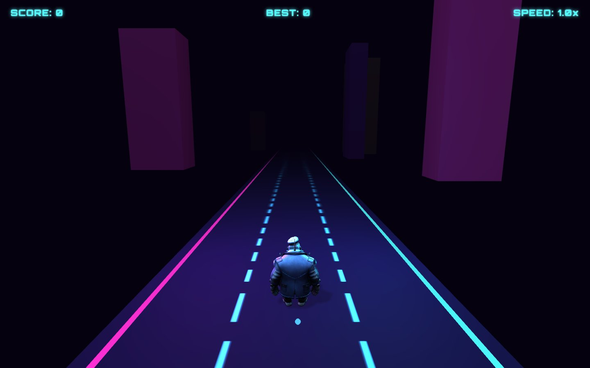
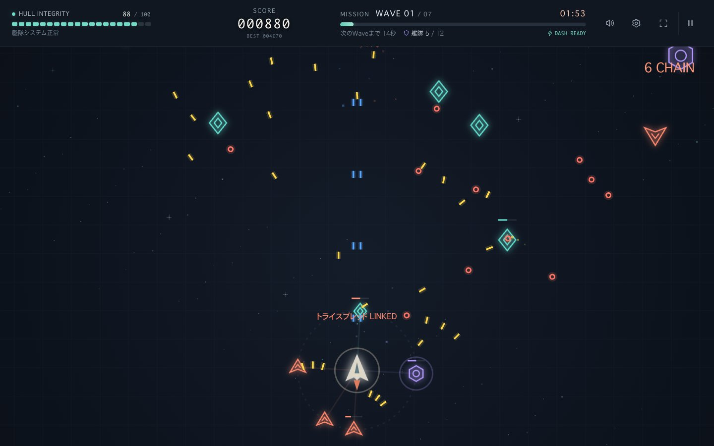
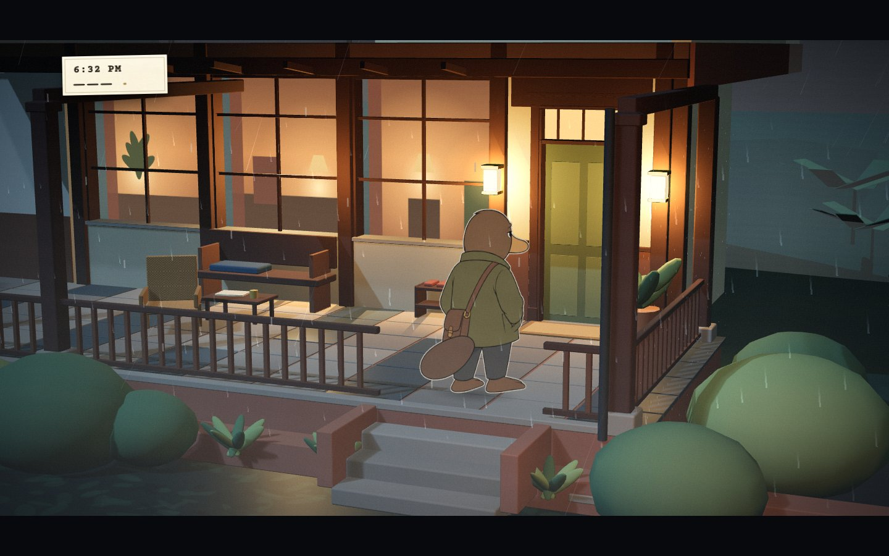
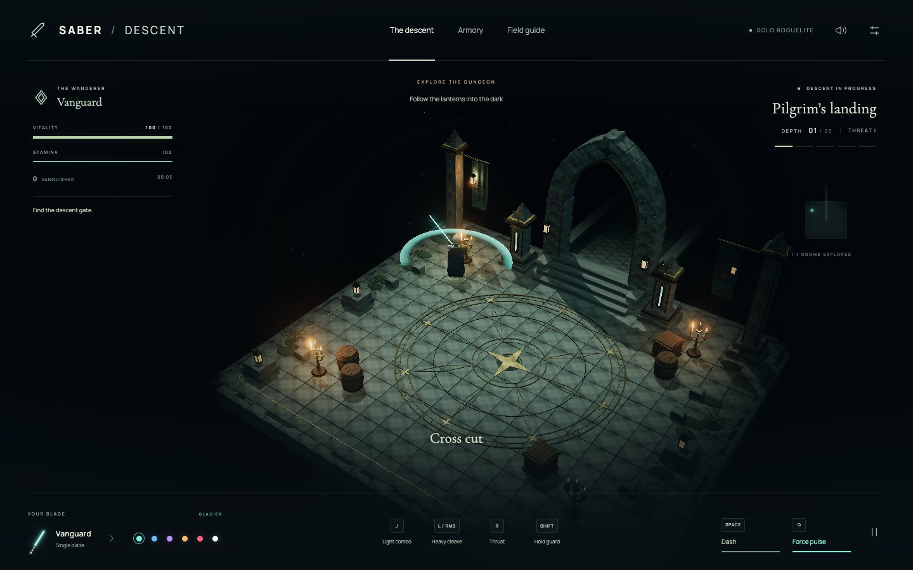
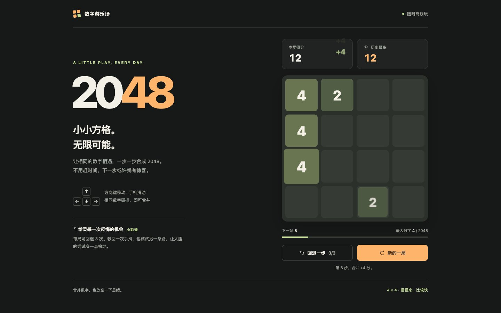

# X discoveries — 2026-10-06

Eight additions, deduplicated against `origin/main` at `4a528380e562be40710632ea7127e3ea5553a4e9`.

Discovery started with community indexes, including [MaynorAI’s playable list](https://github.com/xianyu110/awesome-gpt-6-astra/blob/main/PLAYABLE.md) and [AgentsLoop’s game index](https://github.com/AgentsLoop/awesome-gpt-astra-games). Index claims were not treated as author statements: each selected work has the original X post below, read through public FxTwitter syndication, plus a direct live-game check.

## Verification scope

- Chromium desktop browser on 2026-10-06, fresh browser contexts, no account, installation or API key.
- Checked launching and basic controls, and captured the running scene. This does not certify full campaigns, all devices, multiplayer services or future availability.
- Screenshots are actual browser captures, JPEG compressed, not generated illustrations. Third-party artwork retains its original rights; each image has a `SOURCE.md` credit record.
- Model attribution is creator-reported. Mixed-model development and external asset tools are retained explicitly.
- New entries are present in all 12 READMEs. Existing translation coverage differs: English/Chinese have 174 entries after this update, other languages have 102; this update does not claim to fill historical translation gaps.

## HOLLOWMARK

- Creator: Mindblown
- [Play](https://hollowmark.mindblown.ai/) · [Original X post](https://x.com/mindblown_ai/status/2102040812569944136)
- Attribution: Mindblown attributes the game to Fable 5.1 paired with GPT-6 Astra and Three.js. This is a mixed-model work, not an Astra-only claim. The catalog credits Mindblown and links its site, matching the creator’s earlier request.
- Play check: Opened the embedded game, chose Easy, entered INTAKE, moved with W and used F to fire. The health, ammunition and access-wafer objective appeared.
- [Screenshot credits](../assets/screenshots/hollowmark/SOURCE.md)

## Canyon Overdrive

- Creator: Marco van Hylckama Vlieg / AI & Design
- [Play](https://canyonoverdrive.ai-created.com/) · [Original X post](https://x.com/AIandDesign/status/2105465838946140499)
- Attribution: Marco says the game was made with Astra and Sol 6.1, with ElevenLabs, Suno and Three.js. The current live build is a canyon flight shooter, not a car racing game.
- Play check: Clicked Launch Run, entered the first-flight tutorial, steered with W and used Space. The running flight view, hull, missiles and guidance HUD appeared.
- [Screenshot credits](../assets/screenshots/canyon-overdrive/SOURCE.md)

## Flight 1073

- Creator: Guy Eshel
- [Play](https://flight1073.pages.dev/play/) · [Original X post](https://x.com/GuyEshel_/status/2106292470438822143)
- Attribution: Guy Eshel describes making this aviation simulation/parody with Astra-6. The live game itself explicitly labels the story and tasks fictional parody.
- Play check: Started without an account, skipped the introductory sequence and used pointer dragging. Reached the timed cabin tasks; observed score 170 and stage 02/03. Interface is Hebrew; screenshot preserves the portrait layout.
- [Screenshot credits](../assets/screenshots/flight-1073/SOURCE.md)

## Sulli RUN

- Creator: Morteza
- [Play](https://sulli-game.vercel.app/) · [Original X post](https://x.com/Mortezabihzadeh/status/2102719520699830417)
- Attribution: Morteza says Astra guided the setup while Tripo produced the 3D model, mesh reduction and rigging. Do not describe the character assets as generated by Astra.
- Play check: Started the run with Enter, tested keyboard movement/jump, and observed the score advancing. The browser shows the gorilla, track, score and speed. Physical-phone swipe controls were not tested.
- [Screenshot credits](../assets/screenshots/sulli-run/SOURCE.md)

## FOE TO FLEET

- Creator: miya
- [Play](https://foe-to-fleet.miya333.chatgpt.site) · [Original X post](https://x.com/miya00907380/status/2105055020106252543)
- Attribution: miya explicitly assigns main feature design/implementation and supporting design to Codex GPT-6 Astra, and supporting implementation to GPT-5 Luna. The post describes recruitment, reserve allies and the wave-seven boss.
- Play check: Pressed Enter to start, moved and dashed. The timer ran, enemies spawned, allies joined, and the score reached 4,670 before game over. Restart was also checked; the final preview is from a new run.
- [Screenshot credits](../assets/screenshots/foe-to-fleet/SOURCE.md)

## The Fourth Knock

- Creator: Nikhil Desai
- [Play](https://nikhilsatishdesai.github.io/the-fourth-knock/play/) · [Original X post](https://x.com/NikhilDesai_007/status/2104495667284677078)
- Attribution: Nikhil Desai reports development primarily with GPT-6 Astra and Claude Opus 5.5, alongside ComfyUI, Blender, Three.js and generative audio. His case study and playable build are linked from the X post.
- Play check: Clicked Enter Cedar House, waited through the opening, then used keyboard controls in the covered veranda scene. The objective “Get your bearings” and character scene appeared. This was an opening-area check, not a completed mystery.
- [Screenshot credits](../assets/screenshots/the-fourth-knock/SOURCE.md)

## Saber / Descent

- Creator: Dwayne
- [Play](https://vheissu.github.io/saber-battle/) · [Original X post](https://x.com/CtrlAltDwayne/status/2096365441472209227)
- Attribution: Dwayne explicitly reports using GPT-6 Astra, Imagegen and Blender. The original repository README corroborates the demo URL and five-depth dungeon structure.
- Play check: Clicked Begin descent, moved with W and attacked with J. The game entered Pilgrim’s landing, showed a running timer and Cross cut feedback. No API key, account or installation was needed.
- [Screenshot credits](../assets/screenshots/saber-descent/SOURCE.md)

## Astra 2048

- Creator: Eddy
- [Play](https://jianfan.app/2048/gpt/) · [Original X post](https://x.com/ieddysun/status/2105147777777041494)
- Attribution: Eddy says the same prompt was used for Astra and Opus 5.5, with no edits to the outputs. This listing links specifically to the /2048/gpt/ version, not the other model’s build.
- Play check: Focused the page and played with the arrow keys. The grid changed and the score reached 12 after tile merges. No account or installation was needed.
- [Screenshot credits](../assets/screenshots/astra-2048-eddy/SOURCE.md)

## Candidates not added

The Way of the Samurai remained on its loading screen during the bounded initial checks. Summer Haven, Brackenmere Valley and Settlecoast did not yield a completed start-and-play check in this run. Those observations are not claims that the games are generally broken. Perpetual Dungeon lacked an explicit Astra attribution in the retrieved post. None of these were counted toward the eight additions.
