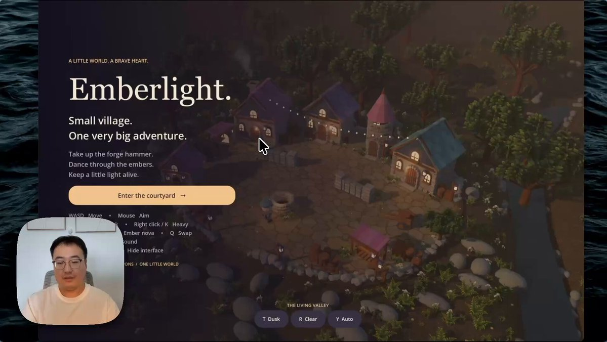
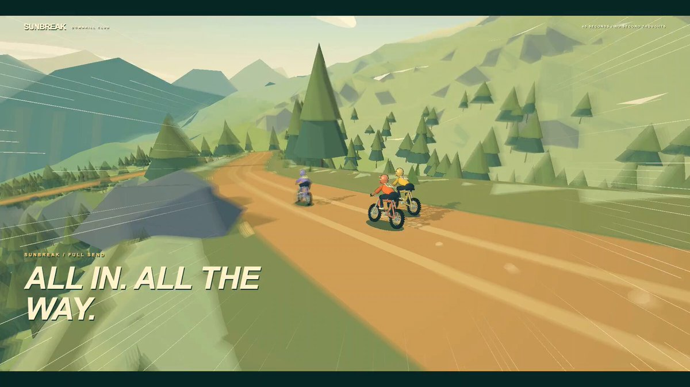
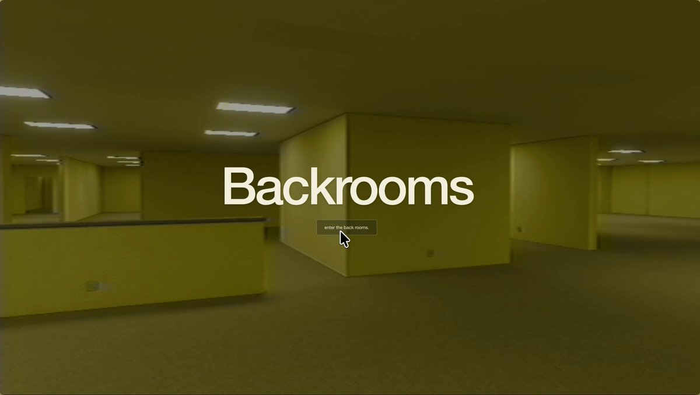
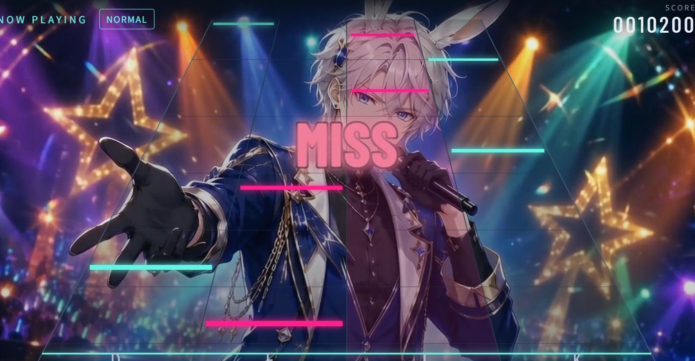

# X 游戏发现与收录核验 · 2026-09-09

本批次以 `upstream/main` 的 `b638a94` 为去重基线：原有 43 项，新增 20 款独立游戏项目，中英文目录各为 63 项。不同作者或不同标题不自动视为新游戏；同时核对了作品入口与玩法。

## 排序口径

以下是在本次检索和核验范围内，满足公开游戏入口或可运行源码、模型归因与实机预览条件的 20 个候选，按 X 帖子显示的浏览量降序排列。它不是全 X 的完整榜单，也不是玩家数、独立访客或游戏站流量排名。计数来自 2026-09-09 检查期间的页面快照，采集时刻略有不同，之后仍会变化。

检索覆盖 GPT-6/Astra 与游戏、竞速、冒险、Three.js、Godot 等组合，以及作者发布帖与回复。社区索引 [xianyu110/awesome-gpt-6-astra](https://github.com/xianyu110/awesome-gpt-6-astra) 仅作为线索，最终入口、归因与计数回到作者或官方来源核实。除 Tidal Rush 使用明确标注的社区分享帖外，排名计数取自作者本人帖子，不借用引用帖、父帖或整个话题的浏览量。

## 新增 20 款

| 排名 | 游戏 | X 浏览量 | X 证据 | 访问与核验 |
| ---: | --- | ---: | --- | --- |
| 1 | [Oz Breakdance](https://satriodewantono.com/breakdance/) | 1,090,464 | [作者原帖](https://x.com/satrio_d/status/2096022866097758500) | [说明与截图来源](../assets/screenshots/breakdance/SOURCE.md) |
| 2 | [The Simpsons: Hit & Run — Browser Recreation](https://vheissu.github.io/hit-and-run-web/) | 948,109 | [作者原帖](https://x.com/CtrlAltDwayne/status/2096872309936287887) | [说明与截图来源](../assets/screenshots/hit-and-run-web/SOURCE.md) |
| 3 | [Emberlight](https://pan.quark.cn/s/70894dcb80cc) | 222,842 | [作者原帖](https://x.com/op7418/status/2096494840431386950) | [说明与截图来源](../assets/screenshots/guizang-roguelike/SOURCE.md) |
| 4 | [SUNBREAK — Downhill Club](https://github.com/Imirushik/sunbreak-downhill-3D-game) | 97,162 | [作者原帖](https://x.com/Im_IrushiK/status/2096280064019353891) | [说明与截图来源](../assets/screenshots/sunbreak-downhill/SOURCE.md) |
| 5 | [Astral War](https://astralwar.io/) | 86,921 | [作者原帖](https://x.com/0xRishi/status/2096079660605997264) | [说明与截图来源](../assets/screenshots/astral-war/SOURCE.md) |
| 6 | [Where the Wind Wanders](https://app.usecrayon.ai/play/a9a3c165-74b3-4ff6-9588-ad97f829ddb5) | 72,994 | [作者原帖](https://x.com/TusharXo/status/2096037482739683574) | [说明与截图来源](../assets/screenshots/crayon-adventure/SOURCE.md) |
| 7 | [Backrooms — Infinite Exploration](https://backrooms.exe.xyz/) | 47,555 | [作者原帖](https://x.com/ryanvogel/status/2095596938502488207) | [说明与截图来源](../assets/screenshots/infinite-backrooms/SOURCE.md) |
| 8 | [ALIBI — The Last Light](https://alibi-blackthorn-manor.vercel.app/) | 21,410 | [作者原帖](https://x.com/Christos_antono/status/2096435122669297892) | [说明与截图来源](../assets/screenshots/alibi-blackthorn-manor/SOURCE.md) |
| 9 | [FLOP CLUB](https://bubucn.com/zh/ai-model-evals/flop-club) | 13,842 | [作者原帖](https://x.com/BubuStd/status/2096402783805354091) | [说明与截图来源](../assets/screenshots/flop-club/SOURCE.md) |
| 10 | [AGI of Empires — The Compute Wars](https://agiofempires.com/) | 10,577 | [作者原帖](https://x.com/timourxyz/status/2096662786692776293) | [说明与截图来源](../assets/screenshots/agi-of-empires/SOURCE.md) |
| 11 | [NEON SYNC BEAT](https://elemayu.itch.io/neon-sync-beat) | 8,517 | [作者原帖](https://x.com/SDAI1807097011/status/2096396438758694933) | [说明与截图来源](../assets/screenshots/neon-sync-beat/SOURCE.md) |
| 12 | [Skyward: The Gathering](https://edge-city-skyward-quests.vercel.app/) | 6,519 | [作者原帖](https://x.com/timourxyz/status/2096379521926840339) | [说明与截图来源](../assets/screenshots/skyward-gathering/SOURCE.md) |
| 13 | [TIDAL RUSH — Paradise GP](https://tidal-rush-paradise-gp.skirano.chatgpt.site/) | 5,610 | [社区分享](https://x.com/alexgetmancom/status/2095598460921614825) | [说明与截图来源](../assets/screenshots/tidal-rush/SOURCE.md) |
| 14 | [Vector Dive — Beyond the Signal](https://vector-dive.openai.chatgpt.site/) | 4,592 | [作者原帖](https://x.com/Dimillian/status/2097188900888322323) | [说明与截图来源](../assets/screenshots/vector-dive/SOURCE.md) |
| 15 | [Atlas Go](https://atlas-go.borisxp.chatgpt.site/) | 3,266 | [作者原帖](https://x.com/BorisMPower/status/2096784808399843582) | [说明与截图来源](../assets/screenshots/atlas-go/SOURCE.md) |
| 16 | [Ironwood — The Art of Industry](https://ironwood.sparkles.dev/) | 2,695 | [作者原帖](https://x.com/aidaniil/status/2096426970930106530) | [说明与截图来源](../assets/screenshots/ironwood/SOURCE.md) |
| 17 | [LUNA — Crimson Requiem / 紅月のレクイエム](https://luna-crimson-requiem.ponsuke.chatgpt.site/) | 2,404 | [作者原帖](https://x.com/ponsuke_otowa/status/2096531744933425299) | [说明与截图来源](../assets/screenshots/luna-crimson-requiem/SOURCE.md) |
| 18 | [Strange Orbit](https://app.usecrayon.ai/play/47df78e2-1410-45d1-833c-196e1161c0b8) | 2,379 | [作者原帖](https://x.com/usecrayon/status/2097468975995302167) | [说明与截图来源](../assets/screenshots/crayon-space-bike/SOURCE.md) |
| 19 | [One More Vine — Into the Wild](https://onemorevine.bennash.dev/) | 2,151 | [作者原帖](https://x.com/bennash/status/2096282758930645170) | [说明与截图来源](../assets/screenshots/one-more-vine/SOURCE.md) |
| 20 | [Anna & Leo · The Starstone Adventure](https://anna-leo-starstone.vercel.app/) | 663 | [作者原帖](https://x.com/dharmautomo/status/2096573649235091967) | [说明与截图来源](../assets/screenshots/anna-leo-starstone/SOURCE.md) |

## 核验边界

- 已打开全部 20 个作品的公开入口；标题、作者与模型角色逐项核对。浏览器启动、客户端文件列表与源码运行说明是不同验证层级，未把 HTTP 200 等同于完整可玩验证。
- Oz Breakdance 开始计分回合；Hit & Run 进入首个任务；Astral War 进入机器人训练；AGI of Empires 开始电脑对局并采集资源；Vector Dive 产生飞行计分；Tidal Rush 开始比赛；Anna & Leo 进入首个任务。其他项目的具体验证范围见各自记录。
- Emberlight 只检查到作者分享的 Windows/macOS 压缩包列表，没有下载或运行可执行程序。SUNBREAK 有公开源码和本地运行说明，本次没有本地构建。
- Backrooms 的检查遇到色彩变换资源加载错误；NEON SYNC BEAT 的 itch.io 嵌入播放器连接重置，但页面提供 HTML 构建下载与键盘操作说明。这两项使用注明发布者的既有实机图，未声称本次成功通关。
- 预览使用当前游戏截图或署名的公开实机画面；已剔除概念封面、宣传图、无关推荐视频与加载占位图。没有重新生成或美化游戏画面。
- 新条目只同步默认英文版与简体中文版；其他语言保留各自已有的 43 项及相符计数。网站从默认 README 解析目录，无需改写演示数据或站点代码。

## 未纳入本批次的较高流量线索

| 候选 | 观察到的浏览量 | 原因 |
| --- | ---: | --- |
| [Afterlight](https://x.com/anshuc/status/2096008083826725132) | 约 290 万 | 未核实到该游戏本身的公开试玩或可运行源码；Dream Loop 图形场景不是同一游戏。 |
| [浏览器 GTA 演示](https://x.com/xikhar/status/2096382232403603752) | 约 49.8 万 | 未核实到对应公开试玩或源码。 |
| [Meng To 的 Catan 原型](https://x.com/MengTo/status/2097291240672993773) | 483,601 | [作者回复](https://x.com/MengTo/status/2097329652872409180)说明尚不能公开发布。 |
| [Paperboy](https://x.com/builtbysketch/status/2096515959469072630) | 约 26.3 万 | 仅确认演示视频，未核实可体验或可运行入口。 |
| [Golden Hour GP](https://x.com/mindblown_ai/status/2097060846912565382) | 7,984 | 当前公开版本主要展示自动赛道渲染、镜头、时间与渲染步骤；本批次优先收录有明确玩家目标和操作的游戏。 |
| [ARK / 22 — Utopia Breaker](https://x.com/chrisjdimarco/status/2097051930686087438) | 5,646 | 有可玩打砖块游戏，但作者原帖仅提及使用 Dream Loop，未明确确认所用模型，暂缓。 |
| [Neural Sight](https://x.com/monstercameron/status/2097117275127959629) | 82 | 有公开源码，但浏览量低于本批次已核实入选项目，且此前场景加载验证未完成。 |

已存在的 STORM RACE、Stick Fighter、JUNK RUN、Spy or Lie、Gogh Strike、Chao Party 等仍保留原条目，没有重复收录。

## Preview index

每款游戏的当前封面均在中英文 README 内嵌，并有独立 `SOURCE.md` 记录出处。以下索引供审阅本批次截图：

### Oz Breakdance

[来源与访问说明](../assets/screenshots/breakdance/SOURCE.md)

### The Simpsons: Hit & Run — Browser Recreation

[来源与访问说明](../assets/screenshots/hit-and-run-web/SOURCE.md)

### Emberlight

[来源与访问说明](../assets/screenshots/guizang-roguelike/SOURCE.md)

### SUNBREAK — Downhill Club

[来源与访问说明](../assets/screenshots/sunbreak-downhill/SOURCE.md)

### Astral War

[来源与访问说明](../assets/screenshots/astral-war/SOURCE.md)

### Where the Wind Wanders

[来源与访问说明](../assets/screenshots/crayon-adventure/SOURCE.md)

### Backrooms — Infinite Exploration

[来源与访问说明](../assets/screenshots/infinite-backrooms/SOURCE.md)

### ALIBI — The Last Light

[来源与访问说明](../assets/screenshots/alibi-blackthorn-manor/SOURCE.md)

### FLOP CLUB

[来源与访问说明](../assets/screenshots/flop-club/SOURCE.md)

### AGI of Empires — The Compute Wars

[来源与访问说明](../assets/screenshots/agi-of-empires/SOURCE.md)

### NEON SYNC BEAT

[来源与访问说明](../assets/screenshots/neon-sync-beat/SOURCE.md)

### Skyward: The Gathering

[来源与访问说明](../assets/screenshots/skyward-gathering/SOURCE.md)

### TIDAL RUSH — Paradise GP

[来源与访问说明](../assets/screenshots/tidal-rush/SOURCE.md)

### Vector Dive — Beyond the Signal

[来源与访问说明](../assets/screenshots/vector-dive/SOURCE.md)

### Atlas Go

[来源与访问说明](../assets/screenshots/atlas-go/SOURCE.md)

### Ironwood — The Art of Industry

[来源与访问说明](../assets/screenshots/ironwood/SOURCE.md)

### LUNA — Crimson Requiem / 紅月のレクイエム

[来源与访问说明](../assets/screenshots/luna-crimson-requiem/SOURCE.md)

### Strange Orbit

[来源与访问说明](../assets/screenshots/crayon-space-bike/SOURCE.md)

### One More Vine — Into the Wild

[来源与访问说明](../assets/screenshots/one-more-vine/SOURCE.md)

### Anna & Leo · The Starstone Adventure

[来源与访问说明](../assets/screenshots/anna-leo-starstone/SOURCE.md)
