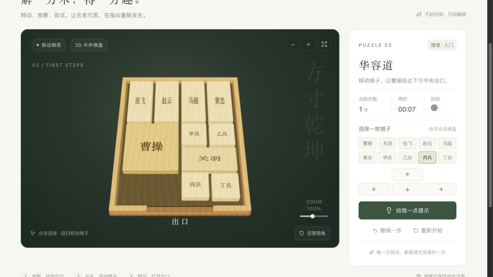

# 榫境 / Sunjing Puzzles

[Play online / 在线试玩](https://sunjing-puzzles.hp20230404.chatgpt.site) · [Creation record / 制作记录](CREATION.md) · [Request history / 需求记录](PROMPTS.md)

A Chinese-language 3D wooden-puzzle workshop with a six-piece interlocking lock and two Huarong Dao sliding-block layouts. Rotate the wooden model, choose a piece, discover the removal order, or make space for Cao Cao to reach the exit.

项目发起人及提交者 / Project initiator and submitter: [MartinDelophy](https://github.com/MartinDelophy). Implemented through an iterative Codex-assisted workflow. **Exact GPT-6 Astra attribution is pending creator confirmation**, as documented in [CREATION.md](CREATION.md).

## Play / 玩法

- **六合 · 孔明锁:** six connected wooden pieces with no initial overlap; swept-path collision checks prevent pulling pieces through other wood. This is a teaching adaptation of interlocking joinery, not a verified historical replica or inventor attribution.
- **初见 · 华容道:** an introductory layout with a shortest solution of 10 single-cell moves.
- **横刀 · 华容道:** the classic 横刀立马 layout, with a shortest solution of 116 single-cell moves under this implementation's counting rule.

Desktop: drag the lock to rotate it, click a wooden piece or its numbered button, then use an extraction button or arrow key. For Huarong Dao, select a block and use arrow keys/buttons. Touch: drag to rotate the lock; swipe a Huarong Dao piece to move one cell. Zoom buttons, hints and move undo are provided. Z undoes a move; R restarts; Esc clears selection.

Free browser play; no account or API key. Requires a modern browser with WebGL 2. Touch controls and responsive styles are implemented; device-specific mobile testing is not claimed. The current puzzle is saved only in that browser's local storage. Switching levels starts a new game; reset, level changes and reload do not preserve the undo history. All game logic runs locally, including the worker that computes hints.

## Run locally / 本地运行

Node.js **22.13 or later** and npm are required. From this repository's root:

```sh
cd works/sunjing-puzzles
npm ci --registry=https://registry.npmjs.org
npm run dev
```

Open the Local URL printed by the server. Keep the terminal running while playing. Dependency installation needs network access; there are no runtime CDN fonts, models, textures or API calls.

## Verify and build / 检查与构建

```sh
npm test
npm run lint
npm run typecheck
npm run build
```

The build uses `output: 'export'` and writes a static site to `dist/client/`. Serve that directory using a local HTTP server or deploy its contents to a static HTTPS host:

```sh
python3 -m http.server 8080 --directory dist/client
```

Open http://localhost:8080. Do not open the HTML through `file://`, because modules and the solver worker require an HTTP origin. This submission does not contain personal environment files or the live site's access/hosting metadata.

## Structure

- `app/page.tsx`: interface, state, controls, progress and success feedback.
- `components/PuzzleScene.tsx`: Three.js wood meshes, materials, picking, orbit and touch handling.
- `lib/game.ts`, `lib/lock.json`, `lib/boards.json`: rules and validated puzzle layouts.
- `public/solver-worker.js`: off-main-thread BFS hints.
- `tests/rules.test.mjs`: eight checks for connectedness, collisions, removal order, board movement and solver replay.

React, Vinext/Vite, Three.js, Tailwind CSS and selected shadcn/Base UI components. See [third-party and licensing notes](THIRD_PARTY_NOTICES.md).

## Actual gameplay / 实机画面

Captured from the submitted playable version on **2026-09-07**; not an image-generation mockup.



