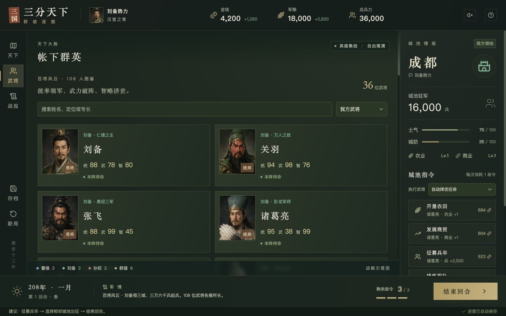

# 三分天下 · 百将风云 / Three Kingdoms: Hundred Heroes

[在线试玩 / Play online](https://sanguo-jiangshan.vercel.app) · [创作记录 / Creation record](CREATION.md) · [需求与提示词 / Requests and prompts](PROMPTS.md)

一款原创三国题材回合制策略网页游戏：在 15 座城池间经营钱粮、调兵攻城，从曹操、刘备、孙权三方中选择一方，统率群英逐鹿天下。共有 **108 位武将，每方 36 位，每人配有独立的生成头像**。

An original turn-based Three Kingdoms browser strategy game. Manage gold and food, develop cities and march between 15 strongholds as Cao Cao, Liu Bei or Sun Quan. The roster contains **108 officers, 36 per faction, each with a distinct generated portrait**.

项目发起人、创作者及提交者 / Project initiator, creator and submitter: [MartinDelophy](https://github.com/MartinDelophy). The creator confirmed GPT-6 Astra use on **2026-09-08**. Codex assisted with iterative game development; the terrain and portrait artwork were created separately with the image-generation tool. See [CREATION.md](CREATION.md) for the division of work.

## 玩法 / Play

- **经营城池 / Develop cities:** farm, trade, recruit, train and strengthen walls. Assign an officer to each order; intelligence can reduce costs.
- **调兵征战 / Command armies:** attack or reinforce adjacent cities, budget marching supplies, and account for command limits, morale, walls and officer recovery.
- **百将图鉴 / Officer roster:** search by name or role, filter factions, view portraits and compare command, combat and intelligence attributes.
- **统一天下 / Unify the map:** compete with two AI factions to control all 15 cities. The scenario gathers heroes from different periods; it is not a historical campaign reconstruction.

免费，无需登录或 API Key。游戏界面为简体中文，支持鼠标及触屏按钮；推荐现代桌面浏览器。游戏在浏览器本地运行并自动存档，可通过 JSON 导入、导出进度。

Free, with no login, API key or backend required. The game UI is **Simplified Chinese**; the collection's multilingual descriptions do not imply a translated in-game interface. Mouse and touch controls are implemented; a modern desktop browser is recommended. Progress is saved locally in the current browser, with JSON import/export. No device-wide mobile compatibility claim is made.

## 本地运行 / Run locally

Use Node.js **22.13 or later** and npm. From the collection repository:

```sh
cd works/three-kingdoms
npm ci --registry=https://registry.npmjs.org
npm run dev
```

Open the Local URL printed by the server. Installing dependencies requires network access. The game uses bundled artwork, system fonts and local rules; playing does not require an AI service.

## 检查与构建 / Verify and build

```sh
npm test
npm run lint
npm run typecheck
npm run build
```

The static export is written to `dist/client/`. To serve it locally:

```sh
python3 -m http.server 8080 --directory dist/client
```

Open http://localhost:8080. Serve the full directory over HTTP/HTTPS, rather than opening the generated HTML as a local file. See [validation notes](VALIDATION.md) and the [balance report](docs/balance-v2.md).

## Vercel 部署 / Deploy to Vercel

The current **v0.2.0** demo is [sanguo-jiangshan.vercel.app](https://sanguo-jiangshan.vercel.app), published on **2026-09-08**. It was deployed through the CLI; pushing this collection does not automatically redeploy the game.

When importing this repository into your own Vercel account, set Root Directory to `works/three-kingdoms`, Framework Preset to **Other**, and use Node.js **22.x** (at least 22.13). The included `vercel.json` installs with `npm ci`, builds with `npm run build`, and publishes `dist/client`. No environment variables are required for the game.

For a manual deployment, sign in to Vercel and link this directory to your own project, then run:

```sh
npm run build
npm run package:vercel
vercel deploy --prebuilt --prod
```

Local `.vercel/`, `.netlify/` and `.env*` files are ignored. The optional Sites static-hosting configuration is retained without account identifiers. To move an existing save from a different domain, export its JSON there and import it through this game's help/save dialog.

## 实机画面 / Gameplay screenshots

Captured from the running **v0.2.0 Vercel release on 2026-09-08**, using the game's fullscreen view. Both images are 1440 × 900 JPEG screenshots, not generated interface mockups.




## 结构与素材 / Structure and assets

- `game/engine.ts`: map, economy, combat, AI, save validation and migration.
- `game/officers.ts`: 108 officer records and atlas assignments.
- `game/Game.tsx`, `game/Portrait.tsx`: interface and portrait rendering.
- `public/terrain.jpg`, `public/portraits/`: generated terrain and three 36-portrait atlases.
- `scripts/test-engine.mjs`: 23 rules and regression checks.
- [Portrait provenance and full prompts](docs/portrait-assets.md) · [Third-party notices](THIRD_PARTY_NOTICES.md).

Built with React, TypeScript, Vinext/Vite, Tailwind CSS, selected shadcn/Base UI components and Lucide icons. This is an original simplified prototype inspired by the user's request for a Three Kingdoms strategy game. It contains no original Romance of the Three Kingdoms XI game code or assets. Officer attributes and strategic roads are custom game rules.
